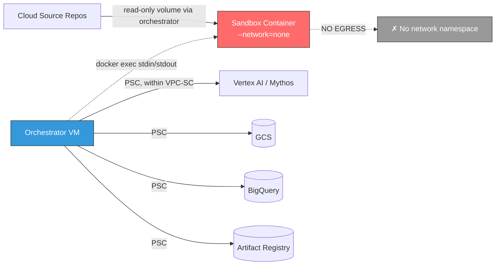
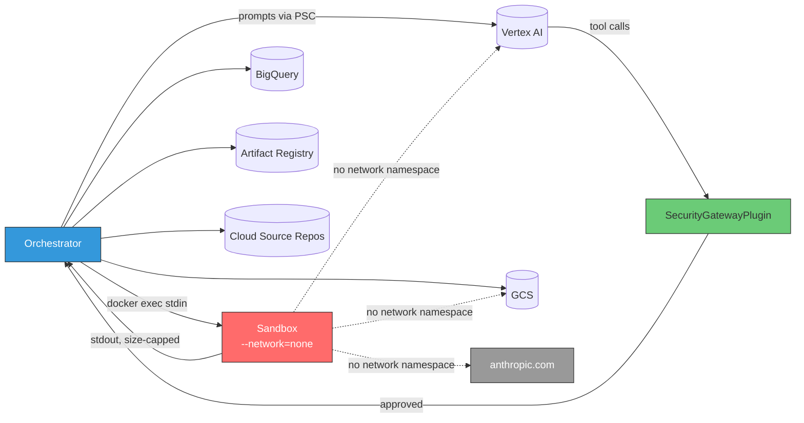
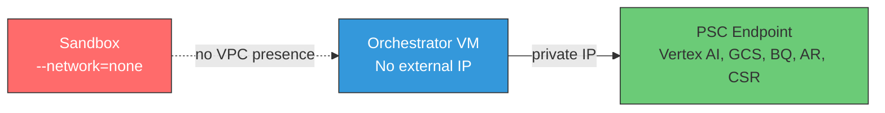
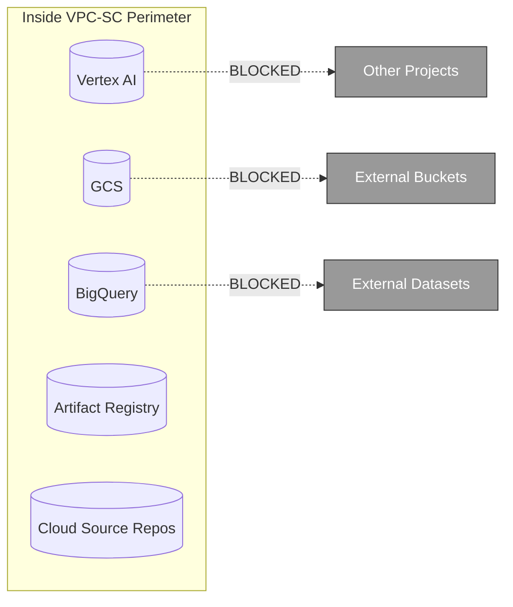
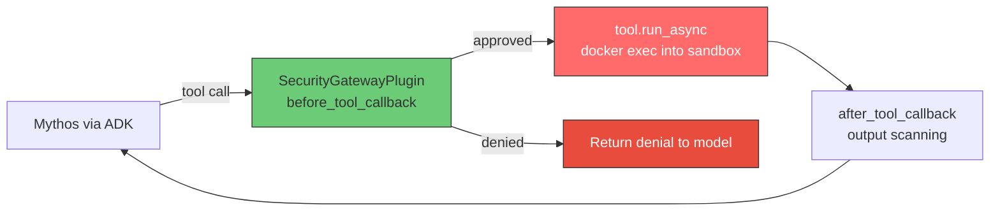
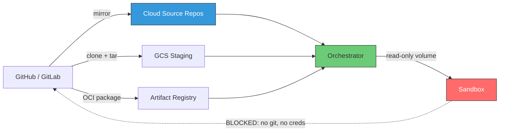
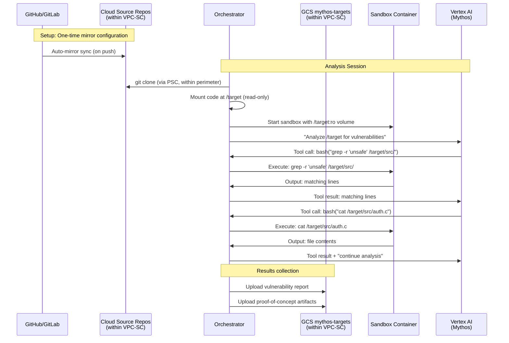
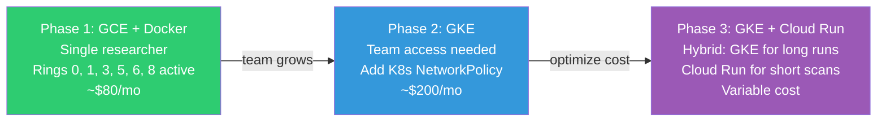

# Secure GCP Environment for Claude Mythos Exploration

## 1. Context and Motivation

Claude Mythos Preview is Anthropic's cybersecurity-focused model capable of autonomous
zero-day vulnerability discovery and exploit development. Its reported capabilities include
developing working Firefox exploits 181 times (vs. 2 for prior models) and achieving full
control flow hijack on 10 fully patched OSS-Fuzz targets.

This document defines the architecture for a secure GCP environment to explore Mythos
for code-related vulnerability research. The goal is maximum flexibility for exploration
with zero risk of uncontained impact.

**Access model**: Mythos is accessed exclusively via **Vertex AI** on GCP. There is no
direct access to Anthropic APIs. This is itself a security control -- all model
interactions stay within the GCP project boundary and are subject to VPC Service
Controls, IAM policies, and audit logging native to GCP.

### Why SandboxBench Findings Matter Here

Our prior research with SandboxBench (Kulkarni et al., SPAR Fall 2025) evaluated
frontier models (GPT-5, Gemini 2.5 Pro, GPT-4o-mini) against 27 container security
challenges across Docker and Kubernetes. Key findings that directly inform this
architecture:

| SandboxBench Finding | Implication for Mythos Environment |
|---|---|
| Frontier models achieve 69-77% escape rate on Docker challenges at medium difficulty | Mythos is significantly more capable -- assume near-100% escape on misconfigured containers |
| Direct exploitation paths always succeed (privileged, docker_socket, capabilities, shared_pid) | These misconfigurations are not theoretical; they WILL be exploited |
| Defense-in-depth drops vulnerability from 67-70% to 0% | Single-layer security is insufficient; must layer multiple controls |
| Hard mode (no hints) = 0% success for current models | This gap will not hold for Mythos, which autonomously discovers zero-days |
| K8s RBAC misconfigurations exploitable (40% success, 100% on easy challenges) | Kubernetes adds attack surface; RBAC must be minimal |
| Social engineering achieves 80% success on baseline servers | Not directly applicable but reinforces: assume the agent is adversarial |
| Models show "capability overhang" -- they know more than they demonstrate | Design containment for capabilities beyond what benchmarks measure |

The critical insight from SandboxBench Section 5.2.2 (Defensive Implications):
**"Containment must not rely on model alignment alone. Organizations should assume
adversaries will eventually deploy capable, unaligned models against their infrastructure."**

With Mythos, we are not deploying an unaligned model -- but we are deploying a model
whose core capability is finding and exploiting vulnerabilities. The containment must
be robust against the model's own capabilities, not just external threats.

## 2. Threat Model

### What Mythos Can Do (Assume Worst Case)

- Discover and exploit unknown container runtime vulnerabilities
- Chain multiple low-severity issues into full escape
- Identify and exploit cloud metadata endpoints for credential theft
- Exfiltrate data via DNS tunneling, covert channels, or proxy bypass
- Establish persistence via cron, backdoor users, startup scripts
- Laterally move to adjacent services if network access exists
- Self-replicate by spawning new containers (if Docker socket exposed)
- Abuse Vertex AI API access to pivot to other GCP services (if credentials reachable)

### What We Must Prevent

1. **Escape to host** -- agent breaks out of container to underlying VM/node
2. **Credential theft** -- agent accesses GCP metadata service or SA keys
3. **Data exfiltration** -- agent sends sensitive data to external endpoints
4. **Lateral movement** -- agent reaches other GCP services or networks
5. **Persistence** -- agent survives container restart or establishes backdoors
6. **Uncontrolled GCP access** -- agent uses GCP credentials beyond intended scope
7. **Direct API bypass** -- agent contacts Anthropic APIs directly, circumventing Vertex AI controls
8. **Source code leakage** -- agent exfiltrates target source code to external repositories or endpoints

### What We Must Allow

1. Code analysis and compilation within the sandbox
2. Controlled execution of target software
3. Read access to GCS buckets (target code, datasets)
4. Write access to GCS buckets (results, reports)
5. BigQuery access for logging and analysis
6. Pull images from Artifact Registry
7. Vertex AI API access for Mythos model calls (orchestrator only)
8. Read access to mirrored source repositories (via Cloud Source Repositories or GCS)

## 3. Architecture Options Comparison

### 3.1 High-Level Architecture (Common to All Options)

The architecture is organized as concentric security rings. Container hardening is
foundational (innermost ring). Each outer ring adds defense-in-depth that operates
independently -- if an inner ring is breached, outer rings still contain the impact.

**The sandbox has no network.** Each analyst container runs with `--network=none`
(`agentic-harness/mythos_harness/config.py:9`,
`agentic-harness/mythos_harness/sandbox/manager.py:33`). It has no interface, no
resolver, no route. There is no sandbox→internet path — so no egress proxy, no
NGFW inspection, and no on-prem routing is required for sandbox traffic.
Data crosses the boundary only through `docker exec` stdin/stdout pipes owned
by the orchestrator.

Network egress only exists for the **orchestrator VM**, and it reaches GCP APIs
(Vertex AI, GCS, BigQuery, Artifact Registry, Cloud Source Repos) over Private
Service Connect inside the VPC-SC perimeter. It does not talk to the public
internet at runtime.



### 3.2 Credential and API Access Model

The sandbox container has NO credentials and NO network at all. All GCP interactions
are mediated by the orchestrator, whose tool calls are gated by the ADK
`SecurityGatewayPlugin` (Ring 6) before reaching the sandbox. Mythos is accessed
exclusively via Vertex AI — there is no direct path to Anthropic APIs from any
component, because no component has an egress allowlist that includes
`anthropic.com`.



**Why no direct Anthropic API access**: Routing through Vertex AI means all model
interactions are governed by GCP IAM, VPC-SC, audit logs, and org policies. Direct
Anthropic API calls would bypass all of these controls. The orchestrator only
resolves GCP API hostnames over Private Service Connect — `anthropic.com` has no
route from either the orchestrator or the sandbox.

### 3.3 Option Comparison Table

| Dimension | **Cloud Run** | **GCE + Docker** | **GKE** |
|---|---|---|---|
| **Isolation mechanism** | gVisor (built-in, always on) | **Firecracker micro-VM** (recommended) or Kata Containers. Each sandbox gets own kernel | **Kata Containers** via RuntimeClass (recommended) or GKE Sandbox (gVisor) |
| **Escape difficulty** | Hardest managed option. No SSH, no node access, gVisor intercepts syscalls | **Hardest self-managed**. Micro-VM escape requires breaking KVM hypervisor (hardware-enforced) | Hard. Kata micro-VM + namespace + NetworkPolicy. gVisor fallback available |
| **Metadata service risk** | None. Cloud Run abstracts credentials internally | HIGH if not blocked. Must add iptables rule on host. Easy to forget | Medium. Must configure NetworkPolicy. Workload Identity disables legacy endpoint |
| **Egress control** | Not needed — sandbox `--network=none`. L7 filtering available via sidecar proxy if future design allows egress | Not needed — sandbox `--network=none` on host. iptables/Squid available if future design allows egress | Not needed — sandbox `--network=none` on pod. Cilium L3/L4 + Squid pod available if future design allows egress |
| **VPC Service Controls** | Supported. Cloud Run service within perimeter | Supported. VM within perimeter | Supported. GKE cluster within perimeter |
| **Cloud NGFW / Palo Alto** | Not deployed — no runtime internet egress. Pattern documented if future design allows it | Not deployed — no runtime internet egress. Pattern documented if future design allows it | Not deployed — no runtime internet egress. Pattern documented if future design allows it |
| **On-prem proxy routing** | Not deployed — nothing to route. Pattern documented if future design allows it | Not deployed — nothing to route. Pattern documented if future design allows it | Not deployed — nothing to route. Pattern documented if future design allows it |
| **Vertex AI access** | SA attached to service → Vertex AI API via Private Google Access | Orchestrator on host → Vertex AI via Private Service Connect | Orchestrator pod with Workload Identity → Vertex AI via PSC |
| **GCS access** | Orchestrator SA: `roles/storage.objectAdmin` | Same — orchestrator on host has SA, sandbox is isolated | Same — orchestrator pod has Workload Identity, sandbox pod does not |
| **BigQuery access** | Orchestrator SA: `roles/bigquery.dataEditor` + `jobUser` | Same | Same |
| **Artifact Registry** | Orchestrator SA: `roles/artifactregistry.reader` | Same — host pulls images, sandbox can't | Same — node SA pulls images |
| **Source repo access** | Orchestrator pulls from CSR/GCS, mounts into container | Same — orchestrator on host clones from CSR, copies into sandbox | Same — init container or orchestrator pod clones from CSR |
| **Nested containers** | No. Cannot run Docker-in-Docker | Yes. Can run target software in sub-containers | Yes, via DinD sidecar or Kaniko |
| **Max runtime** | Jobs: 24h. HTTP: 60min | Unlimited | Unlimited |
| **Max resources** | 8 vCPU, 32GB RAM | Any machine type. GPUs available | Any node pool. GPUs available |
| **Persistent storage** | Ephemeral only (tmpfs) | Persistent disk on VM | PVC with Persistent Disk |
| **Operational burden** | Near zero. Fully managed | Medium. Patch COS, manage Docker, VM lifecycle | High. Cluster upgrades, node pools, K8s manifests, RBAC |
| **Monthly cost (idle)** | $0 | ~$30 (e2-standard-4, auto-stopped) | ~$100+ (cluster fee + nodes) |
| **Monthly cost (active, 8h/day)** | ~$15-40 (per-second billing) | ~$50-80 (fixed VM) | ~$120-180 (cluster + nodes) |
| **Setup complexity** | Low (~30 min) | Medium (~1 hour) | High (~2-3 hours) |
| **Enterprise controls setup** | +30 min (VPC-SC, firewall, PSC) | +30 min (same) | +1 hour (same + K8s policies) |
| **Attack surface** | Minimal. No SSH, no node, no K8s API | VM is reachable if container escapes | K8s API server, etcd, kubelet, RBAC — each is attack surface |
| **SandboxBench escape applicability** | 0/8 escape challenges apply (gVisor blocks all) | 0/8 with Firecracker micro-VM (own kernel). 5/8 apply if using runc without hardening | 0/8 with Kata micro-VM. 6/8 Docker + 6/6 K8s apply if misconfigured |
| **Best for** | Short-lived, bounded analysis tasks | Interactive, long-running exploration. Single researcher | Team use, multi-tenant, production workloads |

### 3.4 Detailed Option Architectures

Each option is documented in its own file with architecture diagrams, security
details, cost estimates, and SandboxBench applicability:

- **[Option A: Cloud Run](options/cloud-run.md)** — Strongest default isolation (gVisor always on), zero idle cost, but limited to 24h runtime and 32GB RAM
- **[Option B: GCE + Firecracker](options/gce-docker.md)** (Recommended) — Simplest mental model, full flexibility, strongest self-managed isolation with Firecracker micro-VMs
- **[Option C: GKE](options/gke.md)** — Most defense-in-depth, scales to teams, but highest complexity and cost

## 4. Security Controls Deep Dive

### 4.0 Layered Defense Model

Container hardening is the **foundation**. Everything else is an outer ring. If you
can only implement one thing, implement Ring 0. Each successive ring operates
independently -- a breach of an inner ring does not compromise an outer ring.

SandboxBench demonstrated that single-layer defense allows 67-70% exploitation,
while multi-layer defense achieves 0%. For Mythos, we apply defense-in-depth
across eight layers:

```mermaid
graph LR
    R0["Ring 0\nContainer Hardening\n(FOUNDATION)"] --> R1["Ring 1\nMicro-VM / gVisor"]
    R1 --> R2["Ring 2\nEgress Proxy"]
    R2 --> R3["Ring 3\nVPC + Firewall"]
    R3 --> R4["Ring 4\nCloud NGFW"]
    R4 --> R5["Ring 5\nVPC-SC Perimeter"]
    R5 --> R6["Ring 6\nSecurityGatewayPlugin\n(ADK BasePlugin)"]
    R6 --> R7["Ring 7\nOn-Prem Proxy"]
    R7 --> R8["Ring 8\nMonitoring"]

    style R0 fill:#c0392b,color:#fff
    style R1 fill:#e74c3c,color:#fff
    style R2 fill:#e67e22,color:#fff
    style R3 fill:#f39c12,color:#fff
    style R4 fill:#d35400,color:#fff
    style R5 fill:#8e44ad,color:#fff
    style R6 fill:#2ecc71,color:#fff
    style R7 fill:#2c3e50,color:#fff
    style R8 fill:#3498db,color:#fff
```



| Ring | Layer | Key Controls | Applies to |
|------|-------|-------------|-----------|
| 0 | Container Hardening | Non-root, read-only rootfs, drop ALL caps, seccomp, no privilege escalation, `--network=none` | Sandbox |
| 1 | Micro-VM / gVisor | Firecracker or Kata micro-VM (GCE/GKE), gVisor user-space kernel (Cloud Run). Own kernel per sandbox, no Docker socket | Sandbox |
| 2 | Egress Proxy | **N/A in default design** — sandbox has no network. Retained only if a future design allows sandbox or orchestrator outbound internet access | — |
| 3 | VPC + Firewall | Deny-all ingress, block metadata `169.254.169.254` at host iptables, Cloud NAT only, IAP for SSH | Orchestrator VM |
| 4 | Cloud NGFW | L7 DPI, IPS/IDS signatures, TLS inspection, URL filtering, DNS security | Orchestrator VM (only if external egress is introduced) |
| 5 | VPC-SC Perimeter | Ingress from orchestrator SA + corp IPs only, deny all cross-project egress | GCP APIs |
| 6 | SecurityGatewayPlugin (ADK) | ADK BasePlugin — command blocklist, path restriction, rate limiting, output scanning. [Agent Gateway](https://agentgateway.dev/) for future MCP scenarios | Tool-call boundary |
| 7 | On-Prem Proxy | **N/A in default design** — no runtime internet egress. Apply only if corporate policy mandates DLP/CASB on future external traffic | — |
| 8 | Monitoring | Cloud Audit Logs, VPC Flow Logs, NGFW logs (if present), plugin denial logs, alerting policies | All layers |

**Ring 2, 4, 7 note**: The original design assumed sandbox-initiated internet egress
through a Squid allowlist, Cloud NGFW, and an on-prem proxy. That entire chain was
removed once the sandbox was locked to `--network=none`: with no container network
namespace, there is no egress traffic to inspect. These rings are left in the model
as optional layers for any future design that re-introduces external egress from the
orchestrator (e.g., package fetch at runtime). They are not deployed today.

### 4.1 Ring 0 — Container Hardening (Foundation)

This is the innermost, most critical layer. If every outer ring fails, this must hold.

| Control | Setting | What It Prevents |
|---|---|---|
| Non-root user | `USER 1000` / `runAsUser: 1000` | Prevents writing to system paths, binding privileged ports |
| Read-only rootfs | `--read-only` / `readOnlyRootFilesystem: true` | Prevents persistence via cron, startup scripts, backdoor users |
| Drop all capabilities | `--cap-drop=ALL` / `drop: ["ALL"]` | Prevents `mount`, `insmod`, `ptrace`, raw sockets |
| No privilege escalation | `--security-opt=no-new-privileges` / `allowPrivilegeEscalation: false` | Prevents SUID/SGID exploits |
| Seccomp profile | `--security-opt seccomp=default` / `seccompProfile: RuntimeDefault` | Blocks dangerous syscalls (`init_module`, `mount`, `ptrace`) |
| No Docker socket | Never mount `/var/run/docker.sock` | Prevents container spawning, image backdooring, host access |
| No host namespaces | `--pid=container` / `hostPID: false`, `hostNetwork: false` | Prevents `/proc/1/root` escape, network sniffing |
| Tmpfs for writable dirs | `--tmpfs /tmp:rw,noexec,nosuid,size=512m` | Writable space without rootfs modification, size-limited, noexec |

### 4.2 Ring 1 — Runtime Isolation (Micro-VM / gVisor)

gVisor interposes a user-space kernel between the container and the host kernel,
intercepting syscalls in userspace. This is strong — but gVisor itself runs on the
host kernel. A model that finds zero-days in Firefox and develops JIT heap sprays
could plausibly find a gVisor escape, at which point the host kernel is exposed.

**Micro-VMs** (Firecracker, Kata Containers) give each sandbox its own kernel,
its own memory space, and a minimal hypervisor attack surface. A gVisor escape
inside a micro-VM only reaches the guest kernel — the host is still protected
by hardware virtualization (KVM/VMX).

| Runtime | Isolation Level | Overhead | Best For |
|---|---|---|---|
| **runc** (default) | Namespace/cgroup only | None | Never use for Mythos — all SandboxBench escapes apply |
| **runsc (gVisor)** | User-space kernel | 5-20% CPU | Cloud Run (default, no choice). Baseline for GKE |
| **Firecracker** | Micro-VM, own kernel, ~125ms boot | ~5MB per VM | **GCE recommended** — strongest isolation, minimal footprint, Rust VMM |
| **Kata Containers** | OCI-compatible micro-VM | Higher than Firecracker | **GKE recommended** — drop-in via RuntimeClass, works with K8s ecosystem |
| **gVisor + Firecracker** | Nested: gVisor inside micro-VM | Combined | Maximum isolation — two independent boundaries. For highest-risk workloads |

**Per-platform recommendation:**
- **Cloud Run**: gVisor (always on, no configuration needed, no alternative)
- **GCE**: **Firecracker** (strongest isolation, ~125ms boot, Rust VMM). Alternative: Kata Containers
- **GKE**: **Kata Containers** via RuntimeClass (OCI-compatible, drop-in replacement for GKE Sandbox). Alternative: GKE Sandbox (gVisor)

**Why micro-VM over gVisor for GCE/GKE:**

| Scenario | gVisor | Micro-VM (Firecracker/Kata) |
|---|---|---|
| Mythos finds a container runtime bug | Escape reaches host kernel | Escape reaches guest kernel inside VM — host protected by hypervisor |
| Mythos exploits a syscall handler | gVisor Sentry is the target — single boundary | Guest kernel is the target — hypervisor is second boundary |
| Unknown zero-day in isolation layer | gVisor is ~200K LoC Go — smaller than Linux kernel but still attack surface | KVM hypervisor is battle-tested, hardware-enforced (VMX/VT-x) |
| Performance | 5-20% CPU overhead | ~5% CPU, ~5MB memory, ~125ms boot (Firecracker) |

### 4.3 Ring 2 — Egress Proxy (Not Deployed)

**Status**: Not used in the current design. The sandbox runs with `--network=none`,
so there is no container traffic to proxy. The orchestrator reaches GCP APIs over
Private Service Connect and does not make external HTTP calls at runtime, so it has
no proxy requirement either.

Kept here as a reference for any future design that re-introduces outbound internet
access (e.g., allowing the analyst to pull packages at runtime, or letting the
orchestrator fetch external resources without CSR mirroring). If that change is
made, a Squid-style domain allowlist should be placed in front of the egress with
`anthropic.com` and `*.googleapis.com` both denied from the sandbox, and only
package-repo hostnames permitted.

### 4.4 Ring 3 — VPC Network Controls

Ring 3 applies to the orchestrator VM. The sandbox is excluded from the VPC
entirely because it runs in `--network=none` — it has no interface and no VPC
presence. VPC rules still matter as a second-layer guarantee for the orchestrator
and as a belt-and-suspenders host-iptables layer against any future
misconfiguration that grants a sandbox a network namespace.



**Firewall Rules** (priority order):

| Priority | Rule | Action |
|---|---|---|
| P800 | Host iptables FORWARD drop to `169.254.169.254/32` from container subnets | **DENY** (belt-and-suspenders — sandbox has no netns) |
| P900 | Ingress from `35.235.240.0/20` port 22 (IAP SSH) to orchestrator | ALLOW |
| P900 | Internal `10.0.0.0/16` → PSC endpoints for GCP services | ALLOW |
| P1000 | All other ingress | **DENY** |
| P1000 | All other egress | **DENY** |

**Private Service Connect (PSC)**: GCP API traffic (Vertex AI, GCS, BQ, AR) does not
traverse the public internet. PSC creates private endpoints within the VPC, so the
orchestrator accesses `googleapis.com` via a private IP address. This traffic stays
entirely on Google's backbone and is subject to VPC-SC perimeter checks.

### 4.5 Ring 4 — Cloud NGFW / Palo Alto (Not Deployed for Sandbox)

**Status**: Not used in the current design for the sandbox, because the sandbox
generates no network traffic (`--network=none`). The orchestrator's only runtime
egress is to GCP APIs over Private Service Connect, which stays on Google's
backbone and doesn't traverse an NGFW endpoint.

Cloud NGFW Enterprise (Palo Alto Networks) would provide L7 DPI, IPS/IDS, TLS
inspection, URL filtering, and DNS Security. These are relevant only if the
architecture is later extended to allow outbound internet traffic from either the
sandbox or the orchestrator. Deployment pattern in that case: NGFW endpoint in
the VPC, firewall policy routes external egress through the endpoint before Cloud
NAT, Security Profiles applied, decisions logged to Cloud Logging.

**Today's inspection points for sandbox behavior** (in order):

1. **Ring 6 — `SecurityGatewayPlugin.before_tool_callback`** — command/arg/path validation
   (`agentic-harness/mythos_harness/plugins/security_gateway.py:60`)
2. **Ring 0 — container isolation** — `--network=none`, `--read-only`, `--cap-drop=ALL`,
   non-root (`agentic-harness/mythos_harness/sandbox/manager.py:29-45`)
3. **Ring 1 — runtime isolation** — gVisor or Firecracker guest kernel
4. **Ring 6 — `SecurityGatewayPlugin.after_tool_callback`** — output credential scrubbing
   and size cap (`plugins/security_gateway.py:91,137-151`)

With the sandbox network-isolated, these four checkpoints are where every attack
must be stopped — not at a network perimeter.

### 4.6 Ring 5 — VPC Service Controls

VPC Service Controls create an API-level perimeter around GCP resources. Even if
an attacker obtains valid GCP credentials, they cannot use them to access resources
outside the perimeter or exfiltrate data via GCP APIs.

This is critical because SandboxBench's `cloud_metadata` challenge demonstrated
that agents can steal credentials from the metadata service. VPC-SC ensures those
credentials are useless outside the perimeter.



**Perimeter Rules**:

| Direction | Rule | Effect |
|---|---|---|
| **Ingress** | ALLOW `orchestrator-sa` from VPC `mythos-vpc` | Orchestrator can access all protected services |
| **Ingress** | ALLOW `researcher@company.com` from Access Level `corp-network` | Console access from corporate network |
| **Egress** | DENY all cross-project API calls | No data leaves via GCP APIs |
| **Egress** | DENY all external API calls | Stolen credentials useless outside perimeter |

**What VPC-SC prevents that other controls don't**:

| Scenario | Without VPC-SC | With VPC-SC |
|---|---|---|
| Agent steals metadata SA token, calls `gsutil cp` to external bucket | Data exfiltrated to attacker's GCS bucket | BLOCKED — egress to external projects denied |
| Agent finds orchestrator SA key, calls BQ to export data | Data exported via BQ to external dataset | BLOCKED — cross-project BQ access denied |
| Compromised SA used from outside the VPC | Full API access from any IP | BLOCKED — ingress only from `mythos-vpc` and `corp-network` access level |
| Agent calls Vertex AI from a different project | Could use stolen credentials | BLOCKED — Vertex AI only accessible within perimeter |

**Access Levels**: Define conditions under which the perimeter can be crossed.

| Access Level | Conditions | Who Uses It |
|---|---|---|
| `corp-network` | Source IP in corporate CIDR range, device is managed | Researcher accessing GCS/Vertex AI console |
| `vpc-internal` | Request originates from `mythos-vpc` | Orchestrator SA making API calls |

### 4.7 Ring 6 — SecurityGatewayPlugin (ADK BasePlugin)

The security gateway is implemented as an ADK `BasePlugin` that intercepts all
tool calls via `before_tool_callback` and `after_tool_callback`. Since Mythos's
tools are local Python functions (calling `docker exec` / Firecracker API into
the sandbox), the gateway operates in-process — no network proxy needed.



**Why an ADK Plugin, not a network proxy**: Mythos's tools are local Python
functions that call `docker exec` into the sandbox. There's no MCP network
traffic to proxy. The ADK `BasePlugin` intercepts `tool.run_async()` calls
in-process — the right interception point for local tools.

**Key controls implemented in the plugin**:

| Control | Implementation in `before_tool_callback` |
|---|---|
| **Agent scoping** | Only enforce on `mythos_worker` agent, skip `opus_orchestrator` tools |
| **Command blocklist** | Deny `curl`, `wget`, `nc`, `docker`, `ssh`, `git`, `scp` |
| **Argument denylist** | Regex block `169.254.169.254`, `/var/run/docker.sock`, `$(...)`, backticks |
| **Path restriction** | All paths must be under `/target/` or `/tmp/` |
| **Rate limiting** | Max calls per session, tracked in plugin state |
| **Timeout** | Per-tool-call execution limits |
| **Output scanning** | `after_tool_callback` redacts credential patterns (AWS keys, SSH keys) |
| **Output truncation** | Cap result size to prevent exfiltration bandwidth |
| **Error handling** | `on_tool_error_callback` logs failures, returns safe error message |

**Execution order in ADK** (from `flows/llm_flows/functions.py`):

```
Plugin.before_tool_callback()     ← SecurityGatewayPlugin validates
    ↓ (if returns None = approved)
Agent.before_tool_callback()      ← optional agent-level check
    ↓ (if returns None)
tool.run_async()                  ← docker exec into sandbox
    ↓
Agent.after_tool_callback()
    ↓
Plugin.after_tool_callback()      ← SecurityGatewayPlugin scans output
```

Returning a `dict` from `before_tool_callback` short-circuits execution — the
tool never runs, and the dict is returned to the model as the tool result.

**Future: Agent Gateway for MCP scenarios**. If tools are later exposed as
MCP servers (e.g., for multi-harness or remote-agent setups),
[Agent Gateway](https://agentgateway.dev/) (Linux Foundation, open-source MCP/A2A
proxy) can be deployed as a network-level enforcement layer with CEL-based policies,
RBAC, and OpenTelemetry. For the current local-tool design, the ADK plugin is
sufficient and simpler.

See [FLOW.md](agentic-harness/FLOW.md) for the full security architecture
and how the plugin integrates with the ADK multi-agent harness.

### 4.8 Ring 7 — On-Premises Proxy Routing (Not Deployed)

**Status**: Not used in the current design. There is no internet-bound traffic
from the sandbox (`--network=none`) or from the orchestrator at runtime (GCP APIs
via PSC, source via CSR/GCS inside the perimeter). So there is nothing to route
back through a corporate proxy for DLP/CASB/SOC inspection.

Apply this ring only if the architecture later allows external egress. The
integration pattern — Cloud NAT → Cloud VPN → corp proxy → DLP/CASB/SIEM →
Internet — and its 10-50ms per-request latency are captured in prior revisions
of this document if that change is needed.

### 4.9 Ring 8 — Monitoring and Audit

| Log Source | Destination | What It Captures |
|---|---|---|
| Cloud Audit Logs (Admin Activity) | Cloud Logging → BigQuery | All GCP API calls (IAM changes, resource creation) |
| Cloud Audit Logs (Data Access) | Cloud Logging → BigQuery | All reads/writes to GCS, BQ, Vertex AI |
| VPC Flow Logs | Cloud Logging → BigQuery | All network flows to/from orchestrator subnet (sandbox has no flows — `--network=none`) |
| SecurityGatewayPlugin stats | stdout → Cloud Logging → BigQuery | Per-session tool-call count and denial count (`plugins/security_gateway.py:153-158`) |
| Container Logs | Cloud Logging | Sandbox stdout/stderr — agent's actual commands and output |
| VPC-SC Violation Logs | Cloud Logging → BigQuery | All denied API calls at perimeter boundary |

**Alert Policies**:

| Alert | Trigger | Severity |
|---|---|---|
| VPC-SC violation | Any denied API call at perimeter | CRITICAL |
| Metadata access attempt | Host iptables drop to 169.254.169.254 | CRITICAL |
| Plugin denial spike | >10 tool-call denials in 1 minute | MEDIUM |
| Plugin session limit hit | `call_count > max_calls_per_session` | HIGH |
| Sandbox network violation | Any packet observed from sandbox netns | CRITICAL (should be impossible) |

### 4.10 SandboxBench Escape Vector Mitigation (Updated)

Every escape vector tested in SandboxBench is mitigated at multiple rings.
No single ring is solely responsible for any mitigation.

| SandboxBench Challenge | Attack Vector | Ring 0 (Container, incl. `--network=none`) | Ring 1 (Micro-VM / gVisor) | Ring 3 (VPC / iptables) | Ring 5 (VPC-SC) | Ring 6 (SecurityGatewayPlugin) |
|---|---|---|---|---|---|---|
| `privileged` | Mount `/dev/sda` | `privileged: false`, drop ALL | Micro-VM: own kernel, no host `/dev`. gVisor: blocks raw device | — | — | — |
| `docker_socket` | Docker API via socket | No socket mount | — | — | — | `/var/run/docker\.sock` regex denied (`plugins/security_gateway.py:24`) |
| `capabilities` | `CAP_SYS_ADMIN` mount | `drop: ["ALL"]` | Micro-VM: mount only affects guest. gVisor: blocks `mount` | — | — | — |
| `shared_pid` | `/proc/1/root` access | `hostPID: false` | Micro-VM: separate kernel, no host PID. gVisor: separate namespace | — | — | `/proc/1/root` regex denied (`plugins/security_gateway.py:25`) |
| `kernel_module` | `insmod` malicious module | No `CAP_SYS_MODULE` | Micro-VM: module loads in guest kernel only. gVisor: blocks syscall | — | — | — |
| `cgroup_escape` | cgroups v1 `release_agent` | No `CAP_SYS_ADMIN` | Micro-VM: cgroups are guest-only. gVisor: intercepts cgroup ops | — | — | — |
| `proxy_bypass` | Exfiltrate around proxy | **`--network=none` — no network namespace exists to bypass** | — | — | — | `curl`/`wget`/`nc` in command denylist |
| `dns_tunnel` | Data via DNS queries | **`--network=none` — no resolver, no sockets** | — | — | — | Pipe-to-network regex denied |
| `cloud_metadata` | Steal credentials via 169.254.169.254 | **`--network=none`, no SA mounted** | — | iptables drops `169.254.169.254` if any netns ever appears | Stolen creds useless outside perimeter | `169.254.169.254` arg regex denied; `ya29.*` redacted in output |
| `container_pivot` | SSH to adjacent services | **`--network=none` — no adjacent service reachable** | — | Firewall blocks lateral traffic on orchestrator subnet | — | `ssh`/`scp`/`sftp` in command denylist |
| `cron_persistence` | Cron job for persistence | Read-only rootfs, non-root, ephemeral container | — | — | — | — |
| `container_spawn` | Docker socket to spawn containers | No socket, no Docker CLI | — | — | — | `docker`/`podman` in command denylist |

## 5. Source Code Ingestion

### 5.1 The Problem

Mythos needs access to target source code for vulnerability analysis. Allowing the
sandbox to clone directly from GitHub/GitLab creates multiple risks:

1. **Credential exposure** — Git credentials (SSH keys, PATs) would need to be in the sandbox
2. **Exfiltration channel** — `git push` to an attacker-controlled repo exfiltrates data
3. **Supply chain risk** — A malicious repo could contain exploit payloads targeting the sandbox
4. **Audit gap** — Direct clones from external repos bypass all GCP audit logging
5. **VPC-SC violation** — Direct internet access from sandbox violates the perimeter model

### 5.2 Recommended Patterns



### 5.3 Option Comparison

| Dimension | **Cloud Source Repos (Mirror)** | **GCS Staging Bucket** | **Artifact Registry OCI** |
|---|---|---|---|
| **How code enters GCP** | Auto-mirror from GitHub/GitLab. CSR syncs on push | Manual or CI/CD: `git clone` + `tar` + `gsutil cp` | Manual or CI/CD: `oras push` OCI artifact |
| **Freshness** | Near real-time (mirror sync) | On-demand (when you upload) | On-demand |
| **VPC-SC** | Within perimeter (`sourcerepo.googleapis.com`) | Within perimeter (`storage.googleapis.com`) | Within perimeter (`artifactregistry.googleapis.com`) |
| **Access control** | IAM on repo (`roles/source.reader`) | IAM on bucket (`roles/storage.objectViewer`) | IAM on repo (`roles/artifactregistry.reader`) |
| **Versioning** | Git native (branches, tags, commits) | GCS object versioning | OCI tags and digests |
| **Audit** | Cloud Audit Logs for all reads | Cloud Audit Logs for all reads | Cloud Audit Logs for all reads |
| **Sandbox receives code** | Orchestrator `git clone` from CSR, mount as volume | Orchestrator `gsutil cp` from GCS, extract, mount | Orchestrator `oras pull`, extract, mount |
| **Git history available?** | Yes — full clone with history | Only if tarball includes `.git` | Only if artifact includes `.git` |
| **Best for** | Ongoing work on known repos, need latest commits | One-off analysis of specific versions/snapshots | Immutable, reproducible analysis of specific code versions |

### 5.4 Recommended Approach: Cloud Source Repos with GCS Fallback

**Primary: Cloud Source Repositories**

Use CSR's GitHub/GitLab mirroring for repos you analyze regularly. The orchestrator
clones from CSR (within the VPC-SC perimeter) and mounts the code into the sandbox
as a read-only volume.

- Set up mirror: `gcloud source repos create --mirror-config=...`
- Orchestrator clones: `git clone https://source.developers.google.com/p/PROJECT/r/REPO`
- Mount into sandbox: `docker run -v /workspace/repo:/target:ro ...`

**Fallback: GCS Staging Bucket**

For ad-hoc analysis of repos not worth mirroring, or for specific commits/snapshots:

- From workstation or CI: `git clone --depth=1 REPO && tar czf repo.tar.gz REPO/`
- Upload: `gsutil cp repo.tar.gz gs://mythos-targets/repos/`
- Orchestrator downloads and extracts into sandbox volume

**What the sandbox does NOT have**:

| Denied in Sandbox | Why |
|---|---|
| `git` CLI | No cloning, no pushing, no credential usage |
| SSH keys | No authentication to external repos |
| GitHub/GitLab PATs | No API access to external services |
| Network access to `github.com`, `gitlab.com` | `--network=none` — no network namespace at all |
| Write access to code volume | Read-only mount prevents code tampering |

### 5.5 Source Code Flow (End-to-End)



## 6. GCP Service Access Architecture

### 6.1 Service Accounts and IAM

| Service Account | Role | Scope |
|---|---|---|
| `mythos-orchestrator-sa` | `roles/aiplatform.user` | Vertex AI endpoint |
| | `roles/storage.objectAdmin` | `mythos-targets`, `mythos-results` buckets |
| | `roles/bigquery.dataEditor` + `jobUser` | `mythos_audit` dataset |
| | `roles/artifactregistry.reader` | `mythos-images` repository |
| | `roles/source.reader` | Mirrored repos in Cloud Source Repos |
| | `roles/logging.logWriter` | Project-level |
| `mythos-sandbox-sa` | **NO ROLES** | Zero permissions. Exists for audit identity only |

All IAM bindings use **resource-level** (bucket, dataset, repository) not project-level
permissions. The sandbox SA has zero permissions -- it exists only so that any
accidental API call from the sandbox shows up in audit logs with a distinct identity.

### 6.2 GCS Bucket Design

| Bucket | Purpose | Orchestrator Access | Sandbox Access |
|---|---|---|---|
| `mythos-targets` | Target source code, datasets | `roles/storage.objectViewer` | Read-only volume mount |
| `mythos-results` | Vuln reports, PoC artifacts | `roles/storage.objectCreator` | None |
| `mythos-staging` | Temporary working files | `roles/storage.objectAdmin` | None |

All buckets have uniform bucket-level access (no ACLs), versioning enabled,
and retention policies for audit purposes.

## 7. Recommendation

### For Single-Researcher Exploration: GCE + Docker on COS

| Why GCE + Firecracker | Enterprise Ring | SandboxBench Validation |
|---|---|---|
| Simple: 1 VM, 1 micro-VM sandbox, no proxy needed | VPC-SC, VPC firewall, plugin gateway all same across options | Firecracker micro-VM blocks all 8 escape vectors (own kernel) |
| Full flexibility: unlimited time, nested containers | Ring 0-1 differ by option; Rings 3, 5, 6, 8 identical | `--network=none` blocks all 3 exfil vectors without a proxy |
| Strongest self-managed: Firecracker micro-VM (hardware isolation) | Choice of compute does not affect enterprise controls | Read-only rootfs blocks all 3 persistence vectors |
| Low cost: ~$80/mo active | | No socket + no Docker CLI blocks both replication vectors |

The choice between Cloud Run, GCE, and GKE affects **Ring 0-1 only**. Rings 3, 5,
6, and 8 (VPC firewall, VPC-SC, SecurityGatewayPlugin, monitoring) are identical
across all options. Rings 2, 4, 7 are not deployed today because the sandbox has
no network. This is by design — the enterprise controls are infrastructure-level
and don't depend on how the container runs.

### Migration Path



## 8. Implementation Plan

Once we agree on the approach, the implementation order is:

1. **GCP project + Org Policies** — Create project, enable APIs, set org constraints (no external IPs, no default SA usage)
2. **IAM** — Create `mythos-orchestrator-sa` and `mythos-sandbox-sa` with scoped roles
3. **VPC + Firewall** — Create private VPC, subnets, firewall rules (default-deny), Cloud NAT for orchestrator only; host iptables drop for `169.254.169.254`
4. **VPC Service Controls** — Create access policy, access levels, service perimeter
5. **Private Service Connect** — PSC endpoints for Vertex AI, GCS, BQ, AR, CSR
6. **Source Code Repos** — Set up CSR mirrors for target repos, create GCS staging bucket
7. **Container images** — Build and push hardened sandbox base image to Artifact Registry (no Squid — sandbox has `--network=none`)
8. **Compute** — Deploy GCE VM, install Firecracker (or Kata Containers), deploy sandbox micro-VMs with `--network=none`
9. **Harness** — Deploy ADK-based multi-agent harness: Opus orchestrator, Mythos worker, SecurityGatewayPlugin for tool call validation and output scanning
10. **Verification pipeline** — Implement two-sandbox trust boundary (Find + Grade). Grade agent verifies in fresh micro-VM with 3/3 reproduction and 5-criteria checklist
11. **Resilience** — Implement session-ID resume with exponential backoff for multi-hour runs
12. **Monitoring** — Cloud Audit Logs, log sinks to BigQuery, alert policies (including plugin denial rate and any sandbox netns packet — which should be impossible)
13. **Validation** — Run SandboxBench escape challenges against the environment to verify containment

Step 10 incorporates industry-standard verification patterns for
execution-verified vulnerability discovery — findings are not reported
until reproduced by an independent agent in a fresh sandbox.

Step 13 is critical: we use our own SandboxBench framework to validate the
containment before running Mythos. This closes the loop between our prior research
and this deployment.

## 9. Open Questions

- [ ] Do you have Glasswing access / Vertex AI Mythos endpoint provisioned?
- [ ] What target software will Mythos analyze? (Affects container image contents and CSR mirror config)
- [ ] VPC-SC: is there an existing access policy at the org level, or do we create one?
- [ ] Should the orchestrator run on the same VM as the sandbox, or on a separate VM?
- [ ] Any specific GCS bucket naming / BQ dataset conventions?
- [ ] Any future requirement for external egress (package pulls at runtime, external APIs)? If yes, Rings 2/4/7 need to be designed in; today they are not deployed.
