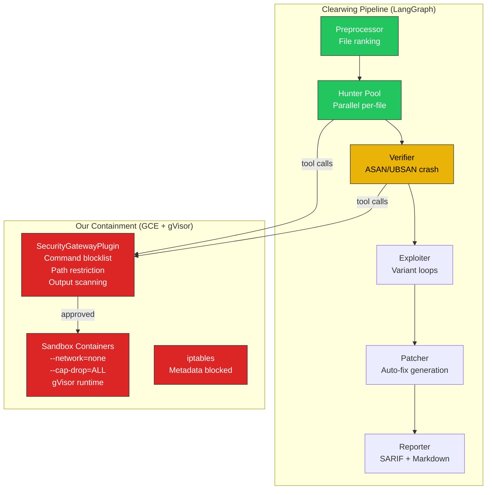
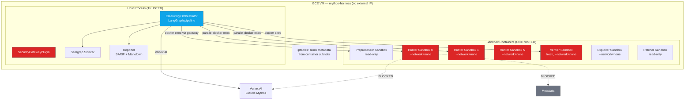
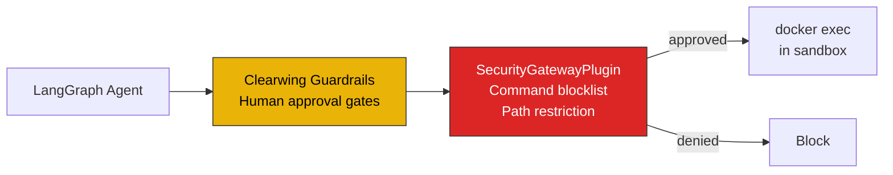
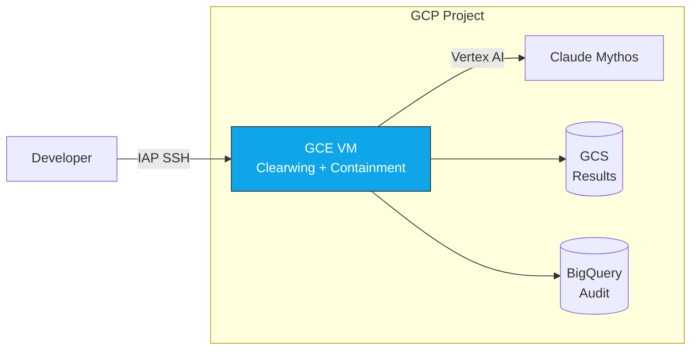

# Reference Architecture: Clearwing on GCP with Secure Containment

[Back to README](README.md) | [Containment Architecture](APPROACH.md) | [Harness Flow](agentic-harness/FLOW.md)

## Overview

[Clearwing](https://github.com/Lazarus-AI/clearwing) is an autonomous
vulnerability scanner built on LangGraph with a mature source-code hunting
pipeline. This document shows how to run Clearwing's source-code mode
inside our GCE containment architecture for secure, GCP-native deployment.

**What Clearwing brings**: Deep vuln-finding pipeline — preprocessing, file
ranking, parallel hunting, ASAN verification, variant loops, auto-patching,
mechanism memory, SARIF output.

**What our containment brings**: GCP-native security — gVisor sandboxes,
`--network=none`, SecurityGatewayPlugin, VPC isolation, metadata blocking,
credential separation, defense-in-depth.



## Architecture Mapping

### Clearwing's Source-Code Pipeline

```
Preprocessor → Ranker → Pool → Hunter (per-file) → Verifier → Exploiter → Variant Loop → Patcher → Reporter
```

Each stage maps to our containment model:

| Clearwing Stage | Needs Sandbox? | Containment Ring | Notes |
|---|---|---|---|
| **Preprocessor** | Read-only | Read-only sandbox | Lists files, parses structure, builds call graph |
| **Ranker** | Read-only | Read-only sandbox | Scores files by attack surface |
| **Hunter** (per-file) | Full sandbox | Full sandbox (`--network=none`) | Reads source, crafts inputs, runs ASAN binary |
| **Verifier** | Full sandbox | **Fresh** sandbox (same image) | Reproduces crash 3/3, ASAN ground truth |
| **Exploiter** | Full sandbox | Full sandbox | Variant loops, escalation attempts |
| **Patcher** | Read-only | Read-only sandbox | Generates fix, applies to source |
| **Semgrep sidecar** | None | Host process | Static analysis assist, no sandbox needed |
| **Reporter** | None | Host process | SARIF/markdown output, no sandbox needed |

### GCE VM Layout



## Integration Points

### 1. Sandbox Layer (`clearwing/sandbox/`)

Clearwing has its own sandbox module (`container.py`, `hunter_sandbox.py`).
Replace or wrap with our `sandbox/manager.py`:

| Clearwing's Sandbox | Our Containment | Change Needed |
|---|---|---|
| `docker run` with default settings | `docker run --runtime=runsc --network=none --cap-drop=ALL --user=1000:1000` | Add hardening flags to Clearwing's container builder |
| Network access possible | `--network=none` absolute | Clearwing's source-code mode shouldn't need network — verify |
| Standard Docker isolation | gVisor syscall interception | Add `--runtime=runsc` |
| No metadata blocking | iptables FORWARD rules on host | One-time host setup |

```python
# clearwing/sandbox/container.py — add hardening
HARDENING_FLAGS = [
    "--runtime=runsc",
    "--network=none",
    "--memory=8g",
    "--cap-drop=ALL",
    "--security-opt=no-new-privileges",
    "--user=1000:1000",
    "--tmpfs", "/tmp:rw,nosuid,size=512m",
]
```

### 2. Security Gateway

Clearwing uses LangGraph guardrails for tool approval. Layer our
SecurityGatewayPlugin as an additional checkpoint:



Clearwing's guardrails handle **exploit approval** (human-in-the-loop for
dangerous actions). Our gateway handles **containment** (block metadata access,
credential exfiltration, escape attempts). Complementary layers.

### 3. LLM Provider

Clearwing supports multiple providers. For GCP deployment, configure
Anthropic via Vertex AI:

```python
# Clearwing provider config — route through Vertex AI
providers:
  anthropic:
    model: claude-mythos  # or claude-opus-4-7
    # Use Vertex AI endpoint, not direct Anthropic API
    base_url: https://{region}-aiplatform.googleapis.com/v1/projects/{project}/locations/{region}/publishers/anthropic/models/
```

This keeps all model traffic within the GCP project boundary, subject to
VPC-SC and IAM controls. `anthropic.com` stays blocked in the egress proxy.

### 4. File Writes

Clearwing's `docker exec` needs to write files (PoCs, patches). Use our
stdin pipe pattern instead of `docker cp`:

```python
# Instead of docker cp (broken with gVisor):
subprocess.run(["docker", "cp", local_file, f"{container}:{path}"])

# Use stdin pipe:
subprocess.run(
    ["docker", "exec", "-i", container, "sh", "-c", f"cat > {path}"],
    input=content_bytes,
)
```

## Security Controls Mapping

### Our 9-Ring Model Applied to Clearwing

| Ring | Control | Clearwing Adaptation |
|---|---|---|
| 0 | Container Hardening | Add hardening flags to Clearwing's container builder |
| 1 | gVisor Runtime | `--runtime=runsc` on all hunter/verifier/exploiter containers |
| 2 | Egress Proxy | Not needed — `--network=none` is stronger. Clearwing source mode doesn't need internet |
| 3 | VPC Firewall | Same GCE VM setup as our harness |
| 4 | Cloud NGFW | Same — no sandbox egress to inspect |
| 5 | VPC-SC | Same — perimeter around Vertex AI, GCS |
| 6 | SecurityGatewayPlugin | Wrap Clearwing's tool execution with our plugin |
| 7 | On-prem proxy | Same — host egress only |
| 8 | Monitoring | Clearwing's audit system + Cloud Audit Logs |

### What Clearwing Adds to Our Security Model

| Clearwing Feature | Security Benefit |
|---|---|
| **Evidence levels** (suspicion → crash_reproduced → exploit_demonstrated) | Graduated trust — don't report unverified suspicions |
| **Human approval gates** | Exploit attempts require human confirmation |
| **Mechanism memory** | Avoid re-exploring dead ends across runs |
| **Historical findings DB** | Dedup across sessions — missing in our harness |
| **SARIF output** | CI/CD integration for automated gating |

## What Needs to Change in Clearwing

| Component | Current | Change for GCP Containment |
|---|---|---|
| `sandbox/container.py` | Basic Docker | Add gVisor, `--network=none`, hardening flags |
| `sandbox/hunter_sandbox.py` | May assume network | Verify source-code mode works without network |
| LLM provider config | Multi-provider | Configure Anthropic via Vertex AI |
| File I/O | Likely `docker cp` | Switch to stdin pipe for gVisor compatibility |
| `clearwing.py` entry point | Local execution | Run on GCE VM with IAP SSH access |
| Network pentest mode | Needs network | **Disable entirely** for this deployment |

## What Stays the Same

- LangGraph pipeline orchestration
- Source-code hunting logic (preprocessor, ranker, hunter, verifier)
- Variant loops and mechanism memory
- Auto-patching
- SARIF/markdown reporting
- Semgrep sidecar
- All evidence tracking and findings management

## Deployment Summary



1. Same GCE VM setup ([SETUP.md](SETUP.md))
2. Install Clearwing: `pip install clearwing` (or clone)
3. Patch sandbox module with hardening flags
4. Configure Vertex AI as LLM provider
5. Disable network pentest mode
6. Run: `clearwing hunt /target/src --provider anthropic --model claude-mythos`
