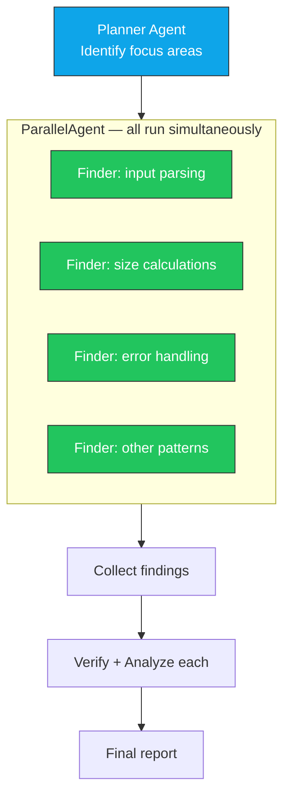
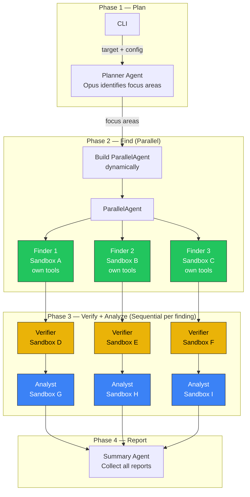

# Parallel Harness Architecture

Exploration of running multiple finder agents in parallel using ADK's
`ParallelAgent` and `ParallelWorker` patterns.

## Current (Sequential) Architecture


Each finder runs one at a time. 4 focus areas × ~3 min each = ~12 min of finding.
With verification and analysis: ~20 min total.

## Target: Parallel Architecture



4 finders run simultaneously: ~3 min total instead of ~12 min.

## ADK Patterns Available

### Option A: ParallelAgent

Fixed sub-agents, all run simultaneously:

```python
from google.adk.agents import ParallelAgent, SequentialAgent, Agent

parallel_finders = ParallelAgent(
    name="parallel_finders",
    sub_agents=[
        create_finder(focus="input parsing"),
        create_finder(focus="size calculations"),
        create_finder(focus="error handling"),
    ],
)
```

**Limitation**: Number of sub-agents fixed at definition time. Can't dynamically
add more based on planner output.

### Option B: ParallelWorker in WorkflowAgent

Fans out ONE agent across N inputs:

```python
from google.adk.agents.workflow.parallel_worker import ParallelWorker
from google.adk.agents.workflow.workflow_agent import WorkflowAgent
from google.adk.agents.workflow.base_node import START

workflow = WorkflowAgent(
    name="harness_workflow",
    edges=[
        (START, plan_node, ParallelWorker(finder_agent), collect_node, report_node),
    ],
)
```

`plan_node` outputs the focus areas, `ParallelWorker` fans out the finder
across each area, `collect_node` gathers results. **Dynamic** — N is determined
at runtime.

### Option C: Hybrid — Opus plans, then dynamic ParallelAgent

```python
# Step 1: Opus plans focus areas (tool call)
focus_areas = run_planner(target)  # returns ["parsing", "alloc", "error"]

# Step 2: Dynamically construct ParallelAgent
parallel_finders = ParallelAgent(
    name="parallel_finders",
    sub_agents=[create_finder(focus=area) for area in focus_areas],
)

# Step 3: Run the parallel finders
results = run_workflow(parallel_finders)

# Step 4: Sequential verify + analyze for each finding
for finding in results:
    verify(finding)
    analyze(finding)
```

## Key Challenge: Per-Container State

Current design uses a **global** `_CURRENT_CONTAINER` in `sandbox_tools.py`.
Parallel finders need separate containers simultaneously.

```python
# BROKEN for parallel:
_CURRENT_CONTAINER = None  # global — all finders stomp on each other

# NEEDED for parallel:
# Each finder's tools must reference ITS OWN container
```

### Solutions

**A. Thread-local storage**:
```python
import threading
_container_local = threading.local()

def set_container(name):
    _container_local.name = name

def _container():
    return _container_local.name
```
Each ThreadPoolExecutor thread gets its own container reference.

**B. Context-based (ADK tool_context)**:
```python
def read_file(path: str, tool_context) -> str:
    container = tool_context.state.get("container_name")
    return sandbox.execute(container, ["cat", path])
```
Container name stored in ADK session state per agent invocation.

**C. Container name baked into tool functions**:
```python
def create_finder_tools(container_name: str):
    def read_file(path: str) -> str:
        return sandbox.execute(container_name, ["cat", path])
    return [read_file, ...]
```
Each finder gets its own tool set with container name in closure.

**Option C is simplest** — no global state, no threading magic. Each parallel
finder gets tools that are bound to its own container via closure.

## Proposed Architecture



## Key Differences from Sequential

| Aspect | Sequential | Parallel |
|---|---|---|
| Finder execution | One at a time, Opus decides next | All simultaneously |
| Container state | Global `_CURRENT_CONTAINER` | Per-finder closure |
| PoC bytes | Single `_poc_bytes_store` | Per-finder, passed to verifier |
| Orchestration | Opus LLM decides flow at each step | WorkflowAgent / ParallelAgent — deterministic |
| Known bugs tracking | Opus tells each finder what's found | Shared `found_bugs.jsonl` (needs locking) |
| Time (4 areas) | ~20 min | ~8 min (finders parallel, verify/analyze sequential) |
| Token cost | Same | Same (same work, just concurrent) |
| Complexity | Simple (tool functions) | More complex (workflow agents, per-finder tools) |

## Validated Results

**ParallelAgent works with Claude on Vertex AI.** Tested and confirmed.

The implemented architecture:
- Phase 2: `ParallelAgent` runs N finders simultaneously (each with own sandbox + tools via closure)
- Phase 3: Sequential per finding — verifier sandbox created, PoC copied, verified, destroyed. Then analyst sandbox created, report produced, destroyed.
- 3/3 findings found, verified, analyzed, and reported in one run.

## Remaining Considerations

1. **Dedup across parallel finders** — Multiple finders may find the same bug
   (all 3 found Bug 3 in the canary test). Need runtime dedup via shared
   `found_bugs.jsonl` or a judge agent.

2. **Resource limits** — N parallel sandboxes × 8GB memory. The VM has ~30GB
   on n1-standard-8, so max ~3 parallel finders. Reduce memory or use a
   larger VM for more parallelism.

3. **Known bugs injection** — Each finder should know what other finders have
   already found. Currently they all find the same easiest bug.
