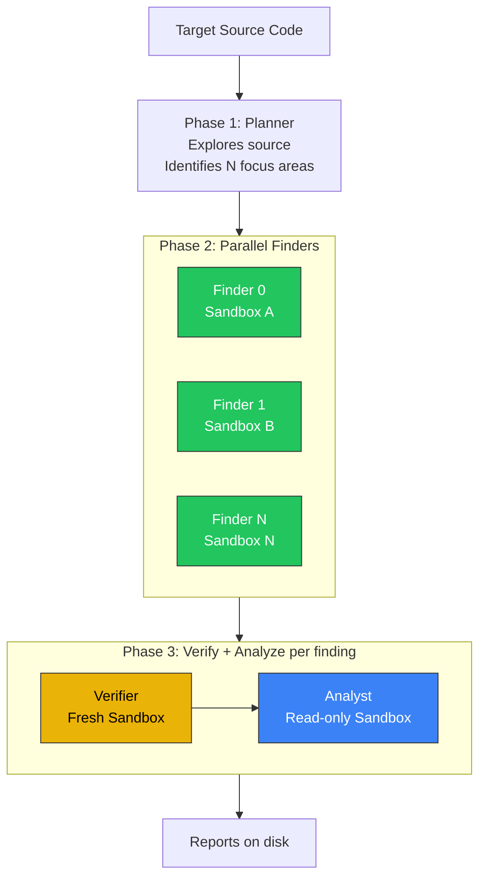

# Mythos Parallel Harness

Autonomous, parallel vulnerability research pipeline using Claude Mythos on
Google ADK with sandboxed execution on GCE.

## How It Works

Point it at a target codebase. Mythos plans the investigation, spawns parallel
finders, verifies each crash, and produces structured exploitability reports.



## Agents

| Agent | Model | Role | Sandbox |
|---|---|---|---|
| **Planner** | Mythos | Explores source, maps attack surface, identifies focus areas | Read-only |
| **Finder** (N parallel) | Mythos | Crafts PoC inputs, triggers ASAN crashes | Full (--network=none) |
| **Verifier** | Mythos / Opus | Reproduces PoC 3/3 in fresh sandbox, 5-criteria check | Fresh, PoC copied in |
| **Analyst** | Sonnet 4.6 | Root cause, exploitability, CVSS, remediation | Read-only |

## Quick Start

```bash
# On the GCE VM (mythos-harness)
cd ~/anthropic-mythos-on-gcp/agentic-harness-parallel
cp .env.example .env
# Edit .env with your project ID

# Build target
docker build -t mythos-canary:latest ../agentic-harness/targets/canary/

# Run — planner explores source, determines focus areas automatically
uv run python -m mythos_harness.cli ../agentic-harness/targets/canary --runtime runsc

# Skip planner, use config focus areas
uv run python -m mythos_harness.cli ../agentic-harness/targets/canary --runtime runsc --skip-planner

# Custom focus areas
uv run python -m mythos_harness.cli ../agentic-harness/targets/canary --runtime runsc \
  --focus-areas "buffer overflows in parsing" "integer overflow in allocation"
```

## Output

```
Phase 1: Planning — exploring source code
  [planner] Analyzing codebase...
    TOOL: list_files({'path': '/target/src', 'recursive': True})
    TOOL: read_file({'path': '/target/src/canary.c'})
    The codebase has a binary parser with three entry types...
  [planner] Focus areas (4):
    0: parse_name() heap-buffer-overflow READ — name_len without bounds check
    1: process_entries() heap-use-after-free — freed payload still dereferenced
    2: parse_data() integer overflow — uint16 truncation in allocation size
    3: parse_input() framing bugs — signed/unsigned mixing in offset arithmetic

Phase 2: Launching 4 finders in parallel
  [finder_0] Sandbox: find_canary_0 | Focus: parse_name() heap-buffer-overflow READ
  [finder_1] Sandbox: find_canary_1 | Focus: process_entries() heap-use-after-free
  ...
  [finder_0] PoC: 11 bytes at /tmp/poc.bin
  [finder_1] PoC: 11 bytes at /tmp/poc.bin
  ...

Phase 3: Verify and analyze 3 findings
  [verifier_0] Sandbox: grade_canary_0 | PoC: 11 bytes
  [analyst_0] Report: results/canary/20260418_170315/parse_name_0.md
  ...

Token Usage
  planner                                11,953 in     1,229 out    13,182 total
  finder_find_canary_0                   29,938 in     1,797 out    31,735 total
  ...
  TOTAL                                 172,510 in    21,254 out   193,764 total

Assessment complete. 3 reports in results/canary/20260418_170315
```

## Security

Every tool call passes through three independent choke points:

1. **ADK Tool Registration** — each agent only sees its allowed tools
2. **SecurityGatewayPlugin** — command blocklist, path restriction, output scanning
3. **Sandbox Isolation** — `--network=none`, `--cap-drop=ALL`, gVisor, non-root

See [FLOW.md](../agentic-harness/FLOW.md) for detailed security architecture.

## Key Design Decisions

| Decision | Why |
|---|---|
| **Planner runs by default** | Mythos should decide what to investigate, not hardcoded config |
| **Per-container tool closures** | Each finder gets tools bound to its own container via closure — no global state, safe for parallel |
| **Finders parallel, verify/analyze sequential** | Finders are independent. Verification needs the PoC from the finder (sequential dependency) |
| **PoC extracted after parallel phase** | All finders finish, then PoC bytes are read from each container before destruction |
| **Auto-save reports** | `run_analyst` saves to disk immediately — doesn't depend on orchestrator calling store_report |

## vs Sequential Harness

| | Sequential (`agentic-harness/`) | Parallel (`agentic-harness-parallel/`) |
|---|---|---|
| Planning | Opus decides at each step | Planner agent explores source upfront |
| Finding | One finder at a time | N finders simultaneously (ParallelAgent) |
| Orchestration | Opus LLM loop (tool calls) | Deterministic pipeline (plan → parallel find → sequential verify/analyze) |
| Container state | Global `_CURRENT_CONTAINER` | Per-finder closures |
| Time (3 areas) | ~20 min | ~8 min |
| Token cost | ~100K | ~190K (parallel finders overlap context) |
| Dedup | Opus tracks known bugs across calls | Not yet implemented |

## Files

```
agentic-harness-parallel/
├── mythos_harness/
│   ├── __init__.py          # dotenv loader
│   ├── cli.py               # Entry point
│   ├── config.py            # Target + model config
│   ├── pipeline.py          # Phase 1-3 pipeline orchestration
│   ├── agents/
│   │   ├── planner.py       # Explores source, outputs focus areas
│   │   ├── finder.py        # Finds vulns, crafts PoC
│   │   ├── verifier.py      # Reproduces 3/3 in fresh sandbox
│   │   └── analyst.py       # Exploitability report
│   ├── plugins/
│   │   └── security_gateway.py  # Command blocklist, path restriction
│   ├── sandbox/
│   │   └── manager.py       # Docker + gVisor lifecycle
│   └── tools/
│       └── sandbox_tools.py # Per-container tool factories
├── pyproject.toml
├── .env.example
├── DESIGN.md                # Architecture exploration + decisions
└── test_parallel.py         # ParallelAgent + Claude verification test
```
