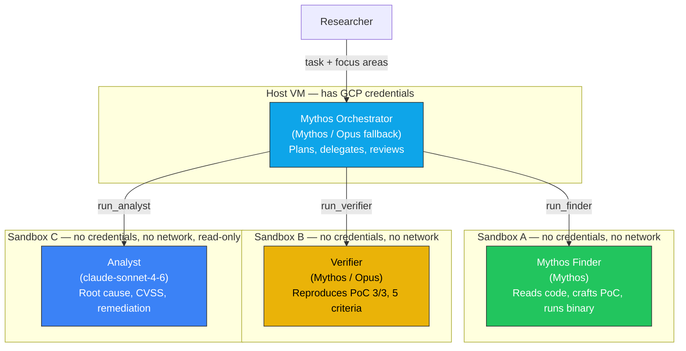
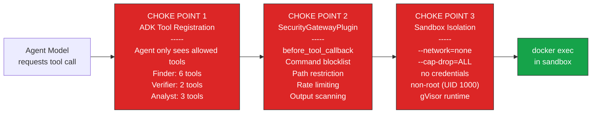
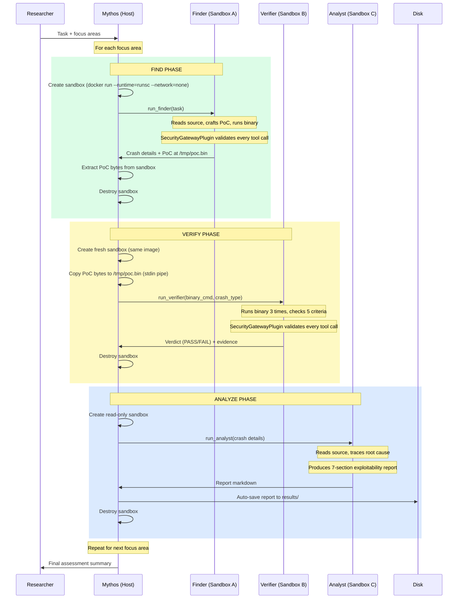
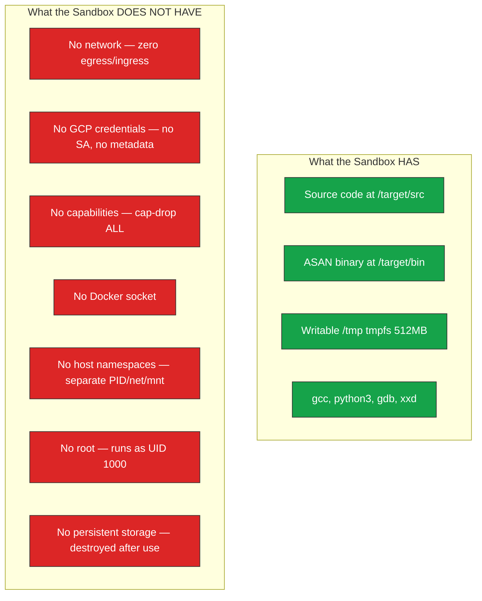
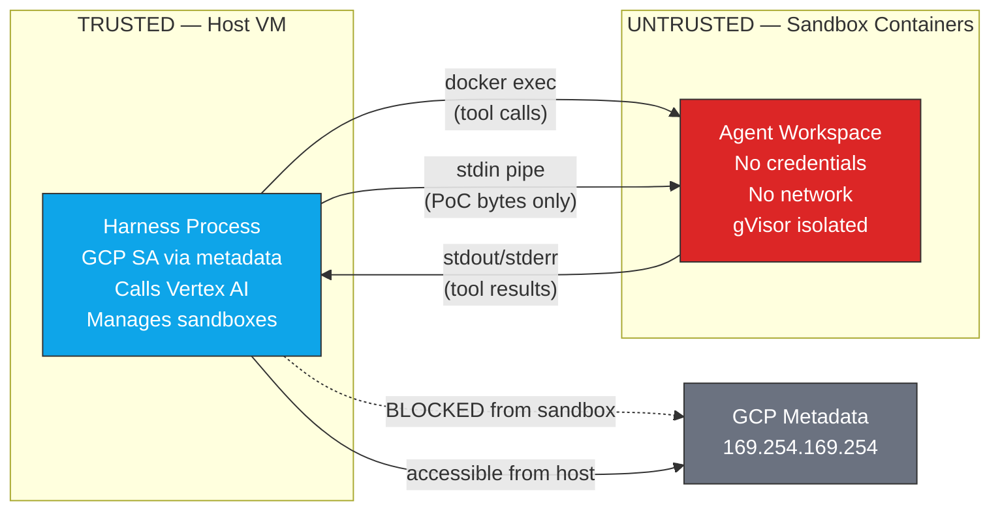
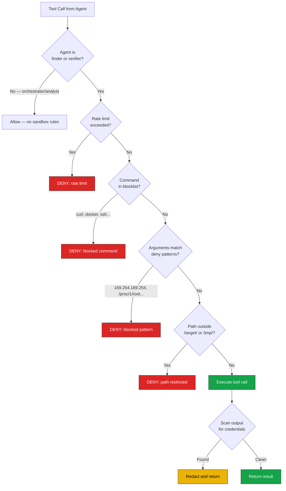

# Harness Flow: Security-First Multi-Agent Vulnerability Research

[Back to README](../README.md) | [Architecture](../APPROACH.md)

## Overview

A four-agent pipeline for automated vulnerability discovery, running on a
GCE VM with sandboxed containers. Every agent tool call passes through
multiple security choke points before reaching the sandbox.

## Agent Hierarchy



## Security Choke Points

Every tool call from a sub-agent passes through three independent choke
points. A call must pass ALL three to execute.



### Choke Point Details

| Choke Point | Layer | What It Blocks | Bypass Requires |
|---|---|---|---|
| **1. ADK Tool Registration** | Framework | Model can't call tools not in its list. Verifier has no `compile_code`. Analyst has no `run_command`. | Bug in ADK framework |
| **2. SecurityGatewayPlugin** | Application | Blocks `curl`, `docker`, `ssh`, `git`, `nc`. Blocks paths outside `/target/` and `/tmp/`. Blocks `169.254.169.254`, `/proc/1/root`, `/var/run/docker.sock`. Redacts credentials in output. | Bug in plugin code |
| **3. Sandbox Isolation** | Infrastructure | No network (can't exfiltrate). No capabilities (can't escape). No credentials (can't access GCP). gVisor intercepts syscalls. | Container runtime vulnerability |

## End-to-End Flow



## Sandbox Security Properties



## Trust Boundaries



**Data that crosses the trust boundary:**

| Direction | What | How |
|---|---|---|
| Host → Sandbox | Tool call commands | `docker exec` arguments |
| Host → Sandbox | PoC bytes (verifier only) | `docker exec -i sh -c 'cat > /tmp/poc.bin'` |
| Sandbox → Host | Tool call output (stdout/stderr) | `docker exec` return |
| Sandbox → Host | PoC file bytes (finder only) | `docker exec cat /tmp/poc.bin` |

**Data that NEVER crosses:**

| What | Why |
|---|---|
| GCP credentials | Sandbox has no SA, metadata blocked by iptables |
| Network traffic | `--network=none` on all sandboxes |
| Host filesystem | No volume mounts to host paths |
| Docker socket | Never mounted |
| Other sandbox state | Each sandbox is independent, destroyed after use |

## SecurityGatewayPlugin Detail



## GCE VM Security Context

```mermaid
graph TB
    subgraph "GCP Project — privacy-ml-lab1"
        subgraph "VPC: mythos-vpc (private)"
            subgraph "GCE VM: mythos-harness (no external IP)"
                HARNESS[Harness Process] --> DOCKER[Docker + gVisor]
                DOCKER --> SBX_A[Sandbox A]
                DOCKER --> SBX_B[Sandbox B]
                DOCKER --> SBX_C[Sandbox C]
                IPT[iptables: block metadata\nfrom container subnets]
            end

            FW1[Firewall: deny all ingress]
            FW2[Firewall: allow IAP SSH only]
        end

        NAT[Cloud NAT — egress only]
        SA[mythos-orchestrator-sa\nroles: aiplatform.user\nstorage.objectAdmin\nlogging.logWriter]
        VTXAI[Vertex AI\nClaude Mythos\nClaude Sonnet 4.6]
    end

    HARNESS -->|Private Google Access| VTXAI
    HARNESS -->|VM metadata| SA

    SBX_A -.->|BLOCKED| VTXAI
    SBX_A -.->|BLOCKED by iptables| SA

    style SBX_A fill:#dc2626,stroke:#333,color:#fff
    style SBX_B fill:#dc2626,stroke:#333,color:#fff
    style SBX_C fill:#dc2626,stroke:#333,color:#fff
    style HARNESS fill:#0ea5e9,stroke:#333,color:#fff
    style FW1 fill:#dc2626,stroke:#333,color:#fff
    style IPT fill:#dc2626,stroke:#333,color:#fff
