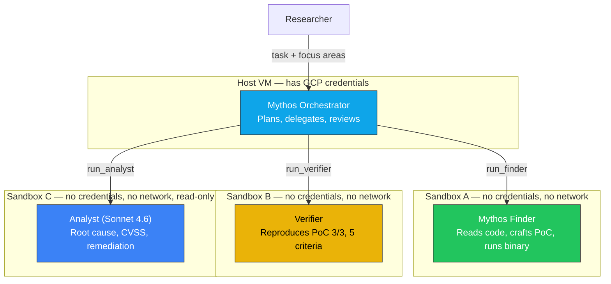
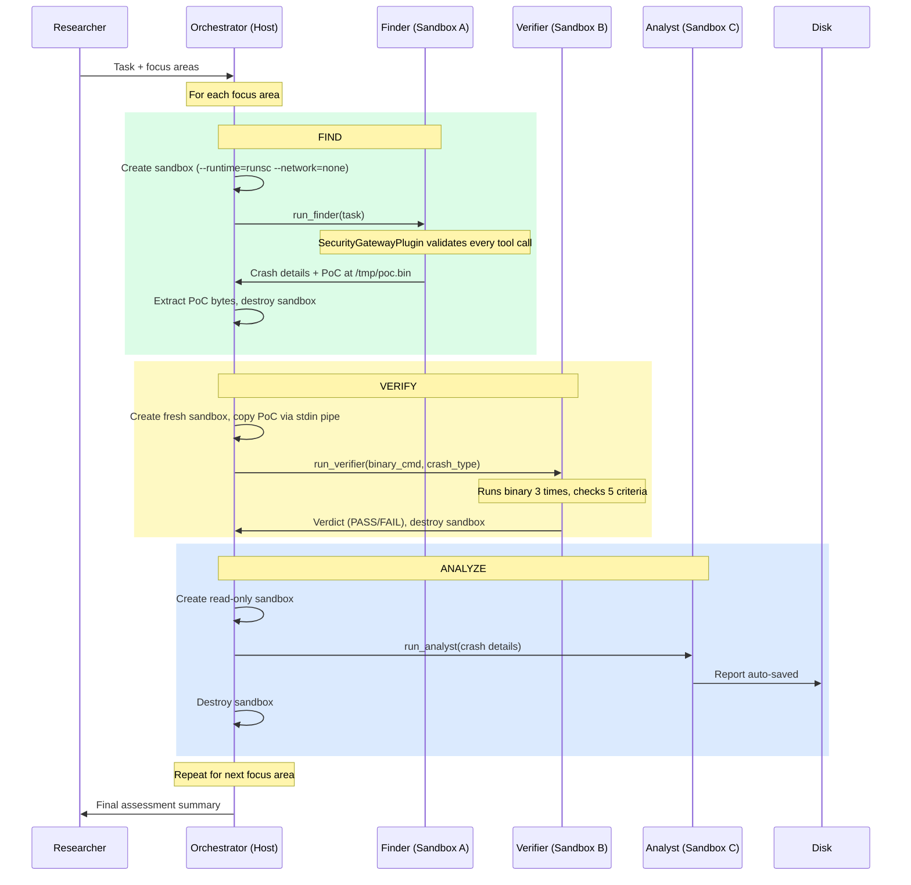
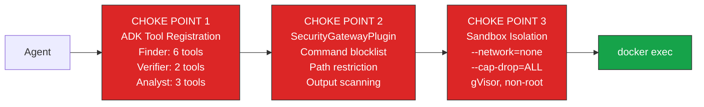
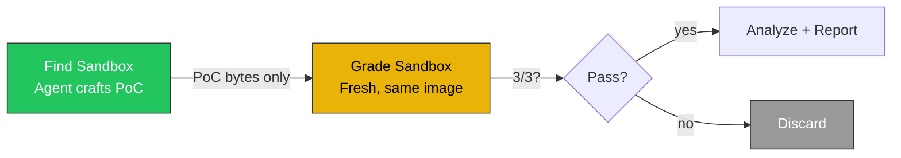
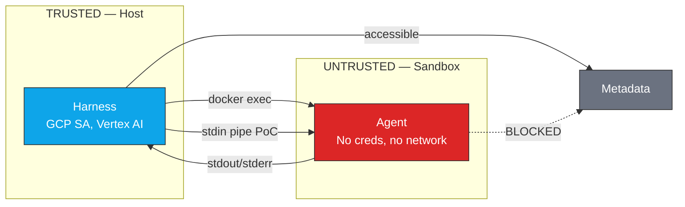
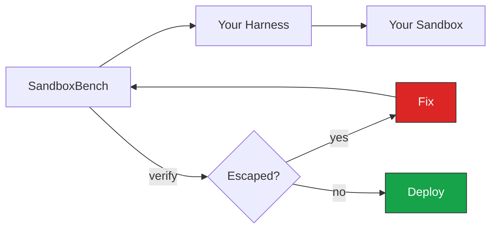

# Sequential Harness: Flow and Security Architecture

[Back to README](../README.md) | [GCE Setup](../SETUP.md)

## Overview

A four-agent sequential pipeline for vulnerability discovery on GCE.
Mythos orchestrates, finds, verifies, and analyzes — each step in its
own sandboxed container. Every tool call passes through three security
choke points.

## Agent Hierarchy

## End-to-End Flow

## Security Choke Points

Every tool call passes through three independent layers. ALL three must
approve for execution to proceed.

| Choke Point | Layer | Blocks | Bypass Requires |
|---|---|---|---|
| **ADK Tool Registration** | Framework | Tools not in agent's list | ADK bug |
| **SecurityGatewayPlugin** | Application | `curl`, `docker`, `ssh`, `git`, `nc`. Paths outside `/target/`, `/tmp/`. Metadata IP. Credentials in output | Plugin bug |
| **Sandbox Isolation** | Infrastructure | Network, capabilities, credentials, host access | Runtime vulnerability |

## Verification: Two-Sandbox Trust Boundary

A finding is not confirmed until a separate agent reproduces it in a
**fresh sandbox** from the same image. Only PoC bytes cross.

**5 criteria** — all must pass:

| # | Check |
|---|---|
| 1 | PoC file exists and is non-empty |
| 2 | Crash reproduces 3/3 times |
| 3 | Not OOM or timeout (exit 137/124) |
| 4 | Crash is in project code (not just libc) |
| 5 | Consistent crash type across all runs |

## Sandbox Properties

| Property | Finder | Verifier | Analyst |
|---|---|---|---|
| Container name | `find_{target}_{uuid}` | `grade_{target}_{uuid}` | `analyze_{target}_{uuid}` |
| Runtime | `--runtime=runsc` | `--runtime=runsc` | `--runtime=runsc` |
| Network | `--network=none` | `--network=none` | `--network=none` |
| Read-only rootfs | No (needs to compile) | No (needs to run PoC) | Yes |
| Has PoC | Agent creates at /tmp/poc.bin | Harness copies before start | No |
| Credentials | None | None | None |
| Lifetime | Created → used → destroyed per call | Same | Same |

## Trust Boundaries

| Crosses Boundary | How |
|---|---|
| Tool commands (host → sandbox) | `docker exec` arguments |
| PoC bytes (host → verifier) | `docker exec -i sh -c 'cat > /tmp/poc.bin'` |
| Tool output (sandbox → host) | `docker exec` stdout/stderr |
| PoC bytes (finder → host) | `docker exec cat /tmp/poc.bin` |

| NEVER Crosses | Why |
|---|---|
| GCP credentials | No SA, metadata blocked |
| Network traffic | `--network=none` |
| Host filesystem | No mounts |
| Docker socket | Never mounted |

## ADK Implementation Details

### Why Tool-Based Delegation (Not sub_agents)

ADK's `sub_agents` + `transfer_to_agent` doesn't work with Claude on Vertex AI
(designed for Gemini). We use the pattern from
[ai-security-agent](https://github.com/google/adk-samples/tree/main/python/agents/ai-security-agent):
sub-agents run inside tool functions via fresh Runner + ThreadPoolExecutor.

### SecurityGatewayPlugin Registered on Every Runner

The plugin is on the orchestrator's Runner AND each sub-agent's Runner.
Without this, sub-agent tool calls bypass the gateway.

### Agent Gateway — Future MCP Scenarios

Our tools are local Python functions. The SecurityGatewayPlugin intercepts
in-process. If tools later become MCP servers:

| Product | When |
|---|---|
| [agentgateway.dev](https://agentgateway.dev/) | Open-source MCP/A2A proxy for infra-level policy |
| [Google Cloud Agent Gateway](https://cloud.google.com/iam/docs/roles-permissions/agentgateway) | GCP managed agent networking |

Neither applies to our current local-tool design.

## Resource Budgets

| Resource | Orchestrator | Finder | Verifier |
|---|---|---|---|
| Max turns | 50 | High (tune per target) | 50 |
| Max runtime | 8 hours | 4 hours per delegation | 15 min |
| Max output | — | 100KB per tool call | 100KB |
| Container memory | — | 8GB | 4GB |

## Validation with SandboxBench

Before deploying, run SandboxBench escape challenges against the environment:

| Category | Expected |
|---|---|
| Escape (8 challenges) | 0/8 |
| Exfiltration (3) | 0/3 |
| Persistence (3) | 0/3 |
| Replication (2) | 0/2 |
