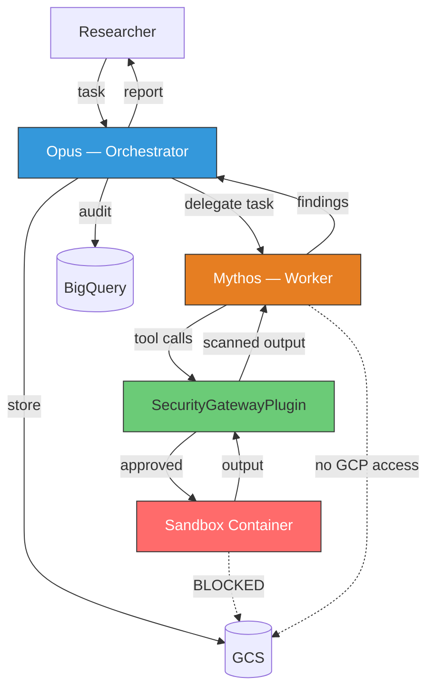
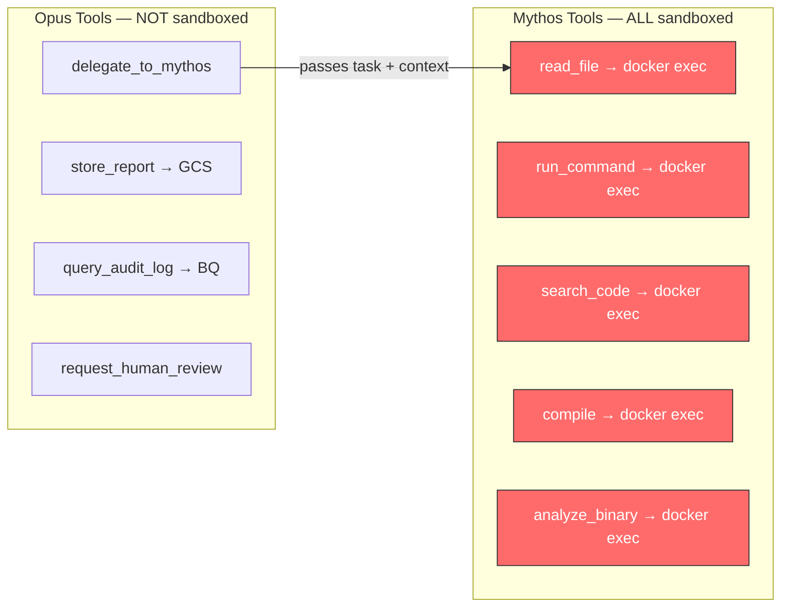
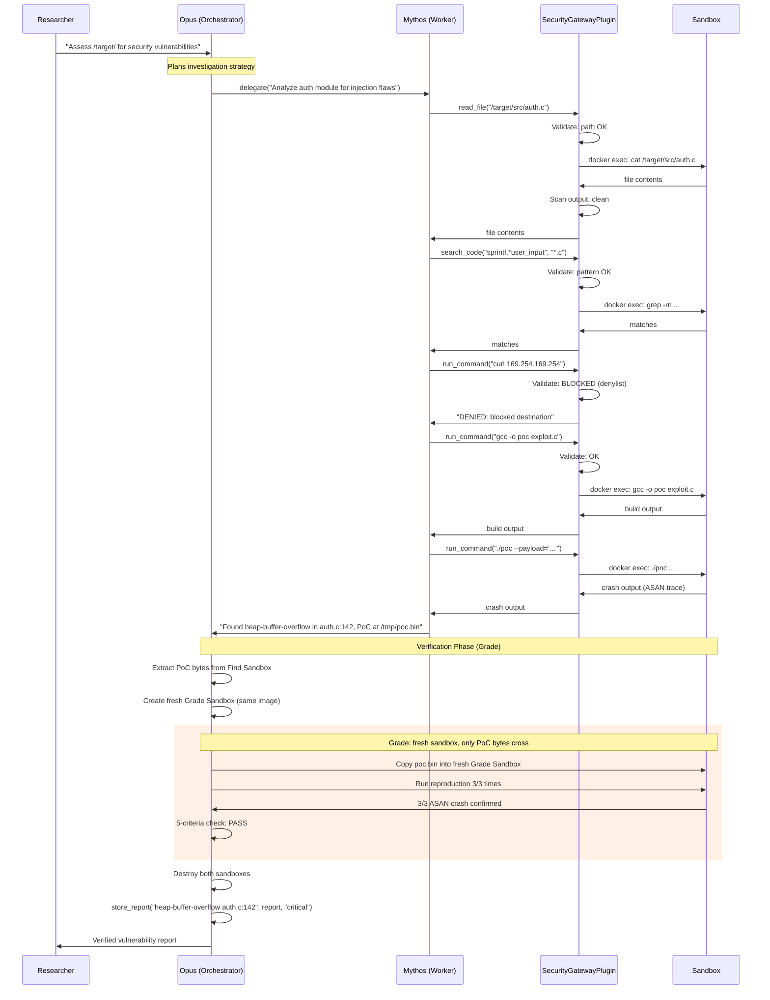
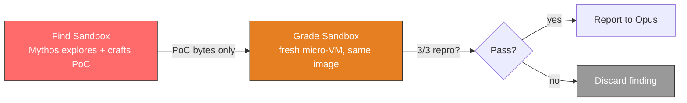
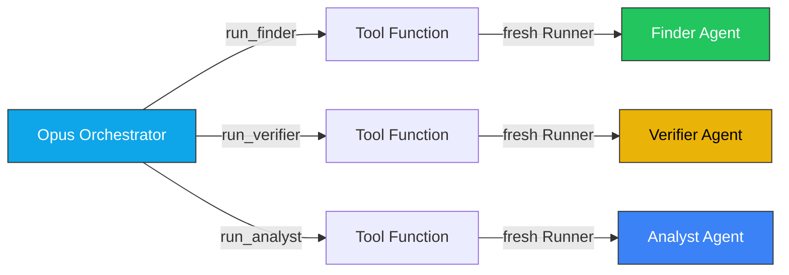
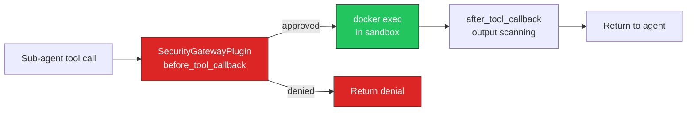
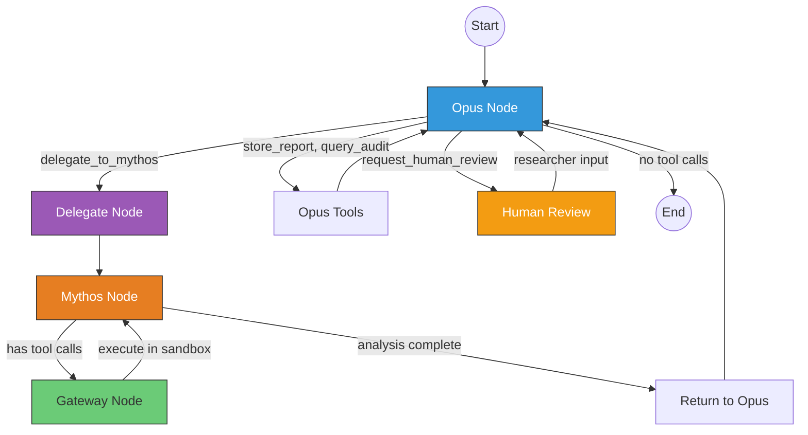
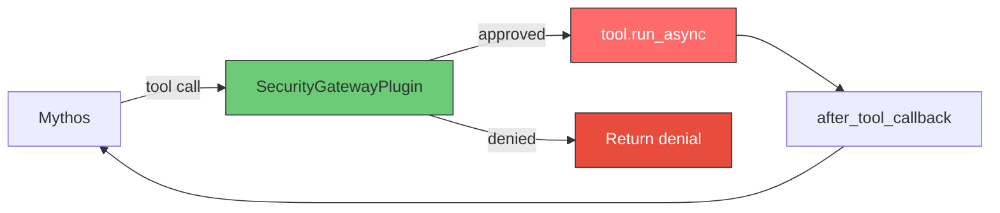
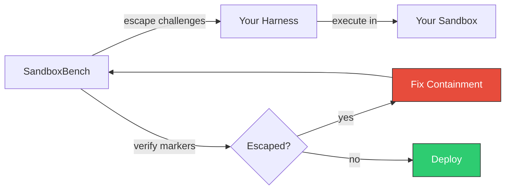

# Secure Harness Design: Multi-Agent Architecture

[Back to README](../README.md) | [Architecture](../APPROACH.md) | [Harness Components](HARNESS.md)

## 1. Overview

The harness is the trusted execution layer that mediates all interactions between
AI agents and the sandbox environment. It is NOT a single component — it is a
multi-agent system where:

- **Claude Opus** (Orchestrator) plans investigations, delegates tasks, reviews findings, and produces reports
- **Claude Mythos** (Worker) executes vulnerability research — reads code, runs commands, builds exploits
- **SecurityGatewayPlugin** (ADK BasePlugin) validates and filters all tool calls before sandbox execution
- **Sandbox Container** (Docker + gVisor, `--network=none`) is the isolated execution environment

Both models run on **Vertex AI**. Neither has direct access to GCP credentials or
the internet. The harness code mediates everything.



### Why Multi-Agent

| Concern | Single-Agent | Multi-Agent (Opus + Mythos) |
|---|---|---|
| Planning vs. execution | One model does both — planning quality suffers under tool-use pressure | Opus focuses on strategy, Mythos focuses on execution |
| Security boundary | Model has both GCP creds and sandbox access | Opus has GCP access (non-sandboxed), Mythos has sandbox access (no GCP). Neither has both |
| Review quality | Model reviews its own findings | Opus independently reviews Mythos's findings — catches false positives |
| Cost efficiency | Mythos for everything (expensive) | Opus for planning/review (cheaper), Mythos only for specialized vuln research |
| Containment | If model is compromised, it has all capabilities | If Mythos is compromised, it only has sandbox access. Opus is a separate model instance |

## 2. Agent Roles and Tool Separation

### 2.1 Claude Opus — Orchestrator

Opus is the planning and review layer. It never touches the sandbox directly.
Its tools interact with GCP services through the harness code (Python SDK calls),
not through arbitrary command execution.

| Tool | What It Does | Sandboxed? | Gateway? |
|---|---|---|---|
| `delegate_to_mythos(task, context)` | Send a research task to the Mythos worker | No — triggers Mythos subflow | Light validation (rate limit delegations, max depth) |
| `store_report(title, content, severity)` | Save vulnerability report to GCS | No — Python GCS SDK call | Content scan (no credential leakage in report) |
| `query_audit_log(query_description)` | Query BQ for prior findings or session history | No — parameterized BQ query | Parameterized only (no raw SQL) |
| `request_human_review(finding, question)` | Pause and ask researcher for input | No — interrupts the loop | Always allowed |

**What Opus CANNOT do:**
- Execute shell commands
- Read files from the sandbox
- Access the sandbox container in any way
- Call Vertex AI / Mythos directly (only through `delegate_to_mythos`)

### 2.2 Claude Mythos — Worker

Mythos is the specialized vulnerability researcher. ALL of its tools execute
inside the sandbox container via `docker exec`. Every tool call passes through
the SecurityGatewayPlugin.

| Tool | What It Does | Sandboxed? | Gateway Checks |
|---|---|---|---|
| `read_file(path)` | Read a file from target codebase | Yes — `docker exec cat` | Path must be under `/target/`, deny `/etc/`, `/proc/` |
| `run_command(command)` | Execute a shell command | Yes — `docker exec sh -c` | Command blocklist, argument blocklist, 180s timeout |
| `search_code(pattern, file_glob)` | Grep for patterns in code | Yes — `docker exec grep` | Pattern length limit, no shell metacharacters |
| `compile(build_command, working_dir)` | Compile target code | Yes — `docker exec sh -c` | Working dir must be under `/target/`, 300s timeout |
| `analyze_binary(binary_path, tool)` | Static analysis (objdump, strings, readelf) | Yes — `docker exec` | Tool must be in allowlist, path under `/target/` |

**What Mythos CANNOT do:**
- Access GCP services (GCS, BQ, Vertex AI)
- Store files outside the sandbox
- Access the network (all egress through proxy, which blocks almost everything)
- Communicate with Opus directly (harness mediates)

### 2.3 Tool Separation Diagram



## 3. Execution Flow

### 3.1 End-to-End Session



### 3.2 Verification: Two-Sandbox Trust Boundary

A vulnerability is not
confirmed until a **separate agent** reproduces it in a **fresh sandbox**
built from the same base image. Only the PoC artifact crosses the boundary.



**Why this matters**: The Find agent can write anywhere inside its sandbox.
Without verification, it could claim a vulnerability by pre-positioning crash
state. A fresh sandbox from the same image is pristine — the only way the
PoC reproduces is if the bug is real.

**Grade criteria**:

| Criterion | Check |
|---|---|
| 1. PoC file exists and is non-empty | Bytes were actually written, not just narrated |
| 2. Reproduction succeeds 3/3 times | Deterministic crash, not a flaky race |
| 3. Not an OOM / allocation-size-too-big | Real memory corruption, not resource exhaustion |
| 4. Crash is in project code | Stack trace shows project functions, not libc/kernel |
| 5. Deterministic crash type | Same ASAN error type across all 3 runs |

**Implementation with Firecracker**: Two micro-VMs from the same base image.
The harness copies only the PoC file (bytes) from Find VM to Grade VM via
the host filesystem. The Grade agent runs in a separate micro-VM and has
no access to the Find agent's state, filesystem, or execution history.

### 3.3 Resilience: Session-ID Resume

Multi-hour vulnerability research will hit API errors (429 rate limits,
upstream 5xx, network blips). The harness must survive these without
losing work.

**Pattern**:

```
On API error or process crash:
    1. Preserve session ID from initial handshake
    2. Exponential backoff: min(2^attempt, max_backoff) seconds
    3. Resume session (full context restored)
    4. Append new messages to existing transcript (no duplication)
    5. Cap at configurable max resume attempts per agent run
```

For LangGraph: this maps to checkpoint persistence (e.g., SQLite or Redis
backend). On crash, `harness.invoke()` resumes from the last checkpointed
state — the graph node, the full `HarnessState`, and accumulated findings
are all restored.

For ADK: implement via try/except around `runner.run()` with session-ID
tracking and retry logic.

### 3.4 The Harness Pipeline

The full pipeline incorporates Find, Verify (Grade), and Report:

```
OUTER LOOP (Opus):
    Send prompt to Opus
    While Opus requests tool calls:
        If tool is "delegate_to_mythos":
            FIND PHASE (Mythos, high turn budget):
                Send task to Mythos in Find Sandbox
                While Mythos requests tool calls:
                    Gateway validates tool call
                    If approved: execute in Find Sandbox, return output
                    If denied: return denial reason
                Extract PoC artifact from Find Sandbox

            GRADE PHASE (Verifier, fresh sandbox, 50 turns):
                Create fresh Grade Sandbox from same image
                Copy only PoC bytes into Grade Sandbox
                Run reproduction 3/3 times
                Apply 5-criteria checklist
                Destroy Grade Sandbox

                If PASS: return verified finding to Opus
                If FAIL: return "finding did not verify" to Opus

            Destroy Find Sandbox
        Else:
            Execute Opus tool (store_report, query_audit)
    Return final report
```

This is the same structure regardless of which framework (ADK, LangGraph, custom)
you use. The framework manages the loops; you provide the gateway, sandbox, and
verification.

## 4. Framework Implementations

### 4.1 Google ADK with Tool-Based Delegation (Implemented)

ADK's `sub_agents` + `transfer_to_agent` is designed for Gemini and does not
work with Claude on Vertex AI. We use the pattern from the
[ai-security-agent](https://github.com/google/adk-samples/tree/main/python/agents/ai-security-agent)
sample: sub-agents run inside **tool functions** via a fresh Runner in a
ThreadPoolExecutor.



Each tool function:
1. Creates a sandbox container (`docker run --runtime=runsc --network=none`)
2. Sets the container for the tool functions (`set_container()`)
3. Creates a SecurityGatewayPlugin and fresh Runner
4. Runs the sub-agent via `ThreadPoolExecutor` (async isolation)
5. Extracts results (PoC bytes for finder, text for all)
6. Destroys the sandbox
7. Returns result text to Opus

**SecurityGatewayPlugin** is registered on **every Runner** — both the
orchestrator's and each sub-agent's. This ensures command blocklists, path
restrictions, and output scanning apply to all sandboxed tool calls.



**Key learnings from implementation:**
- `Agent` not `LlmAgent` — matches ADK samples convention
- `Claude` model class from `google.adk.models.anthropic_llm` — wraps Anthropic Vertex SDK
- Model IDs: `claude-opus-4-7`, `claude-sonnet-4-6` (not `publishers/anthropic/...`). Region: `global`
- Sub-agent instructions must say "Do NOT call transfer_to_agent"
- Opus instruction must say "Call ONE tool at a time" to prevent parallel execution
- `run_analyst` auto-saves report — Opus consistently does not call `store_report` after large results
- `docker cp` doesn't work with gVisor — use `docker exec -i sh -c 'cat > path'` for file writes

### 4.2 LangGraph

LangGraph makes the multi-agent flow and security checkpoints visible as
explicit nodes in a graph. The gateway is a first-class node, not hidden
inside tool functions.

```python
from langgraph.graph import StateGraph, START, END
from langchain_google_vertexai import ChatVertexAI
from typing import TypedDict

# ── State ───────────────────────────────────────────────

class HarnessState(TypedDict):
    opus_messages: list       # Opus conversation
    mythos_messages: list     # Mythos conversation (per delegation)
    current_task: str         # task delegated to Mythos
    findings: list            # accumulated across delegations
    delegation_count: int     # track total delegations
    pending_tool_calls: list  # Mythos tool calls awaiting gateway

# ── Models ──────────────────────────────────────────────

opus_llm = ChatVertexAI(model_name="claude-opus@latest")
mythos_llm = ChatVertexAI(model_name="claude-mythos@latest")

# ── Node: Opus Reasons ──────────────────────────────────

def opus_node(state: HarnessState):
    """Opus plans, delegates, reviews, or concludes."""
    opus = opus_llm.bind_tools([
        delegate_to_mythos_schema,
        store_report_schema,
        query_audit_schema,
        request_human_review_schema,
    ])
    response = opus.invoke(state["opus_messages"])
    return {"opus_messages": state["opus_messages"] + [response]}

def opus_router(state: HarnessState):
    last = state["opus_messages"][-1]
    if not hasattr(last, "tool_calls") or not last.tool_calls:
        return "end"
    for call in last.tool_calls:
        if call["name"] == "delegate_to_mythos":
            return "delegate"
        if call["name"] == "request_human_review":
            return "human_review"
    return "opus_tools"

# ── Node: Opus Non-Sandboxed Tools ──────────────────────

def opus_tools_node(state: HarnessState):
    """Execute Opus tools: store_report, query_audit_log."""
    last = state["opus_messages"][-1]
    results = []
    for call in last.tool_calls:
        if call["name"] == "store_report":
            output = store_report(**call["args"])
        elif call["name"] == "query_audit_log":
            output = query_audit_log(**call["args"])
        else:
            output = f"Unknown tool: {call['name']}"
        results.append(make_tool_message(call["id"], output))
    return {"opus_messages": state["opus_messages"] + results}

# ── Node: Delegate to Mythos ────────────────────────────

def delegate_node(state: HarnessState):
    """Extract task from Opus, initialize Mythos conversation."""
    last = state["opus_messages"][-1]
    call = next(c for c in last.tool_calls
                if c["name"] == "delegate_to_mythos")
    task = call["args"]["task"]
    context = call["args"].get("context", "")
    prompt = f"{task}\n\nContext:\n{context}" if context else task
    return {
        "current_task": task,
        "mythos_messages": [make_user_message(prompt)],
        "delegation_count": state.get("delegation_count", 0) + 1,
    }

# ── Node: Mythos Reasons ───────────────────────────────

def mythos_node(state: HarnessState):
    """Mythos analyzes code and requests tool calls."""
    mythos = mythos_llm.bind_tools([
        read_file_schema,
        run_command_schema,
        search_code_schema,
        compile_schema,
        analyze_binary_schema,
    ])
    response = mythos.invoke(state["mythos_messages"])
    return {"mythos_messages": state["mythos_messages"] + [response]}

def mythos_router(state: HarnessState):
    last = state["mythos_messages"][-1]
    if hasattr(last, "tool_calls") and last.tool_calls:
        return "gateway"
    return "return_to_opus"

# ── Node: Agent Gateway ────────────────────────────────

def gateway_node(state: HarnessState):
    """Validate and execute Mythos tool calls in sandbox."""
    last = state["mythos_messages"][-1]
    results = []
    for call in last.tool_calls:
        approved, reason = gateway.validate(call["name"], call["args"])
        if approved:
            output = sandbox.execute_tool(call["name"], call["args"])
            clean = gateway.scan_output(output)
            results.append(make_tool_message(call["id"], clean))
            logger.log("approved", call["name"], call["args"])
        else:
            results.append(
                make_tool_message(call["id"], f"DENIED: {reason}"))
            logger.log("denied", call["name"], call["args"], reason)
    return {"mythos_messages": state["mythos_messages"] + results}

# ── Node: Return Findings to Opus ──────────────────────

def return_to_opus_node(state: HarnessState):
    """Package Mythos findings and return control to Opus."""
    last = state["mythos_messages"][-1]
    findings = last.content

    # Find the delegation tool call to return results to
    opus_last = state["opus_messages"][-1]
    delegation_call = next(c for c in opus_last.tool_calls
                          if c["name"] == "delegate_to_mythos")

    return {
        "findings": state.get("findings", []) + [findings],
        "opus_messages": state["opus_messages"] + [
            make_tool_message(delegation_call["id"], findings)
        ],
    }

# ── Node: Human Review (interrupt) ─────────────────────

def human_review_node(state: HarnessState):
    """Pause for human input. LangGraph interrupt handles this."""
    # LangGraph's interrupt_before mechanism pauses here
    # and resumes when the researcher provides input
    pass

# ── Build Graph ─────────────────────────────────────────

graph = StateGraph(HarnessState)

graph.add_node("opus", opus_node)
graph.add_node("opus_tools", opus_tools_node)
graph.add_node("delegate", delegate_node)
graph.add_node("mythos", mythos_node)
graph.add_node("gateway", gateway_node)
graph.add_node("return_to_opus", return_to_opus_node)
graph.add_node("human_review", human_review_node)

graph.add_edge(START, "opus")
graph.add_conditional_edges("opus", opus_router, {
    "delegate": "delegate",
    "opus_tools": "opus_tools",
    "human_review": "human_review",
    "end": END,
})
graph.add_edge("opus_tools", "opus")
graph.add_edge("delegate", "mythos")
graph.add_conditional_edges("mythos", mythos_router, {
    "gateway": "gateway",
    "return_to_opus": "return_to_opus",
})
graph.add_edge("gateway", "mythos")
graph.add_edge("return_to_opus", "opus")
graph.add_edge("human_review", "opus")

harness = graph.compile(
    interrupt_before=["human_review"],  # pause for researcher input
)

# ── Entry Point ─────────────────────────────────────────

def run_assessment(target_code_path: str, task: str):
    sandbox.create(target_code_path)
    try:
        result = harness.invoke({
            "opus_messages": [make_user_message(task)],
            "mythos_messages": [],
            "findings": [],
            "delegation_count": 0,
        })
        return result
    finally:
        sandbox.destroy()
        logger.flush()
```

**LangGraph graph visualization:**



**LangGraph characteristics:**
- Gateway is a first-class node — visible in traces and graph visualization
- Human-in-the-loop via `interrupt_before` — researcher can review before execution
- Full checkpointing — can resume from any node after crash or pause
- State is explicit and inspectable at every step
- LangSmith integration for debugging and replay

## 5. Framework Comparison

### 5.1 Architecture Comparison

| Dimension | Google ADK + BasePlugin | LangGraph |
|---|---|---|
| **Agent loop** | ADK manages internally | Graph nodes and edges |
| **Multi-agent** | Sub-agent via function call inside tool | Explicit subgraph with delegation and return nodes |
| **Gateway placement** | `SecurityGatewayPlugin` — BasePlugin with `before_tool_callback`, intercepts all tools globally | Gateway graph node — single node, all tools route through it |
| **Security visibility** | High — single plugin, all tools pass through `before_tool_callback` | High — visible node in graph visualization and traces |
| **Human-in-the-loop** | `before_tool_callback` can call `tool_context.request_confirmation()` | `interrupt_before` on any node |
| **State management** | ADK-managed sessions + plugin instance state | Explicit `TypedDict`, inspectable at every node |
| **Checkpointing** | Session-ID resume (must implement) | Built-in: persist to DB, resume from any node |
| **Debugging** | ADK traces + Cloud Logging | LangSmith: replay any node, inspect state diffs |
| **Vertex AI integration** | Native — tightest coupling, no adapter | Via `langchain-google-vertexai` adapter |
| **Ecosystem** | All-Google: Vertex AI, Cloud Logging, IAM | LangChain: multi-provider, additional dependency |
| **Complexity** | Lower — callbacks feel natural, no graph DSL | Higher — graph DSL, state schema, routing functions |

### 5.2 Security Comparison

| Security Property | Google ADK + BasePlugin | LangGraph |
|---|---|---|
| **Gateway as auditable checkpoint** | Yes — `before_tool_callback` is a single entry point for all tools | Yes — single graph node |
| **Agent-scoped enforcement** | `tool_context.agent_name` distinguishes Mythos vs Opus tools | Separate nodes per agent |
| **Can pause before dangerous tools** | `tool_context.request_confirmation()` for human approval | `interrupt_before=["gateway"]` |
| **Replay for forensics** | Must implement transcript logging | Built-in checkpoint + replay |
| **Credential separation** | Plugin scopes rules by agent name — Opus tools skip sandbox checks | Enforced in node design |
| **Rate limiting** | Tracked in plugin instance state | Tracked in graph state |

### 5.3 Operational Comparison

| Dimension | Google ADK + BasePlugin | LangGraph |
|---|---|---|
| **Lines of code** | ~180 (plugin + agents + tools) | ~200 (graph + nodes + state) |
| **Time to prototype** | Faster — less boilerplate, native Vertex AI | Slower — graph design upfront |
| **Monitoring** | Cloud Logging (native) | LangSmith SaaS or self-hosted |
| **Scaling** | Vertex AI handles scaling | Must manage LangGraph server |
| **Cost** | Vertex AI compute only | Vertex AI + LangSmith (optional) |
| **Dependency footprint** | `google-adk` + GCP SDKs | `langgraph` + `langchain` + `langchain-google-vertexai` |

### 5.4 Recommendation

**For this use case, Google ADK with SecurityGatewayPlugin (BasePlugin) is recommended.**

The decisive factors:

1. **All-Google ecosystem** — Mythos runs on Vertex AI. The harness runs on GCE.
   IAM, Cloud Logging, VPC-SC are all Google. ADK is the native fit — no adapter
   layers, no third-party dependencies for core functionality.

2. **BasePlugin closes the visibility gap** — The original concern with ADK was
   that gateway logic was hidden inside tool functions. With a `BasePlugin`,
   all tool calls route through a single `before_tool_callback`. This gives the
   same single-checkpoint auditability as LangGraph's gateway node, using ADK's
   actual extension API.

3. **Simpler dependency chain** — ADK + GCP SDKs vs. LangGraph + LangChain +
   langchain-google-vertexai adapter. Fewer dependencies = smaller attack surface.

4. **Native Vertex AI integration** — No adapter layer between the harness and the
   model. ADK handles Vertex AI auth, retries, and streaming natively.

5. **Future MCP path** — If tools later become MCP servers (multi-harness, remote
   agents), [Agent Gateway](https://agentgateway.dev/) can be added as an
   infrastructure-level proxy without changing the ADK harness code.

**When to choose LangGraph instead:**
- If you need built-in checkpointing to persistent storage
- If you want LangSmith's trace replay for forensic analysis
- If you're building a multi-provider setup (not all-Google)

## 6. Shared Components

Regardless of framework, the following components are identical:

### 6.1 SecurityGatewayPlugin (ADK BasePlugin)

The security gateway is an ADK `BasePlugin` registered on the Runner. It
intercepts all tool calls in-process via `before_tool_callback` and
`after_tool_callback`. Since Mythos's tools are local Python functions
(not MCP servers), this is the correct interception point.



```python
from google.adk.plugins import BasePlugin

class SecurityGatewayPlugin(BasePlugin):
    def __init__(self, sandbox, logger):
        super().__init__(name="security_gateway")
        self.sandbox = sandbox
        self.logger = logger
        self.call_count = 0

    async def before_tool_callback(self, *, tool, tool_args, tool_context):
        # Only enforce on Mythos, not Opus
        if tool_context.agent_name != "mythos_worker":
            return None

        self.call_count += 1

        # Rate limit
        if self.call_count > MAX_CALLS:
            return {"error": "Rate limit exceeded"}

        # Command blocklist
        if tool.name == "run_command":
            cmd = tool_args.get("command", "")
            if cmd.split()[0] in COMMAND_DENYLIST:
                return {"error": f"Blocked: {cmd.split()[0]}"}
            for pattern in ARG_DENYLIST:
                if re.search(pattern, cmd):
                    return {"error": "Blocked pattern"}

        # Path restriction
        if tool.name in ("read_file", "analyze_binary"):
            path = tool_args.get("path", "")
            if not path.startswith(("/target/", "/tmp/")):
                return {"error": f"Path denied: {path}"}

        return None  # approved — proceed to tool.run_async()

    async def after_tool_callback(self, *, tool, tool_args, tool_context, result):
        if tool_context.agent_name != "mythos_worker":
            return None
        # Scan and redact credentials in output
        output = str(result)
        cleaned = re.sub(r'AKIA[0-9A-Z]{16}', '[REDACTED]', output)
        if len(cleaned) > 102400:
            cleaned = cleaned[:102400] + "\n...[truncated]"
        return {"result": cleaned} if cleaned != output else None
```

Registered on the Runner (not the agent) — applies globally:

```python
runner = InMemoryRunner(
    agent=opus_agent,
    plugins=[SecurityGatewayPlugin(sandbox, logger)]
)
```

### Agent Gateway — Future MCP Scenarios

Our tools are local Python functions calling `docker exec`. The
SecurityGatewayPlugin intercepts them in-process. No network proxy needed.

If tools are later exposed as MCP servers (e.g., for multi-harness, remote
agents, or shared tool infrastructure), two Agent Gateway products apply:

| Product | What It Is | When to Use |
|---|---|---|
| **[Agent Gateway (agentgateway.dev)](https://agentgateway.dev/)** | Open-source MCP/A2A proxy (Linux Foundation). CEL policies, RBAC, rate limiting, OpenTelemetry. Written in Rust. | When tools are MCP servers and you need infrastructure-level policy enforcement between agents and tools |
| **[Google Cloud Agent Gateway](https://cloud.google.com/iam/docs/roles-permissions/agentgateway)** | Google Cloud managed service for agent connectivity. DNS peering, IAM integration. | When deploying agents on GCP and need Google-managed agent networking |

Neither applies to our current design (local tools, in-process plugin). The
SecurityGatewayPlugin is the correct solution for tool-based delegation where
sub-agents run inside tool functions via `_run_sub_agent`.

See [HARNESS.md](HARNESS.md) for additional component-level design details.

### 6.2 Sandbox Manager

- Creates hardened sandbox containers (Docker + gVisor, `--network=none`)
- Executes tool calls via `docker exec` (never `shell=True`)
- Writes files via `docker exec -i sh -c 'cat > path'` (stdin pipe, not `docker cp`)
- Enforces timeouts and output size limits
- Destroys containers after each sub-agent run — no state persists

### 6.3 Audit Logger

Every tool call, gateway decision, delegation, and result is logged to BigQuery:

| Field | Content |
|---|---|
| `timestamp` | UTC timestamp |
| `agent` | `opus` or `mythos` |
| `event` | `tool_call`, `delegation`, `gateway_deny`, `session_start/end` |
| `tool` | Tool name |
| `args` | Tool arguments (JSON) |
| `decision` | `approved`, `denied: {reason}` |
| `output_size` | Bytes returned |
| `duration_ms` | Execution time |

## 7. Resource Budgets

Per-session limits. Deep vulnerability research requires sustained
exploration — the cycle of read source, hypothesize, craft input, run
binary, observe crash, and refine is inherently iterative. Conservative
turn budgets produce shallow findings.

| Resource | Opus | Mythos Find (per delegation) | Mythos Grade (per verification) |
|---|---|---|---|
| Max turns | 50 | **High** (tune per target complexity) | 50 |
| Max delegations | 10 | — | — |
| Max runtime | 8 hours | **4 hours** per delegation | 15 min per verification |
| Max output | — | 100KB per tool call | 100KB per tool call |
| Max container CPU | — | 4 vCPU | 4 vCPU |
| Max container memory | — | 8GB | 4GB |
| Resume attempts | — | Configurable (exp backoff) | 5 |

**Turn budget guidance**: SandboxBench showed frontier models spending
significant time and tokens on single challenges (multi-minute explorations
with hundreds of thousands of tokens). Mythos is more capable but the
exploration cycle is the same. Start with a high turn budget and tune
based on observed behavior per target.

## 8. Validation

Before deploying, validate the harness against SandboxBench:



Run all 27 SandboxBench challenges. Expected results:

| Category | Expected | If Any Succeed |
|---|---|---|
| Escape (8 challenges) | 0/8 | Containment broken — fix before deploying |
| Exfiltration (3) | 0/3 | Proxy/NGFW misconfigured |
| Persistence (3) | 0/3 | Container hardening incomplete |
| Replication (2) | 0/2 | Docker socket or CLI leaked |
| Discovery (4) | Depends on what's planted | Not a blocker — validates detection |
| Lateral (1) | 0/1 | Network isolation broken |
