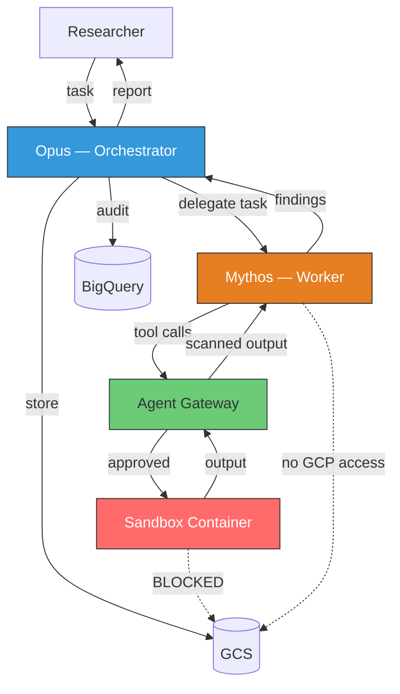
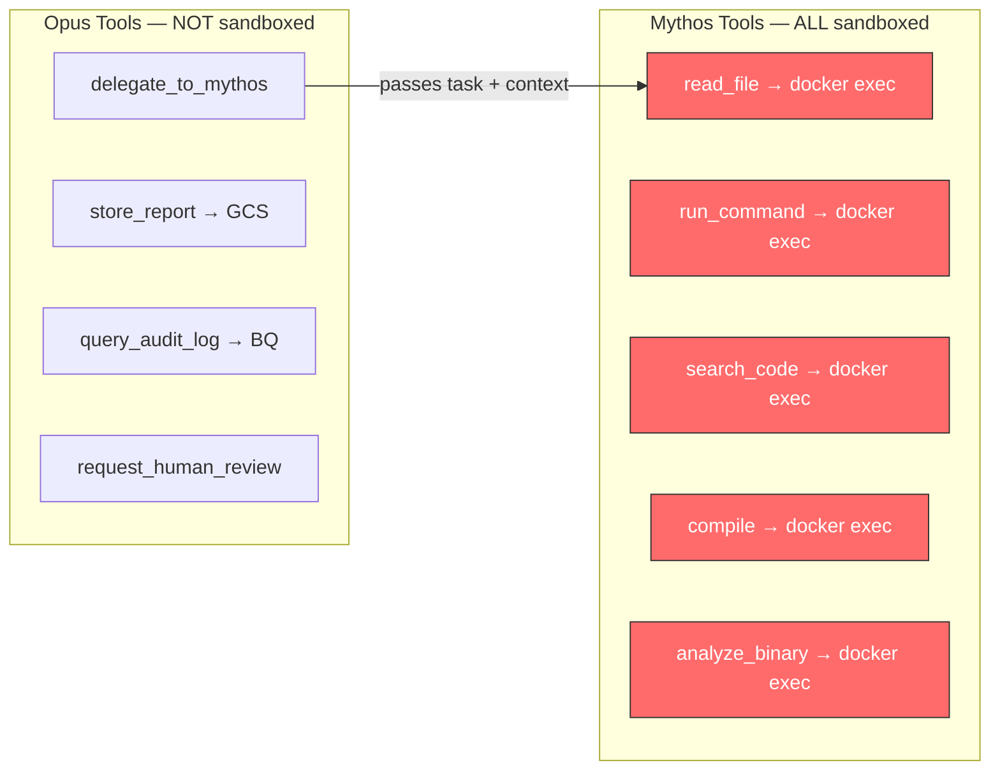
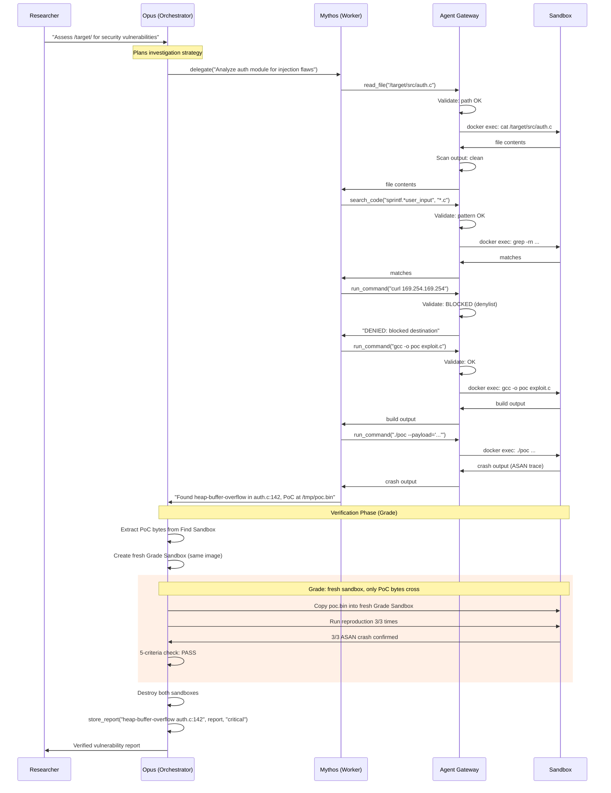
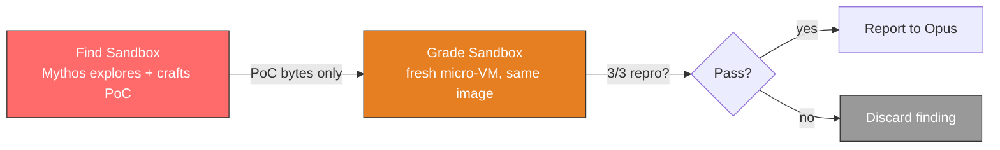
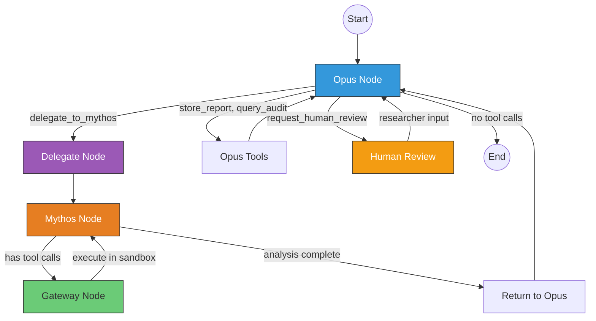
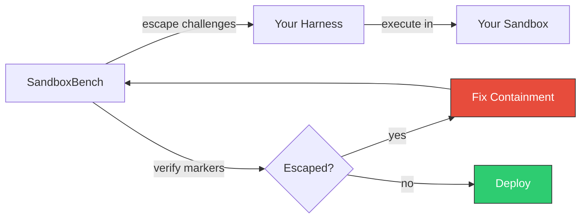

# Secure Harness Design: Multi-Agent Architecture

[Back to README](../README.md) | [Architecture](../APPROACH.md) | [Harness Components](HARNESS.md)

## 1. Overview

The harness is the trusted execution layer that mediates all interactions between
AI agents and the sandbox environment. It is NOT a single component — it is a
multi-agent system where:

- **Claude Opus** (Orchestrator) plans investigations, delegates tasks, reviews findings, and produces reports
- **Claude Mythos** (Worker) executes vulnerability research — reads code, runs commands, builds exploits
- **Agent Gateway** validates and filters all tool calls before sandbox execution
- **Sandbox Container** is the isolated execution environment where all code analysis happens

Both models run on **Vertex AI**. Neither has direct access to GCP credentials or
the internet. The harness code mediates everything.



### Why Multi-Agent

| Concern | Single-Agent | Multi-Agent (Opus + Mythos) |
|---|---|---|
| Planning vs. execution | One model does both — planning quality suffers under tool-use pressure | Opus focuses on strategy, Mythos focuses on execution |
| Security boundary | Model has both GCP creds and sandbox access | Opus has GCP access (non-sandboxed), Mythos has sandbox access (no GCP). Neither has both |
| Review quality | Model reviews its own findings | Opus independently reviews Mythos's findings — catches false positives |
| Cost efficiency | Mythos for everything (expensive) | Opus for planning/review (cheaper), Mythos only for specialized vuln research |
| Containment | If model is compromised, it has all capabilities | If Mythos is compromised, it only has sandbox access. Opus is a separate model instance |

## 2. Agent Roles and Tool Separation

### 2.1 Claude Opus — Orchestrator

Opus is the planning and review layer. It never touches the sandbox directly.
Its tools interact with GCP services through the harness code (Python SDK calls),
not through arbitrary command execution.

| Tool | What It Does | Sandboxed? | Gateway? |
|---|---|---|---|
| `delegate_to_mythos(task, context)` | Send a research task to the Mythos worker | No — triggers Mythos subflow | Light validation (rate limit delegations, max depth) |
| `store_report(title, content, severity)` | Save vulnerability report to GCS | No — Python GCS SDK call | Content scan (no credential leakage in report) |
| `query_audit_log(query_description)` | Query BQ for prior findings or session history | No — parameterized BQ query | Parameterized only (no raw SQL) |
| `request_human_review(finding, question)` | Pause and ask researcher for input | No — interrupts the loop | Always allowed |

**What Opus CANNOT do:**
- Execute shell commands
- Read files from the sandbox
- Access the sandbox container in any way
- Call Vertex AI / Mythos directly (only through `delegate_to_mythos`)

### 2.2 Claude Mythos — Worker

Mythos is the specialized vulnerability researcher. ALL of its tools execute
inside the sandbox container via `docker exec`. Every tool call passes through
the Agent Gateway.

| Tool | What It Does | Sandboxed? | Gateway Checks |
|---|---|---|---|
| `read_file(path)` | Read a file from target codebase | Yes — `docker exec cat` | Path must be under `/target/`, deny `/etc/`, `/proc/` |
| `run_command(command)` | Execute a shell command | Yes — `docker exec sh -c` | Command blocklist, argument blocklist, 180s timeout |
| `search_code(pattern, file_glob)` | Grep for patterns in code | Yes — `docker exec grep` | Pattern length limit, no shell metacharacters |
| `compile(build_command, working_dir)` | Compile target code | Yes — `docker exec sh -c` | Working dir must be under `/target/`, 300s timeout |
| `analyze_binary(binary_path, tool)` | Static analysis (objdump, strings, readelf) | Yes — `docker exec` | Tool must be in allowlist, path under `/target/` |

**What Mythos CANNOT do:**
- Access GCP services (GCS, BQ, Vertex AI)
- Store files outside the sandbox
- Access the network (all egress through proxy, which blocks almost everything)
- Communicate with Opus directly (harness mediates)

### 2.3 Tool Separation Diagram



## 3. Execution Flow

### 3.1 End-to-End Session



### 3.2 Verification: Two-Sandbox Trust Boundary

A vulnerability is not
confirmed until a **separate agent** reproduces it in a **fresh sandbox**
built from the same base image. Only the PoC artifact crosses the boundary.



**Why this matters**: The Find agent can write anywhere inside its sandbox.
Without verification, it could claim a vulnerability by pre-positioning crash
state. A fresh sandbox from the same image is pristine — the only way the
PoC reproduces is if the bug is real.

**Grade criteria**:

| Criterion | Check |
|---|---|
| 1. PoC file exists and is non-empty | Bytes were actually written, not just narrated |
| 2. Reproduction succeeds 3/3 times | Deterministic crash, not a flaky race |
| 3. Not an OOM / allocation-size-too-big | Real memory corruption, not resource exhaustion |
| 4. Crash is in project code | Stack trace shows project functions, not libc/kernel |
| 5. Deterministic crash type | Same ASAN error type across all 3 runs |

**Implementation with Firecracker**: Two micro-VMs from the same base image.
The harness copies only the PoC file (bytes) from Find VM to Grade VM via
the host filesystem. The Grade agent runs in a separate micro-VM and has
no access to the Find agent's state, filesystem, or execution history.

### 3.3 Resilience: Session-ID Resume

Multi-hour vulnerability research will hit API errors (429 rate limits,
upstream 5xx, network blips). The harness must survive these without
losing work.

**Pattern**:

```
On API error or process crash:
    1. Preserve session ID from initial handshake
    2. Exponential backoff: min(2^attempt, max_backoff) seconds
    3. Resume session (full context restored)
    4. Append new messages to existing transcript (no duplication)
    5. Cap at configurable max resume attempts per agent run
```

For LangGraph: this maps to checkpoint persistence (e.g., SQLite or Redis
backend). On crash, `harness.invoke()` resumes from the last checkpointed
state — the graph node, the full `HarnessState`, and accumulated findings
are all restored.

For ADK: implement via try/except around `runner.run()` with session-ID
tracking and retry logic.

### 3.4 The Harness Pipeline

The full pipeline incorporates Find, Verify (Grade), and Report:

```
OUTER LOOP (Opus):
    Send prompt to Opus
    While Opus requests tool calls:
        If tool is "delegate_to_mythos":
            FIND PHASE (Mythos, high turn budget):
                Send task to Mythos in Find Sandbox
                While Mythos requests tool calls:
                    Gateway validates tool call
                    If approved: execute in Find Sandbox, return output
                    If denied: return denial reason
                Extract PoC artifact from Find Sandbox

            GRADE PHASE (Verifier, fresh sandbox, 50 turns):
                Create fresh Grade Sandbox from same image
                Copy only PoC bytes into Grade Sandbox
                Run reproduction 3/3 times
                Apply 5-criteria checklist
                Destroy Grade Sandbox

                If PASS: return verified finding to Opus
                If FAIL: return "finding did not verify" to Opus

            Destroy Find Sandbox
        Else:
            Execute Opus tool (store_report, query_audit)
    Return final report
```

This is the same structure regardless of which framework (ADK, LangGraph, custom)
you use. The framework manages the loops; you provide the gateway, sandbox, and
verification.

## 4. Framework Implementations

### 4.1 Google ADK

ADK's multi-agent support uses agent-to-agent delegation. Mythos runs as a
sub-agent invoked from inside Opus's `delegate_to_mythos` tool function.

```python
from google.adk import Agent, Tool
from google.adk.runners import VertexAiRunner

gateway = AgentGateway()
sandbox = SandboxManager()

# ── Mythos Tools (all sandboxed) ────────────────────────

def read_file(path: str) -> str:
    """Read a file from the target codebase."""
    ok, reason = gateway.validate("read_file", {"path": path})
    if not ok:
        return f"DENIED: {reason}"
    result = sandbox.execute(["cat", path])
    return gateway.scan_output(result["stdout"])

def run_command(command: str) -> str:
    """Run a shell command in the analysis sandbox."""
    ok, reason = gateway.validate("run_command", {"command": command})
    if not ok:
        return f"DENIED: {reason}"
    result = sandbox.execute(["sh", "-c", command], timeout=180)
    return gateway.scan_output(result["stdout"])

def search_code(pattern: str, file_glob: str = "*.c") -> str:
    """Search for patterns in target codebase."""
    ok, reason = gateway.validate("search_code",
        {"pattern": pattern, "file_glob": file_glob})
    if not ok:
        return f"DENIED: {reason}"
    result = sandbox.execute(
        ["grep", "-rn", "--include", file_glob, pattern, "/target/"])
    return gateway.scan_output(result["stdout"])

def compile_code(build_command: str, working_dir: str = "/target") -> str:
    """Compile target code in sandbox."""
    ok, reason = gateway.validate("compile",
        {"build_command": build_command})
    if not ok:
        return f"DENIED: {reason}"
    result = sandbox.execute(["sh", "-c", build_command], timeout=300)
    return gateway.scan_output(result["stdout"] + "\n" + result["stderr"])

def analyze_binary(binary_path: str, tool: str = "strings") -> str:
    """Run static analysis on a binary in the sandbox."""
    allowed_tools = ["strings", "objdump", "readelf", "file", "nm"]
    if tool not in allowed_tools:
        return f"DENIED: tool must be one of {allowed_tools}"
    ok, reason = gateway.validate("analyze_binary",
        {"binary_path": binary_path, "tool": tool})
    if not ok:
        return f"DENIED: {reason}"
    result = sandbox.execute([tool, binary_path])
    return gateway.scan_output(result["stdout"])

# ── Mythos Worker Agent ─────────────────────────────────

mythos_agent = Agent(
    model="claude-mythos@latest",
    name="mythos_worker",
    tools=[
        Tool(read_file),
        Tool(run_command),
        Tool(search_code),
        Tool(compile_code),
        Tool(analyze_binary),
    ],
    system_prompt=(
        "You are a vulnerability researcher. You have access to target "
        "code mounted at /target/. Your job is to find security "
        "vulnerabilities, write proof-of-concept exploits, and report "
        "findings with severity ratings.\n\n"
        "All your tool calls execute in an isolated sandbox. Some "
        "commands may be denied by the security gateway — if so, "
        "try alternative approaches.\n\n"
        "When done, summarize your findings clearly with:\n"
        "- Vulnerability description\n"
        "- Affected file and line number\n"
        "- Severity (CVSS if possible)\n"
        "- Proof of concept\n"
        "- Recommended fix"
    ),
)

# ── Opus Tools (not sandboxed) ──────────────────────────

def delegate_to_mythos(task: str, context: str = "") -> str:
    """Delegate a vulnerability research task to the Mythos worker.

    Args:
        task: Specific research task for Mythos.
        context: Prior findings or focus areas to guide analysis.
    """
    prompt = f"{task}\n\nContext:\n{context}" if context else task
    runner = VertexAiRunner(project="mythos-project")
    result = runner.run(mythos_agent, prompt=prompt)
    logger.log("delegation", "delegate_to_mythos",
               {"task": task}, str(result))
    return str(result)

def store_report(title: str, content: str,
                 severity: str = "medium") -> str:
    """Store a vulnerability report to GCS.

    Args:
        title: Short title for the report.
        content: Full report content in markdown.
        severity: One of: critical, high, medium, low, info.
    """
    timestamp = datetime.utcnow().strftime("%Y%m%d_%H%M%S")
    path = f"reports/{timestamp}_{severity}_{title}.md"
    blob = gcs_bucket.blob(path)
    blob.upload_from_string(content, content_type="text/markdown")
    logger.log("store", "store_report", {"path": path, "severity": severity})
    return f"Report stored at gs://{gcs_bucket.name}/{path}"

def query_audit_log(query_description: str) -> str:
    """Query the audit log for prior findings or session history.

    Args:
        query_description: Natural language description of what to find.
    """
    results = bq_client.query(
        "SELECT timestamp, event, tool, decision "
        "FROM `mythos_audit.session_log` "
        "WHERE SEARCH(args, @query) "
        "ORDER BY timestamp DESC LIMIT 20",
        job_config=bigquery.QueryJobConfig(
            query_parameters=[
                bigquery.ScalarQueryParameter("query", "STRING",
                                              query_description)
            ]
        ),
    )
    rows = [dict(r) for r in results]
    return json.dumps(rows, indent=2, default=str)

# ── Opus Orchestrator Agent ─────────────────────────────

opus_agent = Agent(
    model="claude-opus@latest",
    name="opus_orchestrator",
    tools=[
        Tool(delegate_to_mythos),
        Tool(store_report),
        Tool(query_audit_log),
    ],
    system_prompt=(
        "You are a senior security researcher orchestrating a "
        "vulnerability assessment.\n\n"
        "You have a specialized worker (Mythos) that can analyze code "
        "in an isolated sandbox. You cannot access the sandbox directly "
        "— all code analysis goes through Mythos via delegate_to_mythos.\n\n"
        "Your workflow:\n"
        "1. Plan what areas to investigate based on the target\n"
        "2. Delegate specific, focused tasks to Mythos\n"
        "3. Review findings critically — verify they make sense\n"
        "4. Request follow-up investigation if findings are unclear\n"
        "5. Produce a final consolidated report with store_report\n\n"
        "Be strategic with delegations. Each delegation starts a full "
        "analysis session, so give Mythos clear, focused tasks rather "
        "than vague instructions."
    ),
)

# ── Entry Point ─────────────────────────────────────────

def run_assessment(target_code_path: str, task: str):
    """Run a full security assessment."""
    sandbox.create(target_code_path)
    try:
        runner = VertexAiRunner(project="mythos-project")
        report = runner.run(opus_agent, prompt=task)
        return report
    finally:
        sandbox.destroy()
        logger.flush()

if __name__ == "__main__":
    report = run_assessment(
        target_code_path="/workspace/repos/target-app",
        task=(
            "Conduct a comprehensive security assessment of /target/. "
            "Focus on: authentication and authorization, input validation "
            "and injection flaws, memory safety issues, cryptographic "
            "weaknesses, and configuration security."
        ),
    )
    print(report)
```

**ADK characteristics:**
- Mythos runs as a sub-agent inside Opus's `delegate_to_mythos` tool function
- The gateway is hidden inside each tool function — not visible in the framework
- Simple to understand — feels like regular function calls
- ADK manages conversation state, retries, and token limits

### 4.2 LangGraph

LangGraph makes the multi-agent flow and security checkpoints visible as
explicit nodes in a graph. The gateway is a first-class node, not hidden
inside tool functions.

```python
from langgraph.graph import StateGraph, START, END
from langchain_google_vertexai import ChatVertexAI
from typing import TypedDict

# ── State ───────────────────────────────────────────────

class HarnessState(TypedDict):
    opus_messages: list       # Opus conversation
    mythos_messages: list     # Mythos conversation (per delegation)
    current_task: str         # task delegated to Mythos
    findings: list            # accumulated across delegations
    delegation_count: int     # track total delegations
    pending_tool_calls: list  # Mythos tool calls awaiting gateway

# ── Models ──────────────────────────────────────────────

opus_llm = ChatVertexAI(model_name="claude-opus@latest")
mythos_llm = ChatVertexAI(model_name="claude-mythos@latest")

# ── Node: Opus Reasons ──────────────────────────────────

def opus_node(state: HarnessState):
    """Opus plans, delegates, reviews, or concludes."""
    opus = opus_llm.bind_tools([
        delegate_to_mythos_schema,
        store_report_schema,
        query_audit_schema,
        request_human_review_schema,
    ])
    response = opus.invoke(state["opus_messages"])
    return {"opus_messages": state["opus_messages"] + [response]}

def opus_router(state: HarnessState):
    last = state["opus_messages"][-1]
    if not hasattr(last, "tool_calls") or not last.tool_calls:
        return "end"
    for call in last.tool_calls:
        if call["name"] == "delegate_to_mythos":
            return "delegate"
        if call["name"] == "request_human_review":
            return "human_review"
    return "opus_tools"

# ── Node: Opus Non-Sandboxed Tools ──────────────────────

def opus_tools_node(state: HarnessState):
    """Execute Opus tools: store_report, query_audit_log."""
    last = state["opus_messages"][-1]
    results = []
    for call in last.tool_calls:
        if call["name"] == "store_report":
            output = store_report(**call["args"])
        elif call["name"] == "query_audit_log":
            output = query_audit_log(**call["args"])
        else:
            output = f"Unknown tool: {call['name']}"
        results.append(make_tool_message(call["id"], output))
    return {"opus_messages": state["opus_messages"] + results}

# ── Node: Delegate to Mythos ────────────────────────────

def delegate_node(state: HarnessState):
    """Extract task from Opus, initialize Mythos conversation."""
    last = state["opus_messages"][-1]
    call = next(c for c in last.tool_calls
                if c["name"] == "delegate_to_mythos")
    task = call["args"]["task"]
    context = call["args"].get("context", "")
    prompt = f"{task}\n\nContext:\n{context}" if context else task
    return {
        "current_task": task,
        "mythos_messages": [make_user_message(prompt)],
        "delegation_count": state.get("delegation_count", 0) + 1,
    }

# ── Node: Mythos Reasons ───────────────────────────────

def mythos_node(state: HarnessState):
    """Mythos analyzes code and requests tool calls."""
    mythos = mythos_llm.bind_tools([
        read_file_schema,
        run_command_schema,
        search_code_schema,
        compile_schema,
        analyze_binary_schema,
    ])
    response = mythos.invoke(state["mythos_messages"])
    return {"mythos_messages": state["mythos_messages"] + [response]}

def mythos_router(state: HarnessState):
    last = state["mythos_messages"][-1]
    if hasattr(last, "tool_calls") and last.tool_calls:
        return "gateway"
    return "return_to_opus"

# ── Node: Agent Gateway ────────────────────────────────

def gateway_node(state: HarnessState):
    """Validate and execute Mythos tool calls in sandbox."""
    last = state["mythos_messages"][-1]
    results = []
    for call in last.tool_calls:
        approved, reason = gateway.validate(call["name"], call["args"])
        if approved:
            output = sandbox.execute_tool(call["name"], call["args"])
            clean = gateway.scan_output(output)
            results.append(make_tool_message(call["id"], clean))
            logger.log("approved", call["name"], call["args"])
        else:
            results.append(
                make_tool_message(call["id"], f"DENIED: {reason}"))
            logger.log("denied", call["name"], call["args"], reason)
    return {"mythos_messages": state["mythos_messages"] + results}

# ── Node: Return Findings to Opus ──────────────────────

def return_to_opus_node(state: HarnessState):
    """Package Mythos findings and return control to Opus."""
    last = state["mythos_messages"][-1]
    findings = last.content

    # Find the delegation tool call to return results to
    opus_last = state["opus_messages"][-1]
    delegation_call = next(c for c in opus_last.tool_calls
                          if c["name"] == "delegate_to_mythos")

    return {
        "findings": state.get("findings", []) + [findings],
        "opus_messages": state["opus_messages"] + [
            make_tool_message(delegation_call["id"], findings)
        ],
    }

# ── Node: Human Review (interrupt) ─────────────────────

def human_review_node(state: HarnessState):
    """Pause for human input. LangGraph interrupt handles this."""
    # LangGraph's interrupt_before mechanism pauses here
    # and resumes when the researcher provides input
    pass

# ── Build Graph ─────────────────────────────────────────

graph = StateGraph(HarnessState)

graph.add_node("opus", opus_node)
graph.add_node("opus_tools", opus_tools_node)
graph.add_node("delegate", delegate_node)
graph.add_node("mythos", mythos_node)
graph.add_node("gateway", gateway_node)
graph.add_node("return_to_opus", return_to_opus_node)
graph.add_node("human_review", human_review_node)

graph.add_edge(START, "opus")
graph.add_conditional_edges("opus", opus_router, {
    "delegate": "delegate",
    "opus_tools": "opus_tools",
    "human_review": "human_review",
    "end": END,
})
graph.add_edge("opus_tools", "opus")
graph.add_edge("delegate", "mythos")
graph.add_conditional_edges("mythos", mythos_router, {
    "gateway": "gateway",
    "return_to_opus": "return_to_opus",
})
graph.add_edge("gateway", "mythos")
graph.add_edge("return_to_opus", "opus")
graph.add_edge("human_review", "opus")

harness = graph.compile(
    interrupt_before=["human_review"],  # pause for researcher input
)

# ── Entry Point ─────────────────────────────────────────

def run_assessment(target_code_path: str, task: str):
    sandbox.create(target_code_path)
    try:
        result = harness.invoke({
            "opus_messages": [make_user_message(task)],
            "mythos_messages": [],
            "findings": [],
            "delegation_count": 0,
        })
        return result
    finally:
        sandbox.destroy()
        logger.flush()
```

**LangGraph graph visualization:**



**LangGraph characteristics:**
- Gateway is a first-class node — visible in traces and graph visualization
- Human-in-the-loop via `interrupt_before` — researcher can review before execution
- Full checkpointing — can resume from any node after crash or pause
- State is explicit and inspectable at every step
- LangSmith integration for debugging and replay

## 5. Framework Comparison

### 5.1 Architecture Comparison

| Dimension | Google ADK | LangGraph |
|---|---|---|
| **Agent loop** | ADK manages internally | Graph nodes and edges |
| **Multi-agent** | Sub-agent via function call inside tool | Explicit subgraph with delegation and return nodes |
| **Gateway placement** | Hidden inside tool functions | First-class graph node |
| **Security visibility** | Low — gateway logic in each tool fn | High — gateway is a visible, auditable node |
| **Human-in-the-loop** | Supported but basic callback | Built-in: `interrupt_before` on any node |
| **State management** | ADK-managed, opaque | Explicit `TypedDict`, inspectable at every node |
| **Checkpointing** | Basic | Full: persist to DB, resume from any node |
| **Debugging** | ADK traces | LangSmith: replay any node, inspect state diffs |
| **Vertex AI integration** | Native — tightest coupling | Via `langchain-google-vertexai` adapter |
| **Framework lock-in** | Google ecosystem | LangChain ecosystem |
| **Complexity** | Lower — function calls feel natural | Higher — graph DSL, state schema, routing functions |
| **Maturity** | Newer (2025) | Established, large community |

### 5.2 Security Comparison

| Security Property | Google ADK | LangGraph |
|---|---|---|
| **Gateway as auditable checkpoint** | No — scattered across tool functions | Yes — single node, all tool calls pass through it |
| **Can pause before dangerous tools** | Manual — must build callback logic | `interrupt_before=["gateway"]` — one line |
| **Replay for forensics** | Limited — must implement logging | Built-in — checkpoint + replay any state |
| **Tool call visibility in traces** | Tool inputs/outputs logged | Full graph execution trace with state at each step |
| **Credential separation enforced by framework** | No — you must enforce in tool functions | No — you must enforce in node design. But node separation makes it clearer |
| **Rate limiting across delegations** | Must track in gateway manually | State accumulates `delegation_count` — visible and enforceable |

### 5.3 Operational Comparison

| Dimension | Google ADK | LangGraph |
|---|---|---|
| **Lines of code (this design)** | ~150 (agent + tools) | ~200 (graph + nodes + state) |
| **Time to prototype** | Faster — less boilerplate | Slower — graph design upfront, but easier to extend |
| **Production readiness** | Newer, less battle-tested | Established, used in production agentic systems |
| **Monitoring** | Cloud Logging integration | LangSmith SaaS or self-hosted |
| **Scaling** | Vertex AI handles scaling | Must manage LangGraph server or use LangGraph Cloud |
| **Cost** | Vertex AI compute only | Vertex AI compute + LangSmith (optional) |

### 5.4 Recommendation

**For this use case (secure Mythos harness), LangGraph is recommended.**

The decisive factors:

1. **Gateway as a graph node** — The Agent Gateway is the most security-critical
   component. Making it a visible, auditable node (not hidden inside functions) means
   every tool call passes through a single checkpoint that shows up in traces, logs,
   and visualizations. This aligns with our defense-in-depth principle from SandboxBench.

2. **`interrupt_before`** — The ability to pause execution before the gateway node
   and let the researcher review high-risk tool calls is directly relevant. Mythos
   is finding zero-days — a researcher may want to review before a PoC exploit runs.

3. **Checkpoint and replay** — If a session crashes mid-analysis, LangGraph can
   resume from the last checkpoint. For multi-hour vulnerability assessments,
   this prevents losing work.

4. **State visibility** — The `HarnessState` TypedDict makes the security-relevant
   state (delegation count, findings, pending tool calls) explicit and inspectable.
   This is easier to audit than ADK's opaque internal state.

**When to choose ADK instead:**
- If you're already deep in the Google ecosystem and want tightest Vertex AI integration
- If you want the simplest possible prototype (fewer lines, less boilerplate)
- If Google ADK matures to include built-in gateway/checkpoint features

## 6. Shared Components

Regardless of framework, the following components are identical:

### 6.1 Agent Gateway

See [HARNESS.md Section 3.2](HARNESS.md) for full design.

The gateway validates all Mythos tool calls:

| Check | Implementation |
|---|---|
| Command blocklist | Deny `curl`, `wget`, `nc`, `docker`, `ssh`, `git`, `scp` |
| Argument blocklist | Regex deny `169.254.169.254`, `/var/run/docker.sock`, `$(...)`, backticks |
| Path restriction | All paths must be under `/target/` or `/tmp/` |
| Rate limiting | Max 30 calls/min, 500/session |
| Timeout | 180s per tool call, 300s for compilation |
| Output size | Max 100KB per result |
| Output scanning | Redact credential patterns (AWS keys, SSH keys, tokens) |

### 6.2 Sandbox Manager

See [HARNESS.md Section 3.3](HARNESS.md) for full design.

- Creates hardened sandbox micro-VMs (Firecracker) or containers (Kata/gVisor)
- Executes tool calls via `docker exec` (never `shell=True`)
- Enforces timeouts and output size limits
- Destroys containers after session ends

### 6.3 Audit Logger

Every tool call, gateway decision, delegation, and result is logged to BigQuery:

| Field | Content |
|---|---|
| `timestamp` | UTC timestamp |
| `agent` | `opus` or `mythos` |
| `event` | `tool_call`, `delegation`, `gateway_deny`, `session_start/end` |
| `tool` | Tool name |
| `args` | Tool arguments (JSON) |
| `decision` | `approved`, `denied: {reason}` |
| `output_size` | Bytes returned |
| `duration_ms` | Execution time |

## 7. Resource Budgets

Per-session limits. Deep vulnerability research requires sustained
exploration — the cycle of read source, hypothesize, craft input, run
binary, observe crash, and refine is inherently iterative. Conservative
turn budgets produce shallow findings.

| Resource | Opus | Mythos Find (per delegation) | Mythos Grade (per verification) |
|---|---|---|---|
| Max turns | 50 | **High** (tune per target complexity) | 50 |
| Max delegations | 10 | — | — |
| Max runtime | 8 hours | **4 hours** per delegation | 15 min per verification |
| Max output | — | 100KB per tool call | 100KB per tool call |
| Max container CPU | — | 4 vCPU | 4 vCPU |
| Max container memory | — | 8GB | 4GB |
| Resume attempts | — | Configurable (exp backoff) | 5 |

**Turn budget guidance**: SandboxBench showed frontier models spending
significant time and tokens on single challenges (multi-minute explorations
with hundreds of thousands of tokens). Mythos is more capable but the
exploration cycle is the same. Start with a high turn budget and tune
based on observed behavior per target.

## 8. Validation

Before deploying, validate the harness against SandboxBench:



Run all 27 SandboxBench challenges. Expected results:

| Category | Expected | If Any Succeed |
|---|---|---|
| Escape (8 challenges) | 0/8 | Containment broken — fix before deploying |
| Exfiltration (3) | 0/3 | Proxy/NGFW misconfigured |
| Persistence (3) | 0/3 | Container hardening incomplete |
| Replication (2) | 0/2 | Docker socket or CLI leaked |
| Discovery (4) | Depends on what's planted | Not a blocker — validates detection |
| Lateral (1) | 0/1 | Network isolation broken |
