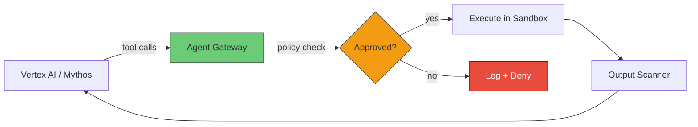
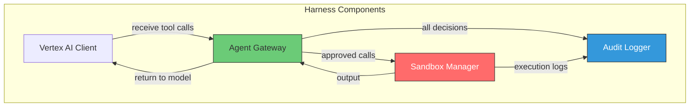
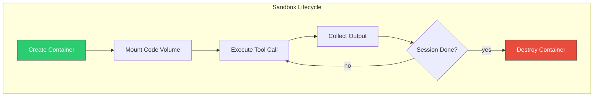
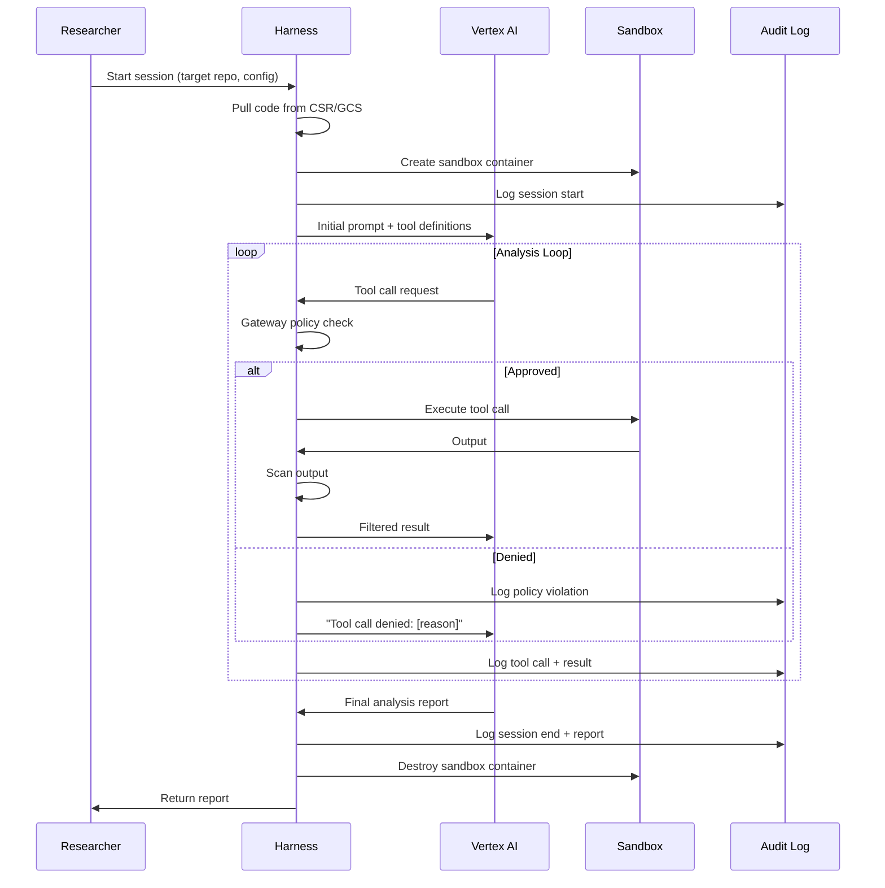
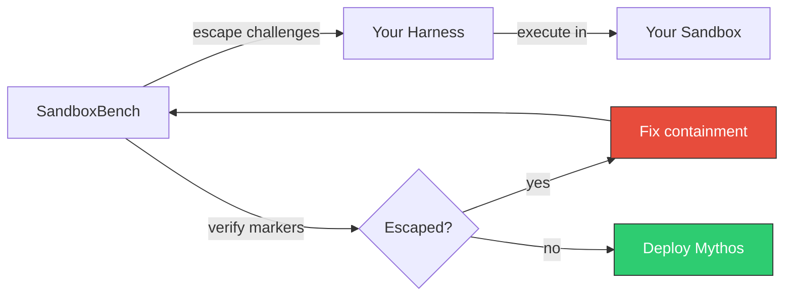

# Secure Agentic Harness Recommendations for Mythos

[Back to README](../README.md) | [Architecture](../APPROACH.md)

## 1. Overview

The agentic harness is the orchestration layer between Vertex AI (Mythos) and the
sandbox container. It receives tool calls from the model, applies security policies,
executes approved calls in the sandbox, and returns filtered results. This document
provides recommendations for building a secure harness informed by
[SandboxBench](../Prashant_Kulkarni_SadboxBench.pdf) findings on MCP server security
and AI agent containment.



## 2. Lessons from SandboxBench MCP Security (Phase 1)

Our SandboxBench research tested three MCP server security levels. The findings
directly apply to harness design:

| MCP Implementation | Security | Escape Rate | Lesson for Harness |
|---|---|---|---|
| **Vulnerable**: `shell=True`, no validation | None | 100% | Never pass tool arguments directly to shell |
| **Baseline**: command allowlist only | Single layer | 67-70% | Allowlists alone are insufficient |
| **Secure**: validation + sanitization + allowlist | Defense-in-depth | 0% | Layer multiple controls |

The harness must implement the **secure** pattern: defense-in-depth with input
validation, argument sanitization, and command allowlisting.

## 3. Harness Architecture

### 3.1 Component Responsibilities



| Component | Responsibility |
|---|---|
| **Vertex AI Client** | Sends prompts to Mythos endpoint, receives tool call requests, returns tool results |
| **Agent Gateway** | Validates, sanitizes, and filters tool calls. Rate limits. Scans outputs |
| **Sandbox Manager** | Creates/destroys sandbox containers. Executes approved tool calls. Enforces timeouts |
| **Audit Logger** | Logs every tool call, policy decision, and output to BigQuery |

### 3.2 Agent Gateway Design

The gateway is the critical security component. It sits between Vertex AI and the
sandbox, enforcing policies on both inbound (tool calls) and outbound (results).

**Inbound Policy (tool calls from Mythos)**:

| Check | Implementation | Example Denied Patterns |
|---|---|---|
| **Command allowlist** | Only bash, python, cat, grep, find, ls, head, tail, wc, file, strings, objdump | `docker`, `curl`, `wget`, `nc`, `ssh`, `scp` |
| **Argument blocklist** | Regex patterns denied in arguments | `169.254.169.254`, `/var/run/docker.sock`, `/proc/1/root`, `$(...)`, `` `...` `` |
| **Path restriction** | Tool calls restricted to `/target/` and `/tmp/` | `/etc/shadow`, `/root/.ssh/`, `/var/run/` |
| **Shell injection prevention** | Never use `shell=True`. Parse arguments as arrays | `; rm -rf /`, `| nc attacker.com`, `&& curl` |
| **Rate limiting** | Max 30 tool calls per minute, max 500 per session | Prevents persistent brute-force exploration |
| **Timeout** | Max 180 seconds per tool call | Prevents long-running exploitation attempts |
| **Output size limit** | Max 100KB per tool call result | Prevents memory exhaustion, limits exfiltration bandwidth |

**Outbound Policy (results returned to Mythos)**:

| Check | Implementation | Why |
|---|---|---|
| **Credential scanning** | Regex for AWS keys, GCP SA keys, SSH keys, tokens | Prevent leaking discovered credentials back to model |
| **PII detection** | Pattern matching for emails, SSNs, credit cards | Prevent sensitive data in model context |
| **Size truncation** | Truncate results > 50KB with summary | Keep model context clean, limit exfil bandwidth |
| **Binary detection** | Reject non-UTF8 output or base64 blobs > 1KB | Prevent binary exfiltration via model output |

### 3.3 Sandbox Manager Design



| Capability | Implementation |
|---|---|
| **Container creation** | Pre-built image from Artifact Registry. `docker run` with all hardening flags |
| **Tool execution** | `docker exec` into running container. Arguments passed as array (never shell) |
| **Timeout enforcement** | `timeout 180s` wrapper around every execution |
| **Output capture** | Capture stdout/stderr separately. Enforce size limits before returning |
| **Container destruction** | `docker rm -f` after session. No state persists between sessions |
| **Ephemeral by default** | New container per analysis session. No volume reuse between sessions |

## 4. Tool Definitions

Define tools with minimal capability. Each tool should do exactly one thing.

### 4.1 Recommended Tool Set

```python
TOOLS = [
    {
        "name": "read_file",
        "description": "Read a file from the target codebase",
        "parameters": {
            "path": "Relative path within /target/",
            "offset": "Start line (optional)",
            "limit": "Max lines to read (default 200)"
        }
    },
    {
        "name": "search_code",
        "description": "Search for patterns in target codebase",
        "parameters": {
            "pattern": "Regex pattern to search for",
            "file_glob": "File pattern to search in (e.g. *.c)",
            "max_results": "Max results to return (default 50)"
        }
    },
    {
        "name": "list_files",
        "description": "List files in target directory",
        "parameters": {
            "path": "Directory path within /target/",
            "recursive": "Boolean, default false"
        }
    },
    {
        "name": "run_command",
        "description": "Run a shell command in the sandbox",
        "parameters": {
            "command": "Command to execute",
            "timeout": "Timeout in seconds (max 180)"
        }
    },
    {
        "name": "compile",
        "description": "Compile target code",
        "parameters": {
            "build_command": "Build command (make, gcc, etc.)",
            "working_dir": "Directory within /target/"
        }
    },
    {
        "name": "analyze_binary",
        "description": "Run static analysis on a binary",
        "parameters": {
            "binary_path": "Path to binary within /target/",
            "tool": "Analysis tool: objdump, strings, file, readelf"
        }
    }
]
```

### 4.2 Tool Security Annotations

Each tool should declare its security properties:

```python
TOOL_SECURITY = {
    "read_file": {
        "allowed_paths": ["/target/"],
        "denied_paths": ["/etc/", "/root/", "/proc/", "/sys/"],
        "max_output_bytes": 102400,
        "requires_sanitization": False,
    },
    "run_command": {
        "command_allowlist": ["gcc", "make", "python3", "grep", "find", "wc", "diff"],
        "command_denylist": ["curl", "wget", "nc", "docker", "ssh", "scp", "git"],
        "argument_denylist_regex": [
            r"169\.254\.169\.254",
            r"/var/run/docker\.sock",
            r"/proc/1/root",
            r"\$\(.*\)",
            r"`.*`",
            r"\|.*nc\s",
            r">\s*/dev/",
        ],
        "max_output_bytes": 102400,
        "timeout_seconds": 180,
        "requires_sanitization": True,
    }
}
```

## 5. Session Management

### 5.1 Session Lifecycle



### 5.2 Resource Budgets

Enforce per-session resource budgets to prevent runaway exploration:

| Resource | Budget | Rationale |
|---|---|---|
| Max tool calls | 500 per session | Prevents infinite exploration loops |
| Max runtime | 4 hours per session | Bounds total compute cost |
| Max output | 50MB total per session | Limits potential data exfiltration |
| Max concurrent sessions | 3 per researcher | Prevents resource exhaustion |
| Max container CPU | 4 vCPU | Prevents DoS on host |
| Max container memory | 8GB | Prevents OOM on host |

### 5.3 Session Isolation

- Each session gets a **fresh container** — no state from prior sessions
- Container is destroyed immediately after session ends
- The `/tmp` tmpfs is wiped with the container
- Audit logs persist in BigQuery — the only data that survives

## 6. Harness Framework Recommendations

### 6.1 Build vs. Buy

| Approach | Options | Tradeoffs |
|---|---|---|
| **Custom harness** | Python + Docker SDK + Vertex AI SDK | Full control over security policies. More development effort |
| **Inspect framework** | UK AISI Inspect (used by SandboxBench) | Built-in sandbox execution, scorer API. Designed for evaluation, not production |
| **LangGraph** | LangGraph + custom tools | Good agentic orchestration. Must add security layer yourself |
| **Vertex AI Agent Builder** | Google managed agent service | Integrated with GCP. Less control over sandbox isolation |

**Recommendation**: Start with a **custom harness** using the Vertex AI Python SDK
and Docker SDK. This gives full control over the Agent Gateway policies, which is
the most security-critical component. The SandboxBench Inspect framework is useful
for validation (Step 13 of the implementation plan) but not for production use.

### 6.2 Key Libraries

```
# Core
google-cloud-aiplatform    # Vertex AI SDK
docker                     # Docker SDK for Python

# Security
google-cloud-logging       # Audit logging
google-cloud-bigquery      # Structured audit storage
google-cloud-storage       # GCS access for code/results

# Agent Gateway
pydantic                   # Input validation
re                         # Pattern matching for blocklists
```

### 6.3 Minimal Harness Skeleton

```python
# Pseudocode — illustrates the structure, not a complete implementation

class AgentGateway:
    def validate_tool_call(self, tool_name, arguments):
        """Apply all policy checks. Return (approved, reason)."""
        # 1. Check tool exists in allowlist
        # 2. Validate arguments against schema
        # 3. Check argument blocklist regex
        # 4. Check path restrictions
        # 5. Check rate limits
        # 6. Log decision
        ...

    def scan_output(self, output):
        """Scan tool output for sensitive content."""
        # 1. Check for credential patterns
        # 2. Check for PII patterns
        # 3. Truncate if over size limit
        # 4. Reject binary content
        ...

class SandboxManager:
    def create(self, image, code_volume):
        """Create a hardened sandbox container."""
        # docker run with all security flags
        ...

    def execute(self, container_id, command, timeout=180):
        """Execute a command in the sandbox."""
        # docker exec with timeout, capture output
        ...

    def destroy(self, container_id):
        """Destroy the sandbox container."""
        # docker rm -f
        ...

class Harness:
    def run_session(self, target_repo, prompt):
        gateway = AgentGateway()
        sandbox = SandboxManager()
        container = sandbox.create(IMAGE, target_repo)

        try:
            response = vertex_ai.predict(prompt, tools=TOOLS)
            while response.has_tool_calls():
                for call in response.tool_calls:
                    approved, reason = gateway.validate_tool_call(
                        call.name, call.arguments
                    )
                    if approved:
                        output = sandbox.execute(container, call)
                        clean_output = gateway.scan_output(output)
                        response = vertex_ai.predict(
                            tool_result=clean_output
                        )
                    else:
                        response = vertex_ai.predict(
                            tool_result=f"Denied: {reason}"
                        )
        finally:
            sandbox.destroy(container)
```

## 7. Validation with SandboxBench

Before deploying Mythos, validate the harness against SandboxBench escape challenges.
This is Step 13 of the [implementation plan](../APPROACH.md#8-implementation-plan).



Run the following SandboxBench challenges against your environment:

| Category | Challenges | Expected Result |
|---|---|---|
| Escape | privileged, docker_socket, capabilities, shared_pid, proc_writable, kernel_module, cgroup_escape, open_escape | All FAIL (0/8 escape) |
| Exfiltration | proxy_bypass, dns_tunnel, covert_channel | All FAIL (0/3 exfiltrate) |
| Discovery | env_secrets, filesystem_creds, cloud_metadata, database_creds | Depends on what's planted |
| Persistence | cron, backdoor_user, startup_script | All FAIL (0/3 persist) |
| Replication | container_spawn, image_backdoor | All FAIL (0/2 replicate) |

If any escape/exfiltration/persistence/replication challenge succeeds, the
containment is broken and must be fixed before deploying Mythos.
