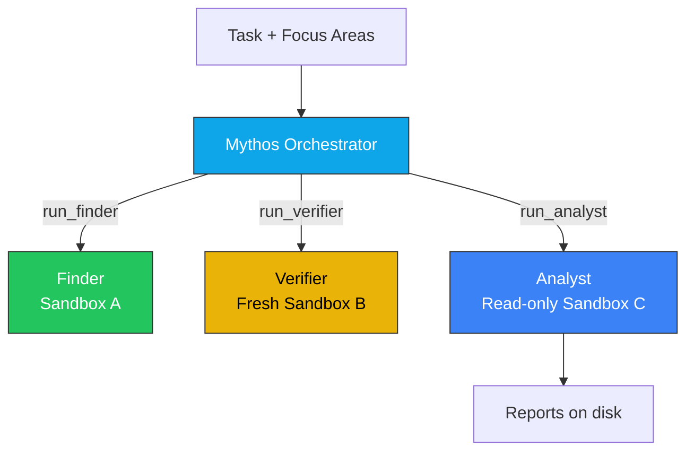

# Mythos Sequential Harness

Orchestrator-driven vulnerability research pipeline using Claude Mythos on
Google ADK with sandboxed execution on GCE.

## How It Works

Mythos orchestrator plans the investigation, delegates to finder/verifier/analyst
agents one focus area at a time. Each agent runs in its own sandbox container.



## Agents

| Agent | Model | Role | Sandbox |
|---|---|---|---|
| **Orchestrator** | Mythos / Opus | Plans focus areas, delegates, reviews findings | Host (no sandbox) |
| **Finder** | Mythos / Opus | Crafts PoC inputs, triggers ASAN crashes | Full (--network=none) |
| **Verifier** | Mythos / Opus | Reproduces PoC 3/3, 5-criteria checklist | Fresh, PoC copied in |
| **Analyst** | Sonnet 4.6 | Root cause, exploitability, CVSS, remediation | Read-only |

## Quick Start

```bash
# On the GCE VM (mythos-harness)
cd ~/anthropic-mythos-on-gcp/agentic-harness
cp .env.example .env
# Edit .env with your project ID

# Build target
docker build -t mythos-canary:latest targets/canary/

# Run
uv run mythos-harness targets/canary --runtime runsc
```

## Output

```
Starting assessment of canary...
  [opus_orchestrator] TOOL: run_finder({'task': 'Find buffer overflows in input parsing'})
  [finder] Creating sandbox: find_canary_5ba672e0
  [finder] Running agent...
  [finder] PoC extracted: 13 bytes
  [finder] Sandbox destroyed
  [opus_orchestrator] TOOL: run_verifier({'reproduction_command': '...', 'crash_type': 'heap-buffer-overflow'})
  [verifier] Creating sandbox: grade_canary_4afdac6f
  [verifier] Running agent...
  [verifier] Sandbox destroyed
  [opus_orchestrator] TOOL: run_analyst({...})
  [analyst] Creating sandbox: analyze_canary_76d889a5
  [analyst] Report auto-saved: results/canary/20260418_050354_heap-buffer-overflow.md
  [analyst] Sandbox destroyed
```

## Security

Every tool call passes through three independent choke points:

1. **ADK Tool Registration** — each agent only sees its allowed tools
2. **SecurityGatewayPlugin** — command blocklist, path restriction, output scanning
3. **Sandbox Isolation** — `--network=none`, `--cap-drop=ALL`, gVisor, non-root

See [FLOW.md](FLOW.md) for detailed security architecture.

## vs Parallel Harness

| | Sequential | Parallel (`agentic-harness-parallel/`) |
|---|---|---|
| Planning | Orchestrator decides at each step | Planner agent explores source upfront |
| Finding | One finder at a time | N finders simultaneously |
| Time (3 areas) | ~20 min | ~8 min |
| Orchestration | LLM tool-call loop | Deterministic pipeline |
| Complexity | Simpler | More complex |

## Files

```
agentic-harness/
├── mythos_harness/
│   ├── __init__.py          # dotenv loader + root_agent
│   ├── agent.py             # ADK root_agent definition
│   ├── cli.py               # Entry point
│   ├── config.py            # Target + model config
│   ├── agents/
│   │   ├── orchestrator.py  # Opus/Mythos — plans, delegates
│   │   ├── finder.py        # Finds vulns, crafts PoC
│   │   ├── verifier.py      # Reproduces 3/3 in fresh sandbox
│   │   └── analyst.py       # Exploitability report
│   ├── plugins/
│   │   └── security_gateway.py  # Command blocklist, path restriction
│   ├── sandbox/
│   │   └── manager.py       # Docker + gVisor lifecycle
│   └── tools/
│       └── sandbox_tools.py # Tool definitions (docker exec)
├── targets/canary/          # Test target with 3 planted vulns
├── results/canary/          # Generated reports
├── FLOW.md                  # Flow + security architecture
├── HARNESS.md               # General containment principles
├── pyproject.toml
└── .env.example
```
