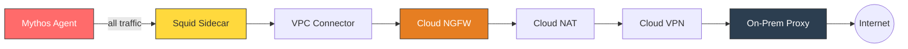
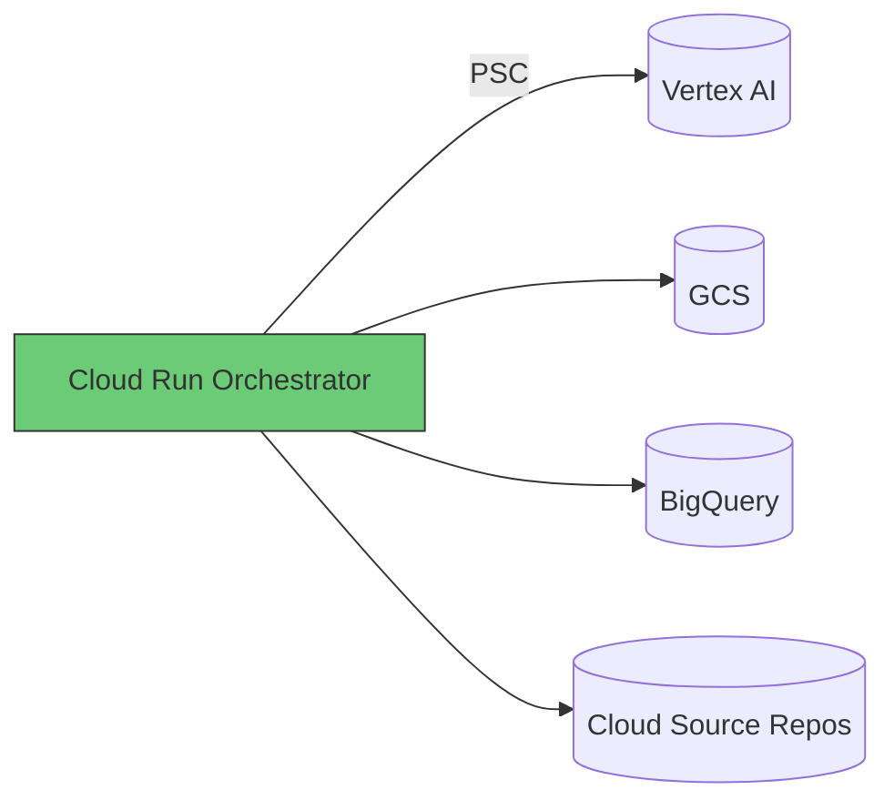

# Option A: Cloud Run

[Back to APPROACH.md](../APPROACH.md)

## Architecture

## How It Works

- Cloud Run runs two containers: the **Mythos agent** (main) and **Squid proxy** (sidecar)
- gVisor is **always on** — no configuration needed, strongest default isolation
- The orchestrator runs as a separate Cloud Run service with a GCP SA attached
- VPC Connector routes all egress through the private VPC
- Traffic flows: container -> sidecar proxy -> VPC Connector -> Cloud NGFW -> Cloud NAT -> VPN -> on-prem

## Vertex AI Access

- Service account attached directly to the Cloud Run service
- SDK auto-discovers credentials via Cloud Run's internal metadata
- Private Google Access routes Vertex AI calls over Google's backbone
- VPC-SC perimeter governs which SAs can access the Vertex AI endpoint

## Source Code Access

- Orchestrator pulls from Cloud Source Repos or GCS within VPC-SC perimeter
- Mounts code into the agent container via shared volume
- No git CLI or credentials in the sandbox container

## Strengths

- gVisor always on — strongest container isolation of all three options
- No node access — no SSH, no underlying VM to compromise
- Zero idle cost — pay only for active compute seconds
- Minimal operational burden — fully managed by Google

## Limitations

- **24h max runtime** (Cloud Run Jobs), 60 min (HTTP)
- **8 vCPU, 32GB RAM max** — may constrain large compilation workloads
- **No nested containers** — cannot run Docker-in-Docker for target isolation
- **Ephemeral storage only** — no persistent disk, tmpfs is memory-backed
- Sidecar proxy configuration less flexible than standalone Squid

## SandboxBench Applicability

0/8 escape challenges apply. gVisor blocks all kernel-level escapes (privileged
container, capabilities, shared PID, cgroup, kernel module). The Cloud Run
execution environment does not expose a Docker socket, host namespaces, or
writable proc filesystem.

## Cost Estimate

| Usage | Monthly Cost |
|---|---|
| Idle | $0 |
| Active 8h/day, e2-standard-4 equivalent | ~$15-40 |
| + Cloud NGFW endpoint | ~$1.75/hr when active |
| + Cloud VPN tunnel | ~$36/mo |

## When to Choose This Option

- Short-lived analysis tasks (< 24h per run)
- Workloads that fit within 8 vCPU / 32GB RAM
- Maximum isolation with minimum operational effort
- No need for nested containers or persistent storage
