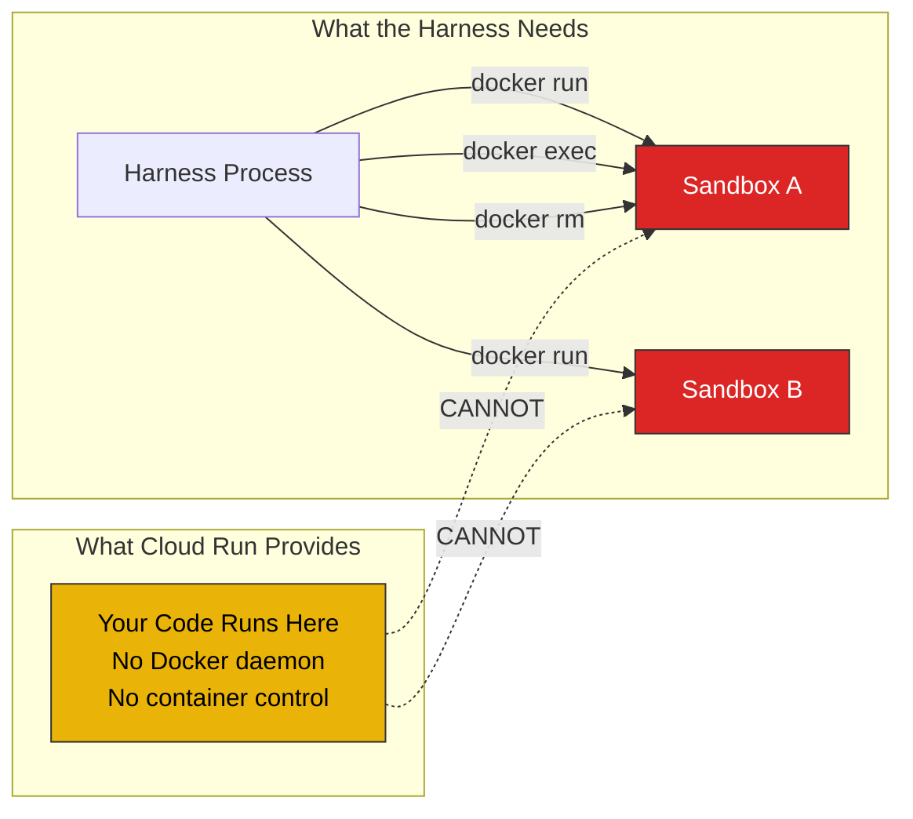

# Option A: Cloud Run — Not Recommended

[Back to APPROACH.md](../APPROACH.md)

## Why Cloud Run Doesn't Work for This Harness

The Mythos harness requires the ability to **orchestrate hardened sandbox
containers** — creating, executing tool calls inside, extracting results from,
and destroying isolated Docker containers on demand. Cloud Run cannot provide
this because **Cloud Run IS the sandbox**. There is no Docker daemon, no
container runtime, and no ability to spawn or manage child containers.

## Specific Limitations

| Requirement | Cloud Run | GCE VM |
|---|---|---|
| **Orchestrate sandboxes** | No Docker daemon, no `docker run/exec/rm` | Full Docker + gVisor, create/destroy containers on demand |
| **Parallel finders** | No way to spawn parallel sandbox containers | ParallelAgent with N containers simultaneously |
| **PoC extraction** | No `docker exec cat /tmp/poc.bin` | Full filesystem access to sandbox via docker exec |
| **Container isolation** | You ARE the container — no nested isolation | Harness on host, sandboxes isolated with --network=none |
| **Runtime** | 24h max (Jobs), 60 min (HTTP) | Unlimited |
| **Resources** | 8 vCPU, 32GB RAM max | Any machine type |
| **Storage** | Ephemeral only | Persistent disk for results |
| **Network control** | VPC connector for egress filtering | --network=none per sandbox (zero network) |
| **gVisor** | Always on (good for the container itself) | Configurable per sandbox |

## When Cloud Run Could Work

Cloud Run is viable for a **different architecture** where:
- The harness runs on GCE/GKE and orchestrates sandboxes
- Individual **stateless analysis tasks** (not the harness itself) run on Cloud Run
- Each Cloud Run instance processes one file/input and returns results
- The harness collects results from Cloud Run instances

This is essentially using Cloud Run as a **worker pool** behind the harness,
not as the harness itself. The orchestration still needs a VM.

## Recommendation

Use **[Option B: GCE + Docker](gce-docker.md)** (deployed and validated) or
**[Option C: GKE](gke.md)** (for team/production use).
