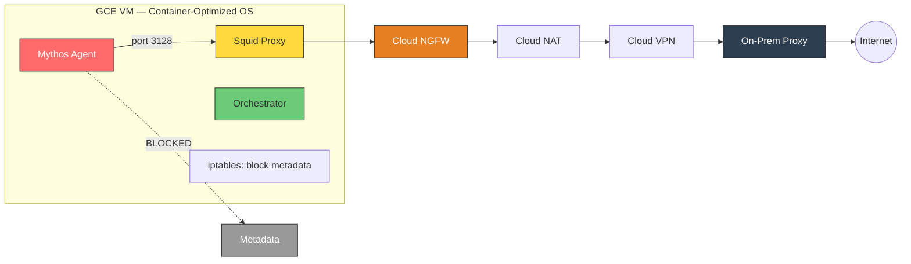
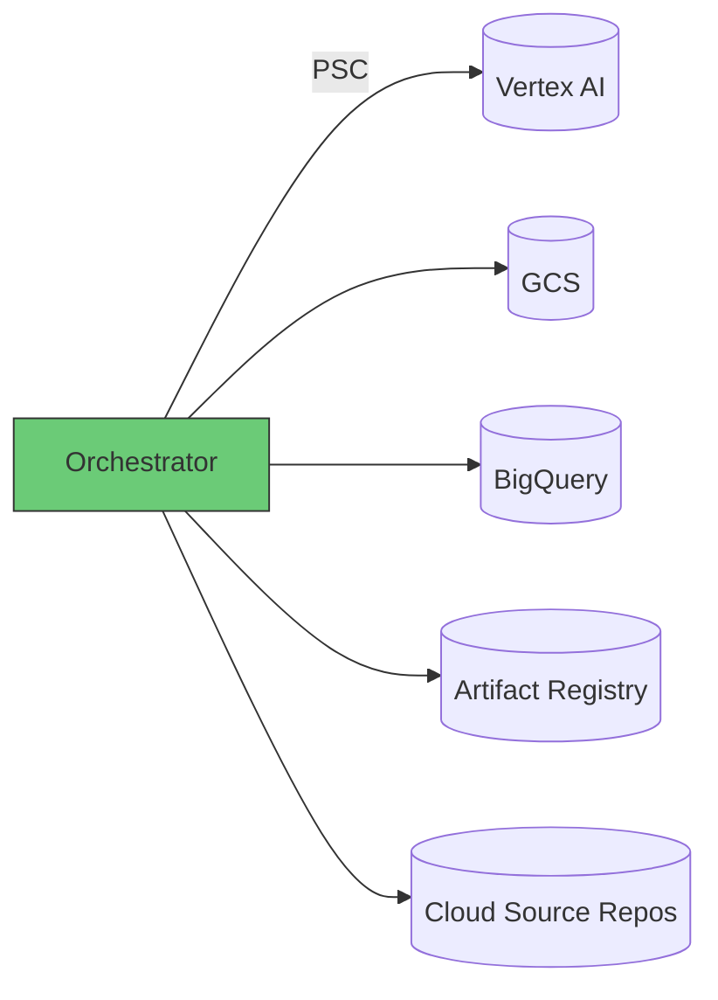

# Option B: GCE + Docker (Recommended)

[Back to APPROACH.md](../APPROACH.md)

## Architecture





## How It Works

- A single GCE VM running **Container-Optimized OS** (COS) hosts all components
- Docker runtime configured with **gVisor (runsc)** for sandbox containers
- Three containers on the VM: Mythos agent, Squid proxy, orchestrator
- The agent container runs on an **isolated Docker network** with egress only through the proxy
- Host-level `iptables` blocks the agent's network from reaching `169.254.169.254`
- The orchestrator runs on the host network with access to the GCP SA via metadata

## Container Hardening

```
docker run \
  --runtime=runsc \
  --read-only \
  --cap-drop=ALL \
  --security-opt=no-new-privileges \
  --security-opt=seccomp=default \
  --user=1000:1000 \
  --network=sandbox-net \
  --tmpfs /tmp:rw,noexec,nosuid,size=512m \
  -v /workspace/target:/target:ro \
  mythos-sandbox:latest
```

## Vertex AI Access

- The VM has a GCP service account attached via instance metadata
- The orchestrator (on host network) accesses Vertex AI via Private Service Connect
- The sandbox container is on a separate Docker network with NO metadata access
- `iptables` rule on the host: `iptables -I FORWARD -d 169.254.169.254 -i docker0 -j DROP`

## Source Code Access

- Orchestrator clones from Cloud Source Repos (mirrored from GitHub/GitLab)
- Code is placed at `/workspace/target/` on the host
- Mounted into the sandbox as a **read-only volume** (`-v /workspace/target:/target:ro`)
- No git CLI, SSH keys, or PATs inside the sandbox container

## Strengths

- **Simplest mental model** — one VM, one container, one proxy
- **Full flexibility** — unlimited runtime, any machine type, GPUs, nested containers
- **Strong isolation** — COS is hardened, gVisor (`runsc`) blocks all kernel escapes
- **Low cost** — ~$50/mo active, auto-stop when idle for $0
- **Easy to audit** — one iptables rule for metadata, one Squid config for egress

## Limitations

- Must patch/manage the VM (COS auto-updates mitigate this)
- iptables metadata block is a manual configuration — easy to forget on rebuild
- If container escapes gVisor AND Docker, the host VM is the blast radius
- Single-tenant — one researcher per VM

## SandboxBench Applicability

With COS + gVisor + hardening: **0/8 escape challenges apply**.

Without hardening: 5/8 apply (privileged, docker_socket, capabilities, shared_pid,
proc_writable). This is why the Docker `run` flags above are non-negotiable.

## Cost Estimate

| Usage | Monthly Cost |
|---|---|
| Idle (auto-stopped) | $0 |
| Active 8h/day, e2-standard-4 | ~$50-80 |
| + Cloud NGFW endpoint | ~$1.75/hr when active |
| + Cloud VPN tunnel | ~$36/mo |
| + Persistent disk 100GB | ~$4/mo |

## When to Choose This Option

- Interactive, long-running vulnerability research
- Single researcher needing full flexibility
- Workloads that require nested containers or large resources
- Fastest path to a working, secure environment
