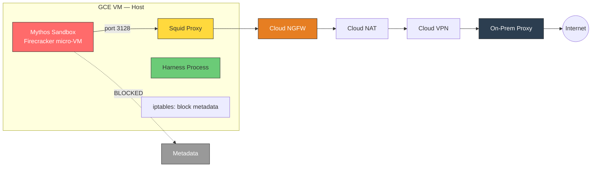
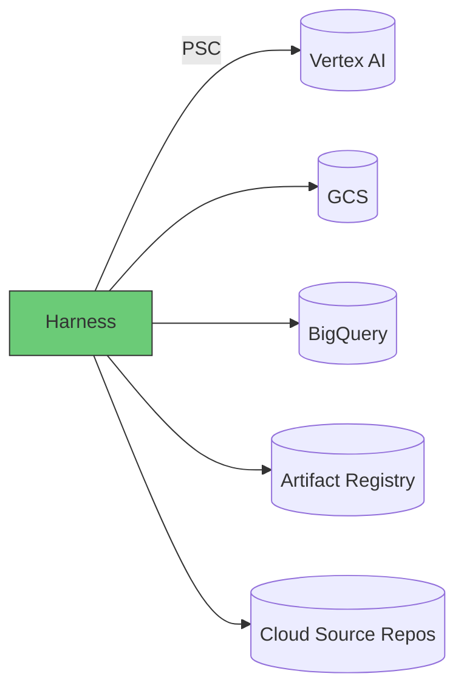

# Option B: GCE + Firecracker Micro-VM (Recommended)

[Back to APPROACH.md](../APPROACH.md)

## Architecture





## How It Works

- A single GCE VM hosts the harness, proxy, and sandbox micro-VMs
- Each sandbox runs in a **Firecracker micro-VM** — its own Linux kernel, isolated
  memory, minimal VMM attack surface (~50K LoC Rust)
- The harness process runs on the host, manages micro-VMs via Firecracker API
- The sandbox micro-VM runs on an **isolated network** with egress only through the proxy
- Host-level `iptables` blocks the sandbox network from reaching `169.254.169.254`
- The harness runs on the host network with access to the GCP SA via metadata

## Why Firecracker Over gVisor

gVisor intercepts syscalls in userspace but still runs on the host kernel. Mythos
finds zero-days in browsers and develops JIT heap sprays — a gVisor escape is
plausible, and the host kernel would be exposed.

Firecracker gives each sandbox its own kernel, enforced by hardware virtualization
(KVM/VT-x). Two independent boundaries must be breached to reach the host.

| Property | gVisor (runsc) | Firecracker | Firecracker Advantage |
|---|---|---|---|
| Isolation boundary | User-space kernel (software) | KVM hypervisor (hardware) | Hardware-enforced, battle-tested |
| Kernel exposure | Host kernel reachable if gVisor bypassed | Guest kernel only — host behind hypervisor | Escape to guest kernel is not escape to host |
| Attack surface | ~200K LoC Go (Sentry) | ~50K LoC Rust (VMM) + KVM | Smaller, memory-safe language |
| Boot time | ~100ms | ~125ms | Comparable |
| Memory overhead | Shared host kernel | ~5MB per VM | Negligible for single-digit VMs |
| Syscall compatibility | Some incompatibilities | Full Linux kernel | Better for compilers, debuggers |
| OCI compatibility | Drop-in Docker runtime | Requires API integration or Kata wrapper | Kata Containers bridges this gap |

## Sandbox Hardening

### Firecracker Micro-VM Configuration

```json
{
  "boot-source": {
    "kernel_image_path": "/opt/firecracker/vmlinux",
    "boot_args": "console=ttyS0 reboot=k panic=1 pci=off"
  },
  "drives": [
    {
      "drive_id": "rootfs",
      "path_on_host": "/opt/firecracker/rootfs.ext4",
      "is_root_device": true,
      "is_read_only": true
    },
    {
      "drive_id": "target-code",
      "path_on_host": "/workspace/target.ext4",
      "is_root_device": false,
      "is_read_only": true
    }
  ],
  "machine-config": {
    "vcpu_count": 4,
    "mem_size_mib": 8192
  },
  "network-interfaces": [
    {
      "iface_id": "eth0",
      "guest_mac": "AA:FC:00:00:00:01",
      "host_dev_name": "tap-sandbox0"
    }
  ]
}
```

### Container Hardening (inside the micro-VM)

Even inside the micro-VM, apply container hardening as defense-in-depth:

```
# Inside the Firecracker VM, the agent runs as a non-root process
useradd -u 1000 agent
su - agent -c "/usr/bin/agent-entrypoint"

# Filesystem: rootfs is read-only, /tmp is tmpfs
mount -o remount,ro /
mount -t tmpfs -o size=512m,noexec,nosuid tmpfs /tmp

# Target code mounted read-only
mount /dev/vdb /target -o ro
```

### Alternative: Kata Containers (OCI-Compatible)

If you prefer Docker-compatible workflows, Kata Containers wraps Firecracker (or
QEMU) behind the OCI runtime interface:

```
docker run \
  --runtime=kata-fc \
  --read-only \
  --cap-drop=ALL \
  --security-opt=no-new-privileges \
  --user=1000:1000 \
  --network=sandbox-net \
  --tmpfs /tmp:rw,noexec,nosuid,size=512m \
  -v /workspace/target:/target:ro \
  mythos-sandbox:latest
```

`kata-fc` uses Firecracker as the hypervisor backend. Same hardware isolation,
familiar Docker commands.

## Vertex AI Access

- The VM has a GCP service account attached via instance metadata
- The harness (on host network) accesses Vertex AI via Private Service Connect
- The sandbox micro-VM is on a TAP device with NO metadata access
- `iptables` rule on the host: `iptables -I FORWARD -d 169.254.169.254 -j DROP`

## Source Code Access

- Harness clones from Cloud Source Repos (mirrored from GitHub/GitLab)
- Code is packaged as a read-only ext4 image or mounted via virtio block device
- No git CLI, SSH keys, or PATs inside the micro-VM

## Strengths

- **Strongest self-managed isolation** — Firecracker micro-VM with own kernel, hardware-enforced by KVM
- **Full flexibility** — unlimited runtime, any machine type, GPUs
- **Simple mental model** — one VM, one micro-VM sandbox, one proxy
- **Low cost** — ~$50/mo active, auto-stop when idle for $0
- **Fast boot** — ~125ms per micro-VM, negligible compared to analysis time
- **Memory-safe VMM** — Firecracker written in Rust, ~50K LoC

## Limitations

- Must manage the VM and Firecracker installation
- iptables metadata block is a manual configuration
- Firecracker API integration requires more plumbing than `docker run`
  (mitigated by using Kata Containers as OCI wrapper)
- KVM required — GCE VM must have nested virtualization enabled
  (`--enable-nested-virtualization` on n1/n2 machine types)

## SandboxBench Applicability

With Firecracker micro-VM: **0/8 escape challenges apply**. All escape vectors
target the container runtime or host kernel — in a micro-VM, these only affect
the guest kernel. The host is protected by the KVM hypervisor.

Even if the agent escapes the micro-VM's guest kernel (extremely difficult — would
require a KVM zero-day), it reaches the host VM, not the GCP infrastructure. The
host VM itself has no external IP, no public SSH, and is within the VPC-SC perimeter.

## Cost Estimate

| Usage | Monthly Cost |
|---|---|
| Idle (auto-stopped) | $0 |
| Active 8h/day, n2-standard-4 (nested virt) | ~$60-90 |
| + Cloud NGFW endpoint | ~$1.75/hr when active |
| + Cloud VPN tunnel | ~$36/mo |
| + Persistent disk 100GB | ~$4/mo |

## When to Choose This Option

- Interactive, long-running vulnerability research
- Single researcher needing maximum isolation with full flexibility
- Workloads where gVisor syscall incompatibilities are a concern (compilers, debuggers)
- When you want hardware-enforced isolation, not just software boundaries
