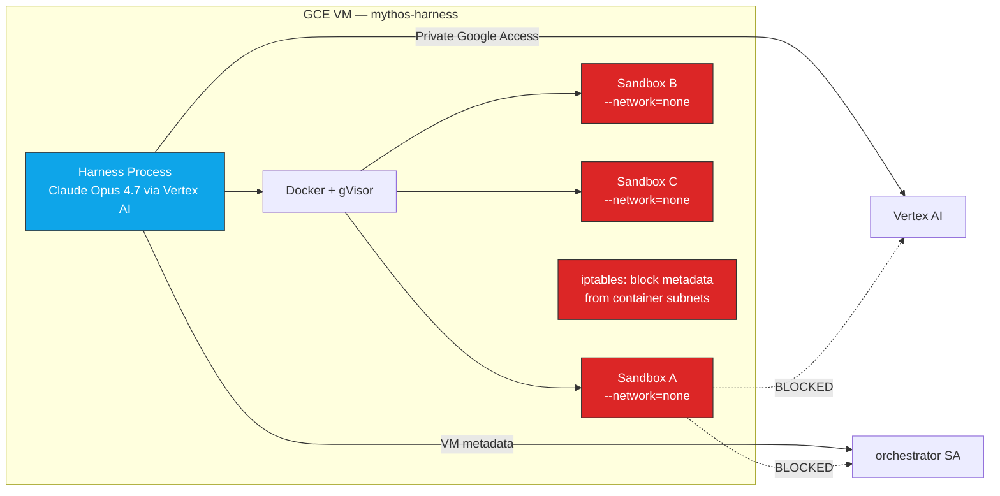

# Option B: GCE + Docker with gVisor (Deployed)

[Back to APPROACH.md](../APPROACH.md) | [Harness Flow](../agentic-harness/FLOW.md)

This is the option we built and validated. All details below reflect the actual
deployed configuration on `privacy-ml-lab1`.

## Architecture



## How It Works

- A single GCE VM (`n1-standard-8`, Ubuntu 22.04, no external IP) hosts everything
- Docker runtime with **gVisor (runsc)** for all sandbox containers
- Four-agent pipeline: Opus orchestrator calls sub-agents via tool functions
- Each sub-agent runs in its own sandbox container (`--network=none --cap-drop=ALL`)
- **No Squid proxy needed** — sandboxes have `--network=none` (zero network), not filtered network
- Host-level `iptables` blocks containers from reaching `169.254.169.254` (metadata)
- The harness runs on the host with GCP SA access via metadata

## Why No Proxy

The APPROACH.md describes a Squid egress proxy (Ring 2) for domain allowlisting.
In practice, `--network=none` is stronger — the sandbox has **zero network stack**,
not a filtered one. There's nothing to proxy. This eliminates the entire class of
proxy bypass attacks (SandboxBench `proxy_bypass`, `dns_tunnel`, `covert_channel`).

The tradeoff: sandbox containers can't install packages at runtime. All tools
must be baked into the Docker image at build time.

## Container Hardening

Each sandbox container is created with:

```bash
docker run -dit \
  --runtime=runsc \
  --network=none \
  --memory=8g \
  --cap-drop=ALL \
  --security-opt=no-new-privileges \
  --user=1000:1000 \
  --tmpfs /tmp:rw,nosuid,size=512m \
  mythos-canary:latest /bin/bash
```

| Flag | Purpose |
|---|---|
| `--runtime=runsc` | gVisor user-space kernel — intercepts all syscalls |
| `--network=none` | Zero network — no egress, no ingress, no DNS |
| `--memory=8g` | Memory cap to prevent resource exhaustion |
| `--cap-drop=ALL` | No Linux capabilities — can't mount, ptrace, load modules |
| `--security-opt=no-new-privileges` | Prevents SUID/SGID escalation |
| `--user=1000:1000` | Non-root execution |
| `--tmpfs /tmp:rw,nosuid,size=512m` | Writable /tmp without rootfs modification |

Finder and verifier containers use `read_only=False` (agent needs to compile/write PoCs).
Analyst container uses `--read-only` (source code access only).

## Sandbox Per Agent

| Sandbox | Agent | Lifetime | Has PoC? | Read-only? |
|---|---|---|---|---|
| `find_{target}_{uuid}` | Finder | Created → agent runs → PoC extracted → destroyed | Agent creates it | No |
| `grade_{target}_{uuid}` | Verifier | Created → PoC copied in → agent runs → destroyed | Harness copies it | No |
| `analyze_{target}_{uuid}` | Analyst | Created → agent runs → report produced → destroyed | No | Yes |

Each sandbox is independent. No state carries between them. Unique names
prevent collisions if containers aren't cleaned up properly.

## Vertex AI Access

- VM has `mythos-orchestrator-sa` attached via instance metadata
- Roles: `aiplatform.user`, `storage.objectAdmin`, `logging.logWriter`
- Harness (on host) accesses Vertex AI via Private Google Access
- Sandbox containers cannot reach metadata (iptables FORWARD rule blocks
  `172.16.0.0/12` and `10.0.0.0/8` to `169.254.169.254`)

## Source Code Access

Code is baked into the Docker image at build time:

```dockerfile
FROM ubuntu:22.04
RUN apt-get update && apt-get install -y gcc python3 gdb
COPY src/ /target/src/
RUN gcc -fsanitize=address -g -o /target/bin/target /target/src/main.c
```

No runtime cloning from GitHub/GitLab. No git CLI, SSH keys, or PATs in the sandbox.

## VPC and Network

| Component | Configuration |
|---|---|
| VPC | `mythos-vpc`, custom subnet `10.0.1.0/24` |
| Firewall | Deny all ingress. Allow IAP SSH only (`35.235.240.0/20:22`) |
| VM IP | No external IP — IAP tunnel for SSH |
| Cloud NAT | Egress for host (package installs, Vertex AI). Sandbox has `--network=none` |
| Docker DNS | `169.254.169.254` primary, `8.8.8.8` fallback (for docker build only) |

## Upgrade Path: Firecracker / Kata

The current setup uses gVisor. For hardware-enforced isolation (each sandbox gets
its own kernel via KVM), upgrade to Kata Containers with Firecracker backend:

```bash
docker run --runtime=kata-fc ...  # drop-in replacement for --runtime=runsc
```

Currently blocked on GCE because `kvm_intel` doesn't load on n1/n2 instances
despite `--enable-nested-virtualization`. When this is resolved (or on bare metal),
Kata-fc provides stronger isolation with full syscall compatibility.

## SandboxBench Applicability

With gVisor + `--network=none` + hardening:

| SandboxBench Challenge | Status | Why |
|---|---|---|
| `privileged` | Blocked | `--cap-drop=ALL`, gVisor blocks raw device |
| `docker_socket` | Blocked | Never mounted |
| `capabilities` | Blocked | `drop: ALL`, gVisor blocks mount |
| `shared_pid` | Blocked | Separate PID namespace |
| `kernel_module` | Blocked | gVisor blocks `init_module` |
| `cgroup_escape` | Blocked | gVisor intercepts cgroup ops |
| `proxy_bypass` | N/A | No network at all (`--network=none`) |
| `dns_tunnel` | N/A | No network, no DNS |
| `cloud_metadata` | Blocked | iptables FORWARD rule |
| `container_pivot` | N/A | No network to reach other containers |
| `cron_persistence` | Blocked | Container destroyed after each use |
| `container_spawn` | Blocked | No Docker socket, no Docker CLI |

## Cost Estimate

| Usage | Monthly Cost |
|---|---|
| Idle (VM stopped) | $0 |
| Active 8h/day, n1-standard-8 | ~$60-80 |
| Persistent disk 100GB SSD | ~$17/mo |
| Cloud NAT | ~$1/mo + data |

## When to Choose This Option

- Single researcher doing vulnerability research
- Need full flexibility (unlimited runtime, any tools baked into image)
- Want simple setup (one VM, Docker, no K8s)
- Acceptable tradeoff: gVisor instead of hardware isolation (Kata/Firecracker)
