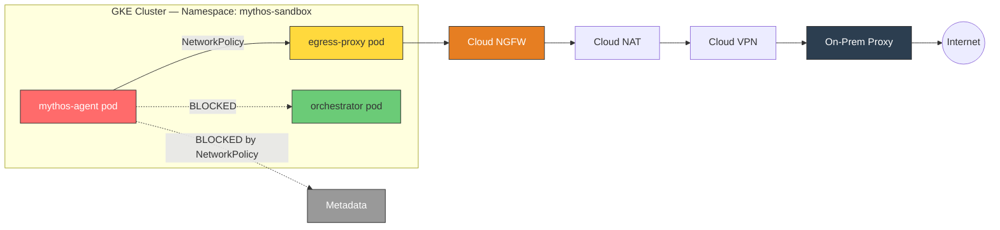
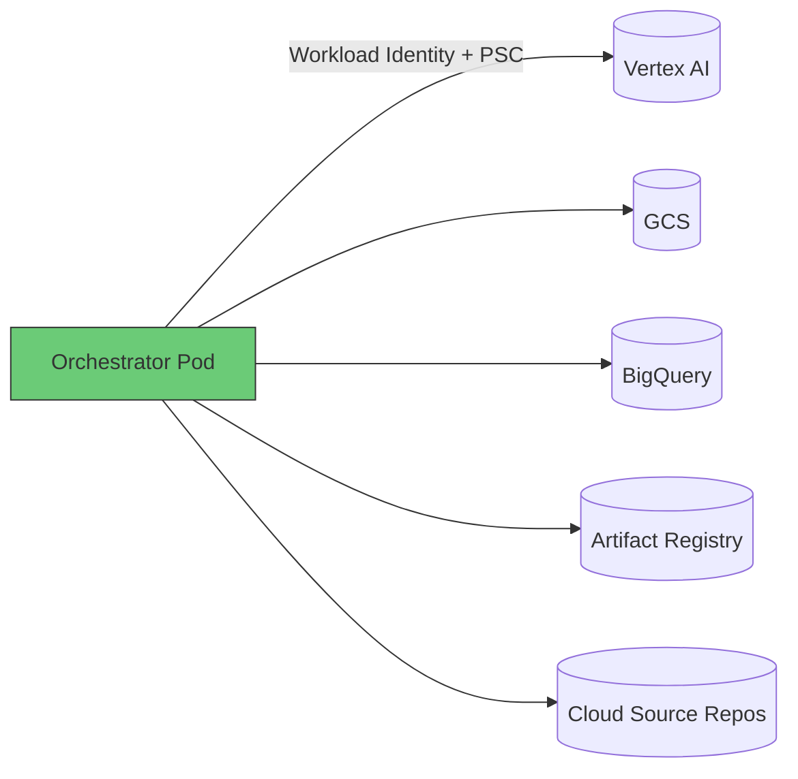

# Option C: GKE

[Back to APPROACH.md](../APPROACH.md)

## Architecture

## How It Works

- Private GKE cluster with no public endpoint
- Dedicated namespace `mythos-sandbox` with **PodSecurityStandard: restricted** enforced
- Three pods: agent (Kata micro-VM or gVisor sandbox), egress proxy (Squid), orchestrator (Workload Identity)
- **Cilium NetworkPolicy**: agent can only reach proxy on port 3128, nothing else
- **Kata Containers** (recommended): agent pod runs in micro-VM via RuntimeClass. Alternative: GKE Sandbox (gVisor)
- **Workload Identity**: orchestrator pod mapped to GCP SA, agent pod has NO mapping

## Key Kubernetes Security Controls

| Control | Setting |
|---|---|
| PodSecurityStandard | `restricted` (enforced at namespace) |
| NetworkPolicy | Default deny all, allow agent->proxy:3128 only |
| SA Token Automount | `automountServiceAccountToken: false` on agent pod |
| Workload Identity | Orchestrator pod only, agent pod unbound |
| Runtime Isolation | Kata Containers via RuntimeClass (recommended) or GKE Sandbox (gVisor) |
| Private Cluster | No public endpoint, authorized networks only |
| Metadata Concealment | `--workload-metadata=GKE_METADATA` disables legacy endpoint |

## Vertex AI Access

- Orchestrator pod uses **Workload Identity** to authenticate as `mythos-orchestrator-sa`
- Vertex AI traffic routed via **Private Service Connect** — stays on Google backbone
- Agent pod has NO Workload Identity binding and NO SA token mounted
- Even if agent compromises the pod, there are no credentials to steal

## Source Code Access

- Orchestrator pod clones from Cloud Source Repos via Workload Identity
- Code mounted into agent pod via **emptyDir** or **PVC** (read-only)
- Alternative: init container clones code before agent starts
- Agent pod has no git CLI, no SSH keys, no network access to github.com

## Strengths

- **Most defense-in-depth** — K8s namespace isolation + NetworkPolicy + PodSecurityStandard + Kata micro-VM
- **Declarative security** — NetworkPolicy and PSS are version-controlled YAML
- **Workload Identity** — cleanest credential separation (no key files, no metadata SA)
- **Scales to teams** — multiple namespaces, RBAC per researcher, shared cluster
- **Kata Containers** — OCI-compatible micro-VM, drop-in via RuntimeClass. Fallback: GKE Sandbox (gVisor)

## Limitations

- **K8s is additional attack surface** — API server, etcd, kubelet, RBAC are all targets
- **SandboxBench showed 40% K8s exploit rate** — RBAC misconfigs are exploitable
- **Highest cost** — cluster management fee (~$70/mo) + node costs even when idle
- **Most complex** — cluster upgrades, node pools, manifests, Helm charts
- **Overkill for single user** — designed for multi-tenant, team environments

## SandboxBench Applicability

With Kata Containers + NetworkPolicy + PSS restricted: **0/8 Docker escape + 0/6 K8s challenges apply** (when correctly configured). Kata micro-VMs give each pod its own kernel, so container escape vectors only affect the guest.

Without hardening: 6/8 Docker + 6/6 K8s challenges apply. The K8s challenges
(RBAC abuse, SA token theft, configmap secrets, metadata service, privileged pod,
pod escape) are all vectors that require explicit configuration to prevent.

## Cost Estimate

| Usage | Monthly Cost |
|---|---|
| Idle (cluster running, nodes scaled to 0) | ~$70 (cluster fee) |
| Active 8h/day, e2-standard-4 node | ~$120-180 |
| + Cloud NGFW endpoint | ~$1.75/hr when active |
| + Cloud VPN tunnel | ~$36/mo |

## When to Choose This Option

- Team of researchers sharing a cluster
- Need multi-tenancy with namespace isolation
- Want declarative, version-controlled security policies
- Already have K8s operational expertise
- Planning to scale to production workloads
